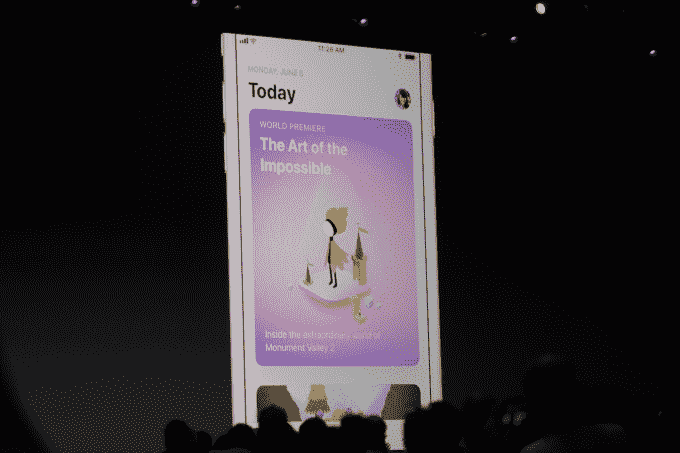
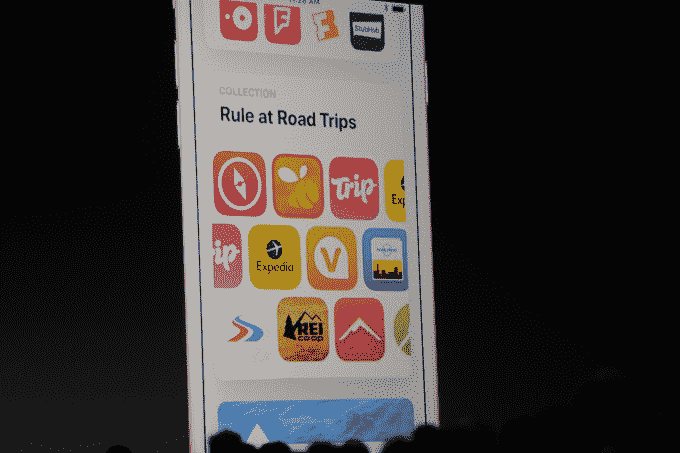
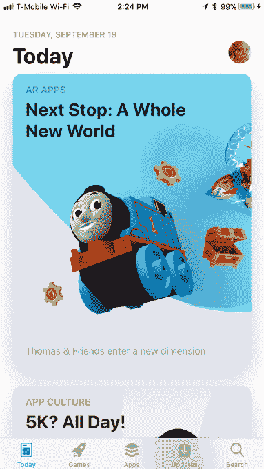
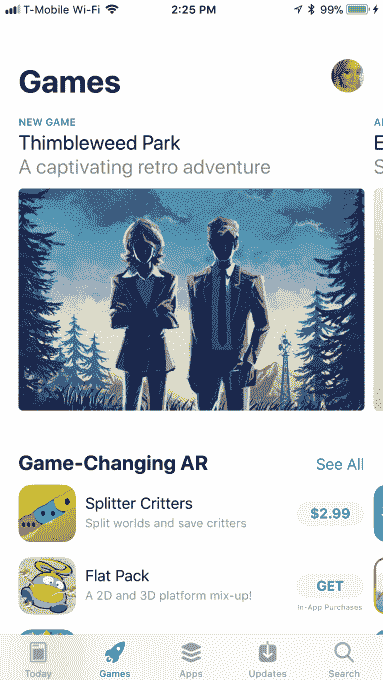
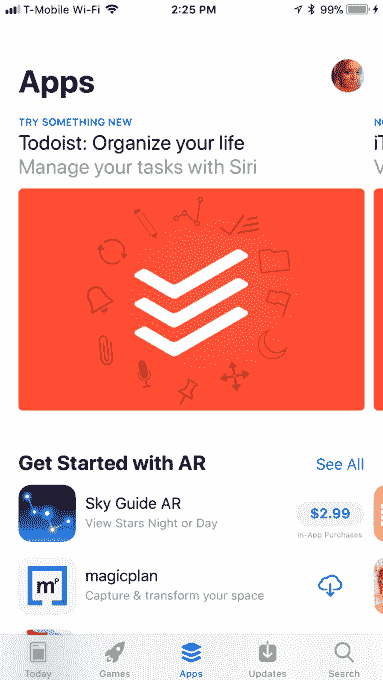
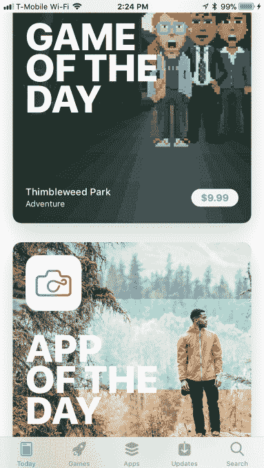
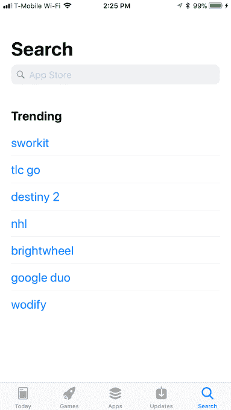

# 苹果巨大的应用商店改造今天在 iOS 11  中到来

> 原文：<https://web.archive.org/web/https://techcrunch.com/2017/09/19/apples-huge-app-store-makeover-arrives-today-in-ios-11/>

苹果公司今天向更广泛的公众发布其完全重新设计的 iOS 应用商店，作为新的 iOS 11 操作系统发布的一部分。根据 App Annie 的最新数据，在 6 月份的全球开发者大会上，新的应用商店首次[预览了](https://web.archive.org/web/20230323205436/https://techcrunch.com/2017/06/05/apple-introduces-a-completely-redesigned-app-store/),并围绕改善店面应用发现的目标做出了许多改变，目前店面已有超过 200 万个应用。

虽然许多开发人员和测试人员已经使用新界面好几个月了，但今天是改版后的应用商店面向广大公众的第一天。这意味着这也是检验苹果假设是否成立的第一天:它的变化——包括将应用和游戏分开、增加对编辑内容的投资以及每天更新的功能，如“每日应用”——将实际上对应用发现和下载产生影响。

虽然 iOS 应用商店的新功能是一套面向消费者的功能，但更大的目标是帮助 iOS 开发者社区向感兴趣的用户展示他们的应用。这直接影响了苹果的底线，除了保持其开发者社区的活跃和参与。

这些变化发生在行业研究发现大多数移动用户不再定期下载应用程序的时候。事实上，comScore 最近的一项研究发现，如今仍有 51%的人平均每月下载零个应用程序。自 2014 年以来，这一直是 comScore 雷达上的趋势[。此外，在每月至少下载一个应用的人中，13%的人只下载一个应用，11%的人下载两个应用，8%的人下载三个应用。](https://web.archive.org/web/20230323205436/https://qz.com/253618/most-smartphone-users-download-zero-apps-per-month/)

唯一过度推动人们尝试新应用的人群是千禧一代。报告发现，70%的人说他们总是在寻找应用程序来尝试，他们愿意为应用程序付费，并订阅应用程序内购买。

comScore 的数据只关注美国的用户，当然，App Store 是一个全球性的市场——它进入了智能手机大规模采用仍处于早期阶段的市场。

由于覆盖面广，应用商店吸引了大量的访问者。在 WWDC，苹果注意到商店每周有 5 亿访客。现在的挑战是将这些访问者转化为不仅浏览应用程序，还安装应用程序的人。

为了激发消费者对应用程序的兴趣，新应用商店最大的变化之一是“今日”部分。这是人们在手机上加载应用商店时看到的第一件事(从上周起，桌面版 iTunes 不再提供应用商店，迫使消费者尝试新体验)。

《今日》读起来很像一个关注应用和应用文化的新闻网站。它提供了由苹果扩大的编辑团队编写的一系列内容，包括对应用程序、技巧和诀窍的深入探讨、开发者采访、操作指南、主题列表、编辑收藏夹综述，甚至还有“每日应用程序”和“每日游戏”

很久以来，苹果一直有编辑写下他们对新应用的想法，及时将精选的应用组织成小组(如“返校”或“夏季公路旅行”应用)，并展示不断轮换的最新最棒的应用。就像一个新闻团队一样，编辑们聚集在一起开会，讨论哪些应用程序值得被精选、组织成集合或以其他方式突出显示。

但是在新的应用商店中，编辑的声音现在得到了最高的账单，而不是应用商店的图表，甚至不一定是新的版本。看起来，其目的是鼓励人们尝试用热情洋溢的词语描述的应用程序的欲望，或者通过讲述应用程序的创建故事来促进开发者和潜在用户之间的联系。

苹果甚至通过 appstore.com/promote.的一个新门户向开发者社区征集这些故事。在这里，应用程序开发者首次可以直接简单地请求编辑考虑。

除了“今天”标签，App Store 的其他部分也发生了变化。例如，排行榜现在分为游戏类和非游戏类应用。受欢迎的游戏往往会在排行榜上挤掉崭露头角的应用，而排行榜本身却过于看重几乎每个人都已经拥有或至少知道的应用，如脸书、Instagram、Messenger、YouTube、Snapchat 等。

事实上，你会注意到，当你跳到应用程序或游戏标签时，这些顶级排名不再突出显示。相反，每个部分都以更专业的内容开始——关于应用程序的故事，这些应用程序已经更新了有趣的新功能，可供试用的应用程序，新游戏，推荐等等。基本上，它就像今天的内容，但在不同的位置。

在这下面是编辑团队喜欢的新游戏或应用的列表，相关列表(如穿越飓风的应用)和专注于某个主题的列表(例如，帮助你“找到你的禅”的应用，带有“华丽图形”的游戏)。只有向下滚动，你才能找到图表。票房排行榜本身也完全消失了。

做出后一个决定是因为消费者并不真正关心赚钱的应用程序——他们寻找的是娱乐和灵感，而不是哪些应用程序在商业模式上表现出色。(我们知道，应用商店分析公司将继续获得数据，并像以前一样作为 RSS 源。)

今天，App Store 还推出了许多其他调整，增强了整体体验，包括使用预览、图像和视频来更好地展示应用程序的内容；关于应用程序内购买的更清晰的细节；一个应用程序的排名、星级、年龄适宜性和评论等更容易阅读的信息。

[gallery ids="1544460，1544459"]

iMessage 的[应用商店也得到了改进，可以更方便地从你的聊天会话中访问 iMessage 应用。](https://web.archive.org/web/20230323205436/https://support.apple.com/en-us/HT206906)

作为一个应用程序的消费者，我在 WWDC 发布后不久就开始运行应用程序商店测试版，公平地说，苹果已经在提高应用程序的可发现性方面取得了进展，这是因为新的、更多编辑驱动的应用程序商店的性质。在设计上感觉更友好，不那么功利。由于多年来一直在寻找人们可能喜欢尝试的新应用和游戏，App Store 的编辑声音已经相当可信。

但更大的问题仍然存在:过去几年大多数人不经常下载应用的原因是旧应用商店在应用发现方面的问题，还是其他因素在这个决定中发挥了作用？也许今天的人们对他们已经拥有的大量基本应用程序很满意？

只有在新的应用商店通过 iOS 11 更新接触到大多数消费者后，这些答案才会为人所知。从今天开始。