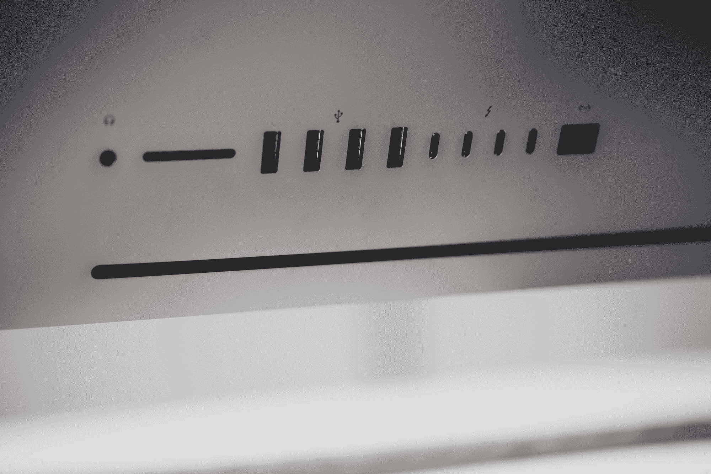
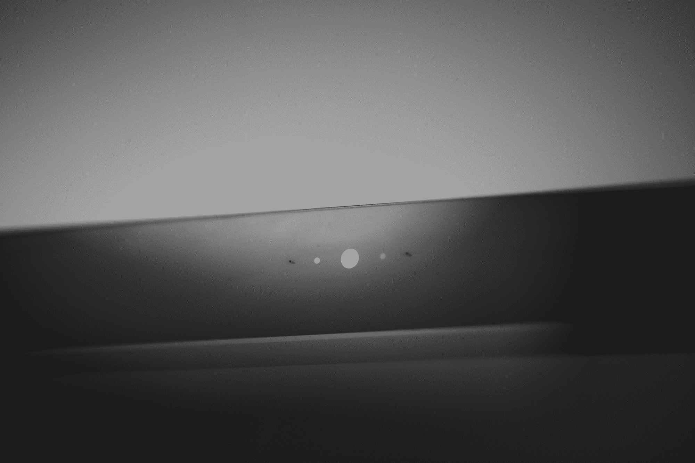
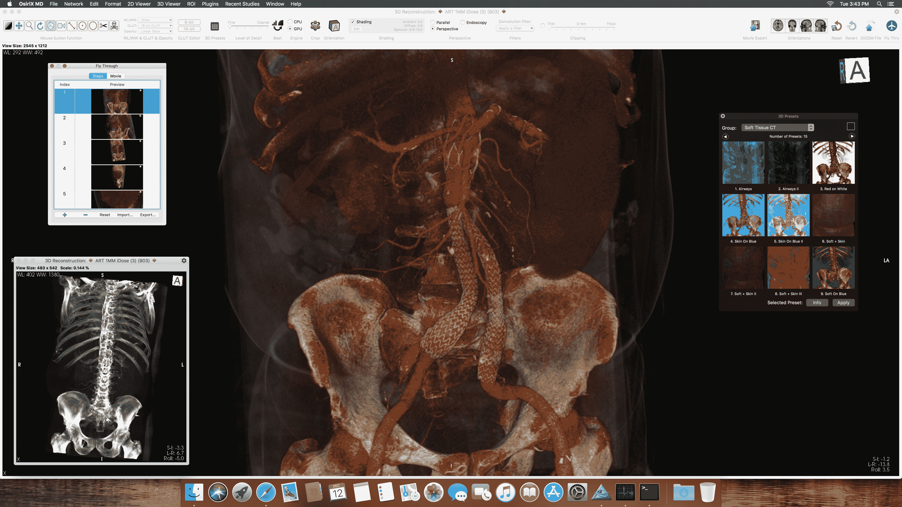

# 苹果的 iMac Pro 是给开发者的情书 

> 原文：<https://web.archive.org/web/https://techcrunch.com/2017/12/14/apples-imac-pro-is-a-love-letter-to-developers/>

iMac Pro 的存在是因为老化的 Mac Pro 下面和非常受欢迎的 MacBook Pro 上面有很多空气。只有个位数比例的 Mac 客户购买 Mac Pro，近年来，苹果看到各种肤色的“专业”客户购买 IMAC 的人数大幅增加，因为它们拥有令人难以置信的屏幕、一体式外形和整体易于部署。

鉴于人们对这款硬件更强大的电脑有如此大的胃口，而且苹果已经开始彻底重新考虑 Mac Pro，苹果决定看看 iMac 的性能在本质上与当前机器完全相同的外壳内会变得多么荒谬——有一层漂亮的颜色处理和一些额外的外观差异。

## Mac Pro 复位

你可能还记得，今年 4 月，苹果对其 Mac Pro 的失败异常坦诚。这种设计把它自己逼到了一个角落，需要回到第一步重新思考它的方法。在那次会议上，苹果高管在一次圆桌会议上说，他们也在重新思考成为 MAC 电脑的专业客户意味着什么。

“首先，当我们谈论专业客户时，重要的是要清楚并不存在一个典型的专业客户。Pro 是一个非常宽泛的术语，它涵盖了许多类别的客户。我们关心所有这些类别，这些客户需要各种不同的产品，”Schiller 说。

“有音乐创作者，有视频编辑，有图形设计师——这是 Mac 电脑的一个非常大的领域。科学家、工程师、建筑师、软件程序员——越来越多，尤其是我们在应用商店的应用开发。所以有很多很多东西和人被称为专业人士，专业工作流，所以我们应该小心不要过度简化，说‘专业人士想要这个’或‘不要那个’——这比那要复杂得多。”

苹果 iMac Pro

Schiller 说，15%的 Mac 用户每周多次使用专业应用程序，30%的用户以某种方式使用它们。这些专业人士中的大多数都使用 MacBooks。然而，iMac 开始被专业人士不成比例地使用，他们要么发现屏幕或外形引人注目，要么发现 Mac Pro 的更新速度停滞不前。

苹果公司的克雷格·费德里吉(Craig Federighi)表示:“如此多的客户转向 iMac，我们看到了通过下一代 iMac 解决越来越多发现自己受到 Mac Pro 限制的客户的途径，我们真的为此投入了大量精力。[但是，]虽然那个[升级的 iMac]系统对大量客户来说将是非常棒的，但我们想做得更多。”

即将推出的 Mac Pro 将会更受欢迎。但现在是 iMac Pro——这款机器将吸引那些寻找能够处理从渲染到医学成像到虚拟现实的苛刻任务的强大硬件的专业人士——但它也为苹果所有 Mac 的未来提供了一些线索。

## iMac Pro

我昨天在纽约看到了 iMac Pro 及其新的太空灰配件，以及一系列来自专业人士的演示，苹果在这些机器上播了几天种子，让他们感受一下会从它身上看到什么样的好处。

除了深灰色的表面之外，这台机器本身在物理上与当前的 iMac 非常接近。

后方港口肯定是不同的，当然。您有 4 个雷电 3 端口，它们运行在两个独立的控制器上，每个控制器有 2 个端口。因此，无论它们是用于 e-GPU 还是存储或显示，您都应该获得惊人的速度。有 4 个 USB 3.0 A 端口和一个 SD 插槽，并且有史以来第一次在背面有一个 10 千兆位以太网端口。

5k 显示器与当前 iMacs 附带的显示器相同。您可以为新机器订购 1、2 和 4tb 固态硬盘选项，用于存储。

另一个变化是，现在您可以将支架从 iMac 上完全拆下，然后由 VESA 安装。以前，你要么使用售后解决方案来安装 iMac，要么专门从工厂订购，去掉支架，以便安装。

苹果 iMac Pro 背部

## 配置

并非 iMac Pro 的每种配置都可以在今天在线订购，下周也可以在商店订购。您将能够获得 8 核和 10 核英特尔至强 W 版本，以及您喜欢的任何其他内存、显卡或存储选项，但 14 核和 18 核版本将于 1 月份推出。每个都有 1MB 的 L2 和 1.365MB 的三级缓存。

要明确的是:你可以订购 iMac 现在提供的任何选项，除了两个更高内核的处理器。事实证明，这并不是一个很大的限制，因为 10 核确实应该是最佳选择。10 核型号为单线程性能提供了 4.5GHz 的最高睿频速度，并支持超线程，允许一次运行 20 个线程。例如，这足以在 ProRes 4×4 中的 8k 红色武器镜头文件或 140 轨道逻辑文件上实现实时回放。

更高的内核选项最适合充分利用如此多的低频内核的应用。例如，机器学习或人工智能应用程序使用多个 CPU 内核来为 GPU 调度任务，或者为 iMac 现在支持的外部 GPU 提供渲染管道。

苹果 iMac Pro 相机

如果你不确定点什么，就选 10 核。您将能够将内存提升至 128GB(用户不可升级，但可在服务中心或商店升级)，并获得更强大的 Vega 64 显卡，最终获得一台令人印象深刻的机器。

Vega 56 和 64 选项绝对是 Mac 中有史以来最强大的显卡，我能够看到要求苛刻的虚拟现实应用程序，渲染任务和实时处理 3D 和视频，这在任何其他 iMac 硬件上都是完全不可能的——并且可以在我目前用于虚拟现实的相对强大的 PC 上运行。

这些新处理器还支持 AVX-512 指令，这将为多核 iMac Pros 的开发用户提供一个不错的“免费”性能提升，如果他们正在使用苹果库(或手动调用指令本身)。

然而，从整体角度来看，最有趣的硬件不是更奇特的图形或处理器选项，而是一种称为 T2 的系统控制器芯片。

## T2 和安全

T2 是当前 MacBooks 中 T1 芯片的迭代，但它将机器的更多功能带入了折叠中。它控制运行 1080p 摄像头的 ISP、包括 4 个麦克风和扬声器的音频控制器、SSD 控制器，以及重要的是，iMac Pro 中包含的 Secure Enclave。

SE 处理固态硬盘的实时自动加密。这意味着基于硬件的加密对 CPU 没有影响，这是 FileVault 一贯的妥协。如果您的 SSD 与 SE 分离，则无法读取它。如果您想要一个额外的保护层，您也可以使用 FileVault 将您的用户密钥注入到组合中，以防止目标磁盘访问。

T2 还从头到尾验证整个引导过程(可以禁用该选项)，从而在物理访问级别防止注入攻击。

T2 的附加安全层绝对是 Mac 系列的其余部分。顺便说一下，这是个人预测。苹果不肯说。但是废话。然而，令我震惊的是，这种更强大的安全性内置了对复杂攻击者的保护，将在政府或研究应用中非常受欢迎。如果我是一个有高度安全需求的买家，我会选择 issa bulk buy。

这就引出了真正的问题。

## 客户是谁？

苹果公司准备的演示讲述了他们向谁推销这款机器的故事。四个不同的 VR 应用程序，几个渲染繁重的工作流，这些工作流在 iMac Pro 上从几分钟或几小时的等待升级到了实时，一个由一堆同时运行的多设备模拟器组成的会话，这些模拟器运行在 Windows 和 OS X 机器模拟器上的浏览器测试之上，同时从源代码编译 Linux 没有一个风扇在旋转。

Survios 展示了其在 Vive 上的音乐创作/节奏游戏混合体 Electronauts，它在今年早些时候通过 Steam 增加了支持。在 Mac 上使用该领域最好的开发者之一开发的成熟的虚拟现实应用是一种享受。我在 iMac 上运行过虚拟现实系统，这从来都不是一次愉快的经历。现在坐在办公桌前，我的腿右侧有一整个 PC 塔，几乎完全是为了支持我运行的多个耳机。对我来说，能够回到单机游戏和 VR 将是非常棒的。但是，更重要的是，iMac Pro 现在突然成了 VR 开发者的可行选择。

3D 设计工具[重力草图](https://web.archive.org/web/20221005152036/https://www.gravitysketch.com/)的 Oluwaseyi Sosanya 指出，这在混合管道环境中变得很重要。因为他们超级专注于支持汽车行业，他们习惯了设计师不得不离开 Mac 跳到他们的建模工具，然后回到他们喜欢设计的 Mac。iMac Pro 填补了这一空白，使设计师更容易采用数字建模工具，这些工具通常依赖于插入到流程中的 PC 工作流。

来自 4D[电影院](https://web.archive.org/web/20221005152036/https://www.maxon.net/en-us/products/overview/)的一些人在现场谈论将外部 GPU 堆叠到 Thunderbolt 阵列上，提升和降低场景的复杂性，使他们能够在真实的渲染视口中工作，只需要几秒钟就可以获得可用的帧，几分钟就可以以生产质量显示——这通常需要运送到渲染场等待。

建筑场景的实时和近实时[渲染](https://web.archive.org/web/20221005152036/http://www.twinmotion.com/)，医学成像和[数字合成](https://web.archive.org/web/20221005152036/https://theblog.adobe.com/get-the-goods-announcing-updates-to-photoshop-cc-dimension-cc-and-more-today/)也展示了机器的强大。

奥西里克斯医学博士

我对这些信息很感兴趣。很明显，这是一封写给开发者的情书。我认识的大多数 Mac 和 iOS 开发人员都使用 iMacs 或 MacBook Pro 机器——尤其是考虑到 Mac Pro 目前存在的局限性。鉴于苹果公司表示 Mac Pro 将专注于“模块化”，我认为 iMac Pro 将成为这一代最强大的一体机之一。

这里没有任何建议等待软件开发人员。我真的相信 Mac Pro 会比前几代产品更偏向于工业化。价格与自建选项相当，而且你不会像 T2 那样拥有苹果的一体化系统。虽然价格标签不是开玩笑的——4999 美元起——但对于医疗和专业行业来说，这只是沧海一粟。对于寻求更高精确度的外科医生来说，一个 700 美元的 OsiriX 座位和一台 iMac Pro 可以将 CAT 扫描的切片叠加到处于困境的血管系统的实时 3D 模型中。

当然，苹果自己的数据支持 Mac Pro 下面有一大块露天空间，即使是在它最新的时候。

所有的基准测试和真实世界的压力测试将会告诉我们 iMac Pro 兑现承诺的情况，但迄今为止，苹果似乎有一款强大的新机器来填补 Pro 的漏洞。