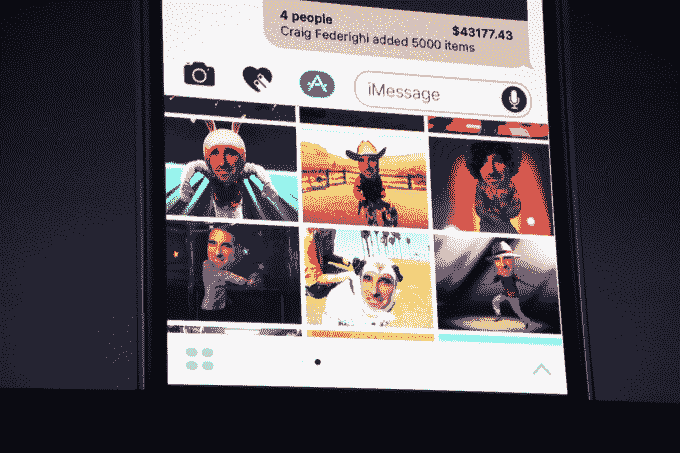
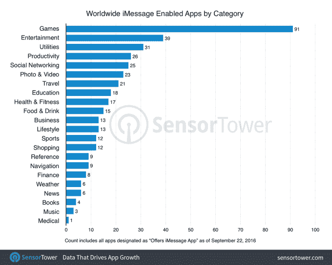
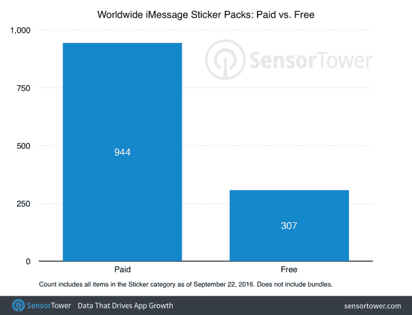

# 苹果的 iMessage 应用商店已经有超过 1650 个应用，大部分是贴纸包

> 原文：<https://web.archive.org/web/https://techcrunch.com/2016/09/23/apples-imessage-app-store-already-has-over-1650-apps-majority-are-sticker-packs/>

在短短一周多的时间里，苹果的 iMessage 应用程序商店已经增长到超过 1650 个应用程序和贴纸包——超过了第一代 iPhone 在[发布](https://web.archive.org/web/20230324151511/http://appleinsider.com/articles/08/07/10/apples_app_store_launches_with_more_than_500_apps)时的数量以及 iPad 首次亮相时的 1000 个，但远远低于去年[手表应用程序商店的 3500 多个。](https://web.archive.org/web/20230324151511/https://techcrunch.com/2015/04/27/apple-boasts-over-3500-apple-watch-apps-already-available/)根据来自 [Sensor Tower 的一份新报告，](https://web.archive.org/web/20230324151511/https://sensortower.com/)最受欢迎的迷你移动应用是“贴纸包”——该公司表示，该商店包括 1251 个这种应用，以及 402 个其他非贴纸 iMessage 应用。

iMessage 应用商店是苹果建立一个平台的最新尝试，该平台允许第三方开发者向规模庞大的 iPhone 用户群营销他们的软件。它出现在最初的 iOS 应用程序商店变得如此混乱，充斥着过时和废弃的应用程序——以至于苹果实施了整个商店的清理过程，这可能会影响成千上万的应用程序。

与此同时，iMessage 应用商店反映了用户寻找和使用应用程序方式的转变。

许多人不是寻找独立的应用程序贴在主屏幕上，因为它们经常被遗忘，而是寻找附加程序来增强他们的移动通讯体验。迄今为止，这已经包括了从定制键盘到帮助你更容易地给你的信息添加味道和幽默的应用程序，如分享 gif、表情符号、贴纸等的应用程序。

此外，目前 App Store 上一些最受欢迎的应用程序是那些在自己的墙内提供更丰富的信息体验的应用程序，例如 Facebook Messenger(排名第三的免费应用程序)、Snapchat(排名第五)或 WhatsApp(排名第十五)。

苹果希望通过上周与 iOS 10 一起推出的改版 iMessage 应用程序，更好地迎合这一信息受众。

新的 iMessage 将短信应用程序变成了一个平台，并引入了许多新功能，如让你用动画和声音装饰屏幕的效果，用“隐形墨水”像素化消息，链接预览，手写笔记，通过点击快速回复，表情符号建议等等。

不过，它最大的特点是向应用程序开放了平台。

尽管这是一种与应用互动的新方式，但新的应用商店已经反映了我们在更广泛的应用市场中看到的趋势——即游戏仍然占据主导地位。

根据 Sensor Tower 的数据，在新店面的 402 个非贴纸应用程序中，最大的类别是游戏。目前已经有 92 款游戏可供下载，几乎是第二大类别娱乐类(39 款)应用数量的 2.5 倍。

排在前十位的是公用事业(31)、生产力(26)、社交网络(25)、照片和视频(23)、旅游(21)、教育(18)、健康和健身(17)以及食品和饮料(15)。

有趣的是，新闻应用程序非常少，目前只有 6 个。例如，这与 Facebook Messenger 非常不同。根据 Messenger 负责人 David Marcus 最近在 TechCrunch Disrupt 上的发言，新闻机器人是其聊天平台上表现非常好的类别之一。根据机器人追踪网站[僵尸列表](https://web.archive.org/web/20230324151511/https://botlist.co/platforms/13-messenger?category=24)的说法，已经有几十个这样的程序可用。

然而，贴纸比应用程序更受欢迎，也是开发者创收的最可靠方式。在 1，251 个贴纸包中，944 个是付费下载，307 个是免费的。

大多数(86%)价格为 0.99 美元，而一些价格为 1.99 美元(12%)，更少的价格为 2.99 美元(1%)。最贵的一包——只有一包——定价 3.99 美元。

虽然对 iMessage 应用商店的初步调查有助于描绘出开发者正在开发的东西，但这并不能表明消费者实际上正在下载哪些应用。随着越来越多的人升级到新的 iPhones，用新的操作系统更新他们当前的设备，并发现 iMessage 应用程序的世界，这些数据将会及时出现。

第三方应用情报公司，如 [Sensor Tower](https://web.archive.org/web/20230324151511/https://sensortower.com/) 或 [App Annie](https://web.archive.org/web/20230324151511/http://www.appannie.com/) ，也必须及时将 iMessage 应用下载整合到他们的情报产品中，以帮助行业更好地了解应用的受欢迎程度和吸引力——特别是因为该商店目前没有“排行榜”部分。随着开发者自己看到受众的反应，可用应用的选择也会及时调整。