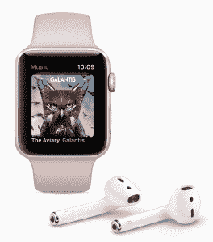

# 苹果支持 LTE 的手表可能成为可穿戴设备的分水岭

> 原文：<https://web.archive.org/web/https://techcrunch.com/2017/09/12/apples-lte-enabled-watch-could-be-a-wearable-watershed-moment/>

苹果的 Series 3 智能手表从外面看上去可能与上一代产品一样(尽管有一个新的陶瓷灰色选项和对比鲜明的红色数字表冠)，但它们的内部可能有助于将有点沉闷的可穿戴类别推向高潮。需要说明的是，苹果并不是第一个将蜂窝连接应用到智能手表中的公司，但它是第一个将蜂窝连接应用到好的智能手表中的公司。

Apple Watch 仍然是一款让我百感交集的设备，尽管我通常每天都戴着它。这并不像智能手机那样必不可少，但在一些关键情况下，它可以节省时间和压力，尤其是如果你的工作需要与时俱进的话。不可否认，如果你经常跑步、训练或旅行，这是非常有用的。

当手表首次推出时，苹果面临着很多批评，尽管随后对软件体验的反思使事情有了很大改善，但它仍然没有受到其产品线中其他产品的频率和强度的称赞，特别是 iPhone。

但是如果你在其他可穿戴设备上花了很多时间，你就会开始意识到最初的 Apple Watch(以及 Series 2，推而广之)实际上有多正确。它勾选了 Android Wear 或三星竞争对手不太经常检查的基本框，包括通知和心率跟踪等基本功能。

蜂窝连接可能最终不会真正增加拥有苹果手表的体验——例如，它不会成为你唯一的设备，完全取代 iPhone。但它将支撑手表的一些剩余限制，并可能扭转对该设备的整体情绪。

苹果选择强调新的系列 3 和蜂窝将提供连续访问苹果音乐流媒体的方式，这意味着你可以在苹果音乐上获得任何歌曲的流媒体，并通过一个新的专用广播应用程序访问苹果音乐电台，尽管这两个功能都被列为“今年秋天晚些时候”推出。

不管他们什么时候来，他们都会来，这将支持当前的不太理想的体验，即在旅行中不带手机时试图在 Apple Watch 上听音乐。尽管在 watchOS 的最新主要版本中引入了自动隔夜播放列表同步等修复功能，但它仍然是整体使用中最令人沮丧的部分之一。

可通过持续数据连接获得的通知也是 iPhone 的一大优势——易用性，以及在不连接时使用 Siri 的能力。苹果基本上每天都会增加数百个手表的可用用例，这取决于你出门拿东西、去开会或出差的频率，如果这是一个实用的选择的话。

健康功能，包括苹果正在使用内置心率监测器来识别心律失常和其他与心率变化有关的潜在问题，也将受益于独立的数据连接，因为这意味着这些信息可能会触发行动，即使用户不在手机旁边。当你在锻炼时遇到医疗问题时，我们可能仍然离你的手表发出紧急呼叫还有一段距离，但这是朝着那个方向迈出的潜在一步。

同样，苹果并没有通过在可穿戴设备中加入 LTE 连接来开辟新的领域，但正如它过去所做的那样，它可以采用一种已知的方法，创造出更好的产品体验，因为它拥有独特的设计和实施视角和方法。但如果它确实提高了人们对这一类别的兴趣，并为其他人展示了一条可循之路，那么你可以打赌，业内其他人将很快追随这款手表的脚步，重返这个现在往往被忽视的市场。