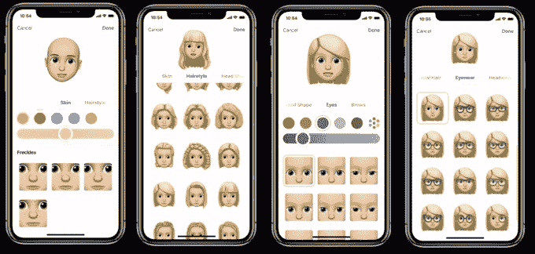
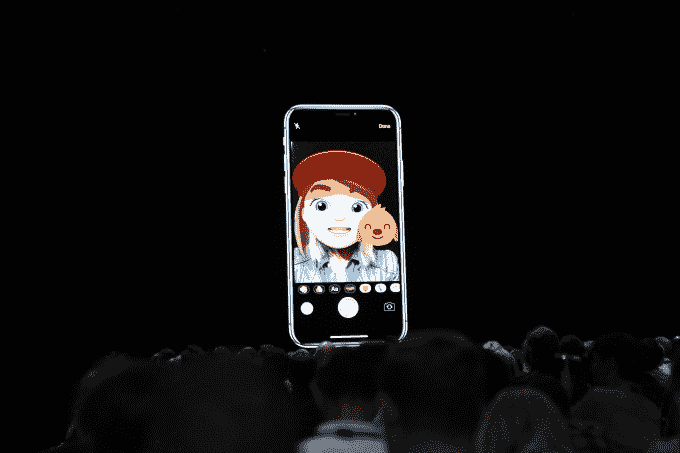

# 苹果的 Memoji 给你的 iPhone 带来了一个动画的你

> 原文：<https://web.archive.org/web/https://techcrunch.com/2018/06/04/apples-memoji-brings-an-animated-you-to-your-iphone/>

# 苹果的 Memoji 给你的 iPhone 带来了一个动画的你

苹果今天展示了 Animojis 的重大更新，在愚蠢的 iPhone X 动物上添加了一个名为 Memoji 的人类外观和舌头检测。

该公司的 Animoji 功能是 9 月 iPhone X 发布会的一大亮点。憨态可掬的卡通猪和鸡利用手机新的前置摄像头阵列来跟踪用户的面部，并以有趣的方式传递记录的信息。

自最初推出以来，该公司在动画剧目中又增加了几个角色；今天是它们在外观和操作方式上的第一次重大改变。

 该公司今天宣布将增加幽灵、考拉、老虎和霸王龙 Animojis(带舌头追踪！)，但更有趣的是该公司添加了 Memoji，这是一个定制的 Animoji 工具，允许用户构建自己的更类似于三星 Galaxy S9 的功能。

你将能够定制你的脸到一个几乎惊人的细节数量，不仅仅是发型的改变，允许用户输入大量的细节。

它的设置很像 Bitmoji，但采用了 Animoji 实时面部跟踪的魔力，来提供一些非常有趣和多样化的体验，这些体验可以存在于消息中，也可以通过相机应用程序直接转换到你的脸上。

