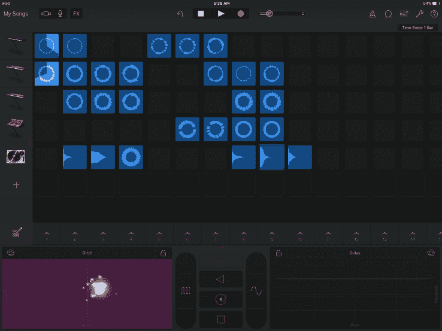
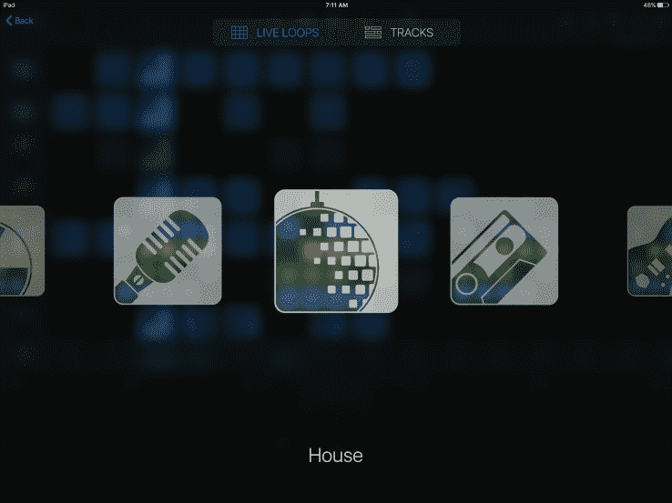
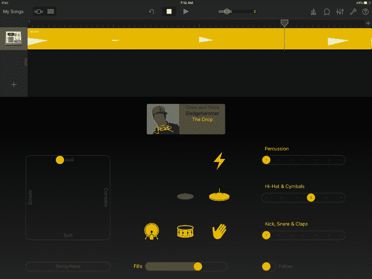
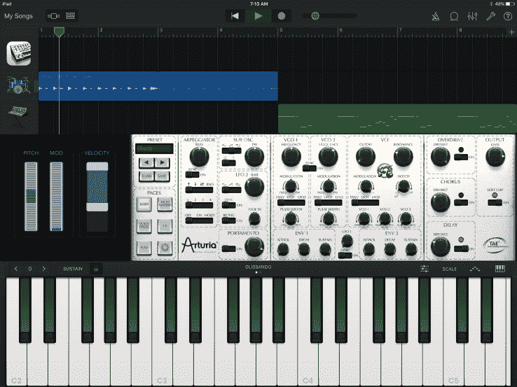

# 苹果新推出的 iOS 版 GarageBand 是电子音乐人的梦想

> 原文：<https://web.archive.org/web/https://techcrunch.com/2016/01/20/apples-new-garageband-for-ios-is-an-electronic-musicians-dream/>

GarageBand 一直对为他的原声吉他演奏添加音轨的人或希望定制他们的重金属音乐的乐队有着明确的吸引力，但对电子音乐爱好者来说，该应用程序以前并没有太多的街头信誉。

今天，苹果发布了一个巨大的 iOS 版 GarageBand 更新，它对新手(比如我自己)来说更有吸引力，并且由于增加了音频单元和制作节拍的新功能，无疑会更受电子音乐人的欢迎。

这个节目真正的明星是一个名为 Live Loops 的功能，它给了你一种全新的制作音轨的方式，这种方式更有利于建立电子果酱的任务。基于网格的界面允许用户突出显示不同的细胞，以创建您可以无限定制的恒星声音样本。结果是一种鼓机式的体验，这是一种爆炸式的体验，我敢打赌，你会在未来的更多派对上看到这种体验，比你想象的要多。

当你最初打开 Live Loops 时，苹果已经预装了一整套用于各种声音分类的循环，其中包括 EDM、Hip Hop、Dubstep、House 和 Beat Masher 模式(以及其他模式)，所以是的，苹果肯定希望通过这个版本向电子艺术家展示一些爱。股票样本听起来很棒，但过一会儿你会想更深入。这可能意味着从数百个预先制作的循环中交换出来，或者用内置键盘创建自己的循环。

一旦你选定了一些样本，并且习惯了使用同步循环栏，FX 面板就是你为你的音轨添加炒作的地方。触摸控制使添加抖动、混响或重复效果变得轻而易举，也让我回忆起回到拉斯维加斯 CES afterparty 的时光，即在摇头晃脑的同时，一边极客地享受酷酷的技术，一边说“doooope”。

应用程序中的一些功能似乎是专门为一些主要的 EDM 表演设计的。其中一个按钮可以让你通过移动设备本身来控制 FX。使用加速度计来控制旋转的轨道过滤器似乎是免费的，因为它确实是，但它更多的是在炫耀“是的，这听起来很棒，不是吗？”算是吧。

现场循环是你必须更多地去看才能完全体验的东西。在我习惯新 GarageBand 的布局时，我有一些时间亲自动手操作，所以请查看下面的视频，了解该版本制作样本的新风格。

当涉及到制作循环时，这个新的 GarageBand 版本还包含了一个名为 drummer 的新功能，可让您添加一个具有自己签名声音的虚拟会话 Drummer。鼓手有自己的名字和音乐风格，因此有些人更适合 EDM，而其他人则带来经典的摇滚氛围。你可以定制他们的声音，所以如果你想更多地探索他们独特的艺术风格，你可以给“Jasper”和“Dez”带来更多的深度。

自从几个月前被取笑以来，更严肃的音乐家一直期待的一件事是为 iOS 版 GarageBand 添加音频单元。该功能允许您输入第三方插件，以其他平台独有的方式处理声音。在测试新的实时循环功能时，我添加了一个在 Arturia iSEM 电子合成器上创建的循环，并且能够没有太多麻烦地完成。

这种体验当然是为 iPad Pro 优化的，但所有这些详细描述的功能都可以在不太大的 iPad 和 iPhones 上使用(只要它们运行的是 iOS9)。Live Loops 实际上是一个很好的界面，尤其是对于像 iPhone 这样的小设备。当你在 iPhone 上导航时，GarageBand 的轨道布局有时会感觉很拥挤，它一直被宣传为移动编辑的工具，可以在旅途中播放，但通过 Live Loops，你可以在 iPhone 上创建一些很酷的东西，并在以后的任何其他苹果设备上打开它，这要感谢 iCloud，并继续制作。

GarageBand 一直是一个对严肃音乐人有很大吸引力的平台。虽然有些人可能喜欢更“严肃”的音频制作软件，如 Logic，当他们寻求真正精细的专业曲目时，这个有 11 年历史的音乐程序已经在艺术家和临时创意人员中占据了一席之地。

虽然 GarageBand 更传统的轨道布局对于即兴演奏或制作粗糙的剪辑来说是一个爆炸，但带有实时循环的 iOS 版 GarageBand 可能更像是一个派对，并且最终对那些音乐天赋有限的人来说更加友好。这款应用预装在内部空间为 32gb 或更大的 iOS 设备上，我预计会有相当多的人因为这些漂亮、恶心的新功能而给这款软件一个机会。

GarageBand 现在可以在 App Store 中免费升级，并且兼容任何可以运行 iOS 9 的设备。