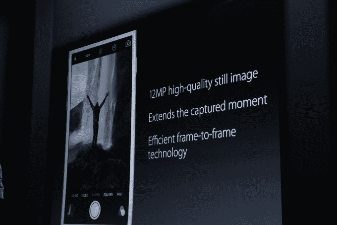
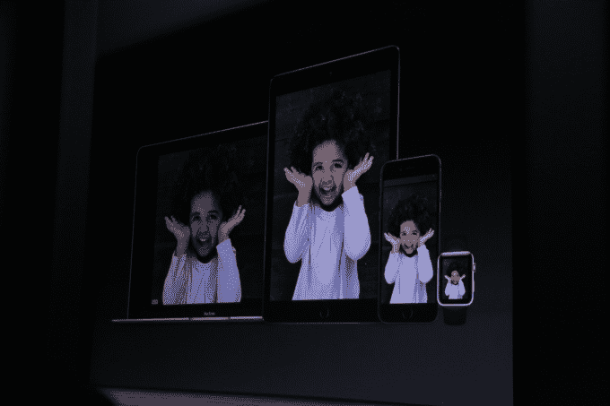

# 苹果新 iPhones 让你拍出类似哈利波特的动画照片 

> 原文：<https://web.archive.org/web/https://techcrunch.com/2015/09/09/apples-new-iphones-let-you-snap-harry-potter-like-animated-photos/>

随着新的 iPhone 6S 和 6S Plus 智能手机的推出，苹果今天展示了一种用这些设备拍摄照片的新方法，它称之为“实时照片”该功能利用了设备对 Force Touch 的支持，可以让您拍摄照片，然后像 gif 一样制作动画。也就是说，这些图像看起来是静止的，但是当你按下它们时，它们就开始动起来了。

听起来熟悉吗？应该是——不仅仅是因为这些照片给人的哈利波特般的感觉。

事实上，这种功能的想法在其他智能手机中也出现过。你可能还记得，诺基亚去年在 Lumia 930 上的诺基亚相机应用中引入了一个类似的功能，[称之为“活图像](https://web.archive.org/web/20221224151710/http://lumiaconversations.microsoft.com/2014/04/15/relive-those-moving-moments-with-nokia-living-images/)

尽管相似，苹果的实现意味着该功能有机会被更广泛地采用。正如该公司今天不那么谦虚地吹嘘的那样，iPhone 的增长速度是业内其他产品的 3 . 5 倍，其最新型号 iPhone 6 是有史以来最受欢迎的。

Live Photos 是一种对那些希望从照片中获得更多乐趣的人有吸引力的附加功能，尤其是年轻用户。动画 gif 在这些人群中仍然非常受欢迎，他们定期在 Tumblr 和 Twitter 等社交网络上发布这样的图片。甚至脸书今年也屈服了，[最终允许用户在他们的时间线上发布 gif](https://web.archive.org/web/20221224151710/https://techcrunch.com/2015/05/29/facebook-confirms-it-will-officially-support-gifs/)。

小一点的孩子也会喜欢这个，现在又有了一个乞求玩爸爸妈妈的 iPhone 的理由。苹果的演示中包括一个孩子，这肯定不是巧合。

但是苹果的现场照片并不是真的 gif。相反，它们是由独立的 12 MP 高质量静止图像组成的动画。(同时，gif 通常是低分辨率的东西。)苹果公司解释说，这些图片采用了高效的帧间技术，旨在以一种新的方式延长捕捉到的瞬间。它们介于静态照片和视频之间。如果有什么不同的话，这很像是在连拍模式下浏览你拍摄的照片。

要拍摄实时照片，您需要像平常一样拍照。iOS 9 会在你的快照两边自动捕捉一秒半的动画。现场照片也将包括运动和声音。

在你创建了一张实时照片后，你可以将它设置为你的锁屏壁纸，这要归功于新款 iPhones 对动画壁纸的支持。

苹果没有提到用户如何分享他们捕捉到的实时照片，但其 iPhone 6S [产品页面](https://web.archive.org/web/20221224151710/http://www.apple.com/iphone-6s/cameras/)确实表明这项技术目前存在局限性。该网站指出，“你也可以在其他苹果设备上观看实时照片。”然而，没有提到能够分享给那些拥有其他智能手机或社交媒体的人。

