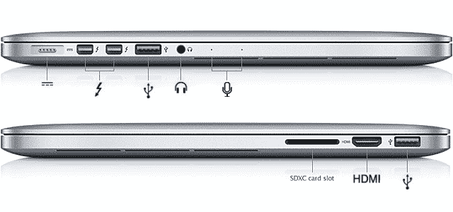
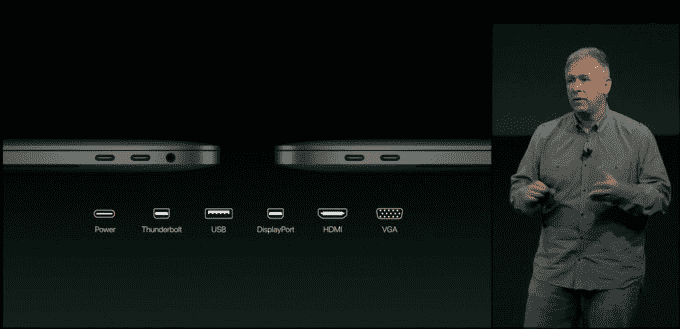

# 苹果的新 MacBook Pro 取消了你可能需要的大部分端口

> 原文：<https://web.archive.org/web/https://techcrunch.com/2016/10/27/apples-new-macbook-pro-just-killed-off-most-of-the-ports-you-probably-need/>

苹果刚刚[推出了](https://web.archive.org/web/20230322160429/https://techcrunch.com/2016/10/27/return-of-the-mac/)一款闪亮、超薄的新款 MacBook Pro。但是对于诞生的东西来说，许多广为接受的标准必须消亡。

今天，苹果移除了 MagSafe 2 充电端口类型，他们剥离了 HDMI 端口，他们撕掉了 SD 卡插槽，他们关闭了 Thunderbolt 2 端口(你可能会使用三次)，他们最明显的是取消了标准 USB 端口。所有这些端口，为数据传输和你可能使用的大多数东西充电，已经被四个雷电 3/USB-C 端口取代。令人惊讶的是，苹果公司的人认为在新型号上给耳机插孔一个暂缓执行的机会是合适的。

2014 MacBook Pro

抱怨苹果在连接类型方面牺牲了现有的消费者需求变得相当令人厌倦。大多数都很有道理，一般来说，当该公司取消专有标准时，它基本上是唯一一个推动的人。参见:火线或霹雳 2。其他一些问题，比如在新的 iPhone 7 上失去耳机插孔，或者在新的 MacBook 上放弃旧的 USB，在用户中引起了更大的骚动，他们不喜欢随时需要一个加密狗来连接他们的设备和他们需要的东西。

但是，即使耳机插孔的死亡，苹果也做出了更广泛的声明，它相信大多数耳机制造商将很快采用蓝牙并设计无线耳机。对于这款 MacBook Pro，苹果仍然认为人们需要所有这些其他端口(见下面的幻灯片)，他们似乎并不在乎消费者需要购买一个单独的配件来实现这一点。

苹果在这方面确实有优势，因为 USB-C/雷电 3 更紧凑的设计和更快的传输速度，它们永远是未来的发展方向。USB-C 和雷电 3 是具有相同物理端口的不同连接标准。这是一个重要的注意事项，因为虽然 MacBook Pro 端口与这两种类型都兼容，但普通 MacBook 只与 USB-C 接口。

这种优越感的理由可能听起来有点不满意 MacBook 的买家，当苹果在 Thunderbolt 2 端口上浪费空间时，他们不得不听到完全相同的推理，这些端口最终只被少数高端外设采用，但这一次苹果不是唯一一个引领 USB-C/雷电 3 革命的人，所以这可能会看到不同的结果。

这并没有让拥有大量设备(许多是苹果制造的)的消费者变得更容易，他们现在需要一个加密狗来连接他们的“专业”电脑。

大多数用户为新 MacBook 上的单一 USB-C 端口辩护的理由是频率问题。在 Airdrop 和 Dropbox 盛行的时代，你真的需要多长时间才能把东西插到笔记本电脑上？但如果是这样的话，为什么还要在 MacBook Pro 上给消费者四个呢？嗯，理论上因为 Pro 是给“超级用户”用的。

但对于所有喜欢在备受吹捧的新 Touch Bar 上编辑内容的 Final Cut X 和 Logic power 用户来说，有多少人最终会使用不会很快更新到 USB-C 连接的经典外设来创建内容？

对于专业人士来说，端口不只是装饰门面，它们是必要的连接，无论您在哪里旅行，它们都可以让您自由地即插即用新工具。有多少电影制作人会尝试在投影仪上展示他们正在制作的项目，并不得不询问是否有人有加密狗，以便他们可以连接到 HDMI？既然 MacBook Pro 已经放弃了 SD 卡插槽，那么有多少摄影师将无法使用兼容的读卡器呢？如果没有 25 美元的新线缆，人们甚至无法将他们的 iPhones 与苹果的旗舰笔记本电脑进行物理连接。

这些最终可能只是成长的烦恼，随着雷电 3/USB-C 标准的采用，这些烦恼将会消退，但在如此少的设备使用这一标准的情况下全身心投入真的很烦人。隐晦地暗示，当苹果在几年后推出另一款 MacBook 时，USB Type-A、HDMI 端口或 SD 卡将会过时，这实在是可笑。

苹果一直被指责在放弃传统技术或接受新标准的决定上傲慢自大。他们已经开始将这种批评歪曲成勇气的宣言。不同的是，在过去的事件中，苹果基本上只是将新兴的连接类型与旧的备用连接类型结合在一起，但很大程度上由于苹果的产品迅速变得比端口类型本身更薄，该公司正在抛弃消费者需要的东西，并改变其对连接标准的理念，这似乎从根本上对消费者不友好。