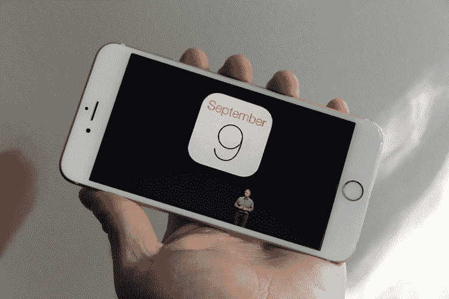

# 据传苹果下一代 iPhone 将于 9 月 9 日亮相 

> 原文：<https://web.archive.org/web/https://techcrunch.com/2015/08/07/apples-next-iphone-rumored-to-debut-on-september-9th/>

# 据传苹果的下一代 iPhone 将于 9 月 9 日首次亮相

我不是一个喜欢打赌的人——但是如果有人说“快！苹果什么时候会公布下一代 iPhone？!"我想是九月。这就是…他们所做的。

果然不出所料:谣言四起，下一次公告将于 9 月 9 日发布。

虽然还没有发出官方邀请，但是通常被认为是正确的约翰·帕茨科夫斯基说苹果正在计划 9 月 7 日的活动，目前看来最有可能是 9 日。

他们会在这个特别的活动上宣布什么？

iPhone 6 于 2014 年 9 月公布。

iPhone 5s 于 2013 年 9 月公布。

iPhone 5 于 2012 年 9 月公布。

你可以明白我的意思。如果苹果要在 2015 年推出 iPhone，可能会在 9 月份。

这些日期也与之前的传言一致，即苹果正在为九月的 AppleTV 发布会做准备，推迟了据说原本计划在 WWDC 的发布会。