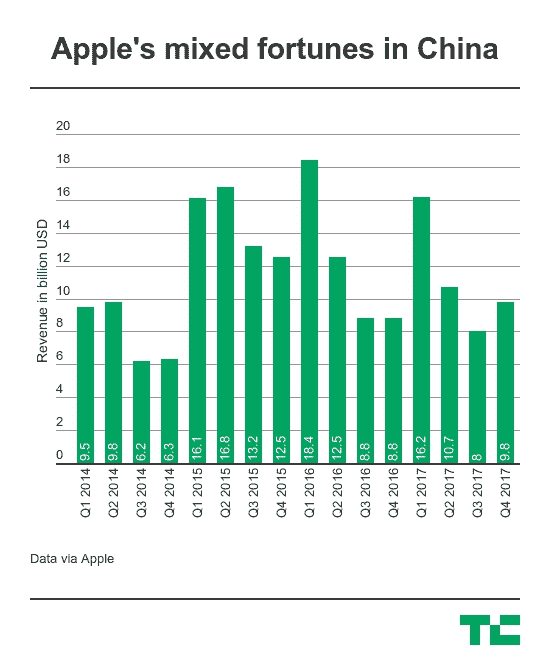

# 苹果在中国的收入再次增长 

> 原文：<https://web.archive.org/web/https://techcrunch.com/2017/11/03/apples-revenue-is-growing-again-in-china/>

# 苹果在中国的收入再次增长

苹果的重磅炸弹 Q4 [将该公司的估值推至 9000 亿美元](https://web.archive.org/web/20221006020539/https://beta.techcrunch.com/2017/11/02/apple-briefly-taps-900b-after-a-blowout-fourth-quarter/)，但它也见证了该公司在过去几年充满挑战的关键市场中国恢复增长。

[分析师已经报告称，苹果上个季度在中国的出货量增长了 41 %,但现在该公司最新的财务报告证实收入也有所增加。苹果公司定义的大中华区(包括中国、香港、新加坡和台湾)的总销售额同比增长 12%，达到 98 亿美元。这一数字比上季度增长了 22%。](https://web.archive.org/web/20221006020539/https://beta.techcrunch.com/2017/10/30/iphone-8-launch-propels-apple-to-growth-in-china/)

iPhone 销量的增长得益于新发布的 iPhone 8，[首席执行官蒂姆·库克在收益电话会议上告诉投资者](https://web.archive.org/web/20221006020539/https://www.imore.com/apple-earnings-q4-2017)苹果在本季度销售了创纪录数量的 MAC 电脑。同样，苹果在全球范围内取得巨大进步的服务行业的收益也创下了历史新高。

“我们在本季度增加了 iPhone、Mac 和 iPad 的市场份额。本季度，Mac 和中国的服务收入创下历史新高。我们的 iPad 收入增长非常强劲。我们的 iPhone 销量实现了两位数的增长，升级用户和安卓用户在本季度同比都有所增加。所以结果是广泛的，”库克在回答一个问题时说。

虽然增长当然是积极的，但苹果在中国的收入仍低于两年前的峰值，当时 iPhone 6 和 iPhone 6 Plus——该公司的第一款平板电脑大小的设备——帮助收入跃升至 125.1 亿美元。

分析师对 iPhone X 在中国的影响不太确定。虽然它的设计代表了与其他设备的明显区别，并强调奢华，这一点在苹果以前的手机中得到了很好的体现，但对于最便宜的机型 1000 美元的起价和限量供应是否会对苹果有利，人们有不同的看法。

“苹果不太可能在第四季度保持这种增长，”[科纳仕公司分析师莫佳本周早些时候在](https://web.archive.org/web/20221006020539/https://beta.techcrunch.com/2017/10/30/iphone-8-launch-propels-apple-to-growth-in-china/)表示。“尽管 iPhone X 将于本周发布，但它的定价结构和供应仍在抑制。iPhone X 将享有健康的灰色市场地位，但其受欢迎程度不太可能在短期内帮助苹果。”