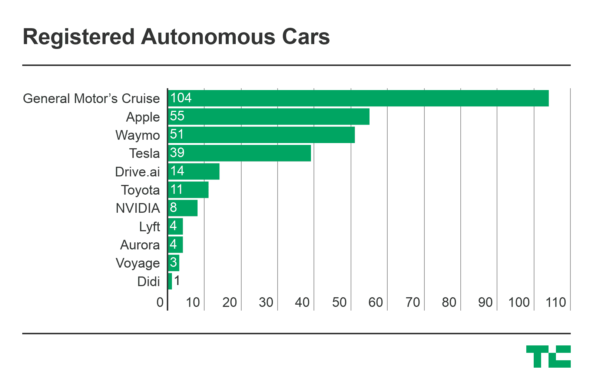
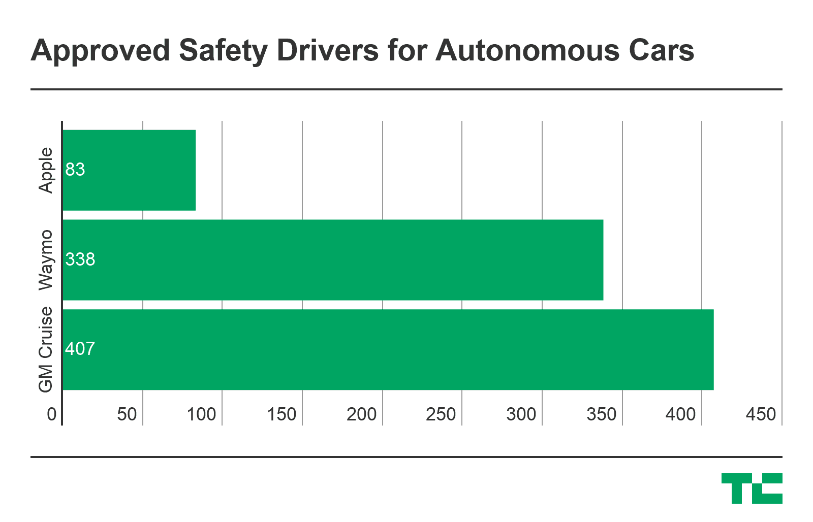

# 苹果无人驾驶车队在加州增至 55 辆 

> 原文：<https://web.archive.org/web/https://techcrunch.com/2018/05/14/apples-self-driving-car-fleet-grows-to-55-in-california/>

# 苹果无人驾驶车队在加州增至 55 辆

苹果现在有 55 辆无人驾驶汽车在加州机动车辆部注册，相比之下，今年早些时候有 27 辆，去年只有 3 辆。这意味着苹果在加州拥有第二大无人驾驶车队， [Mac 报道首先指出](https://web.archive.org/web/20221206204015/https://macreports.com/apple-again-grows-its-california-self-driving-fleet/)。

根据加州车管所的数据，苹果现在注册的汽车数量超过了 Waymo，后者有 51 辆。然而，通用汽车公司的 Cruise 以 104 辆位居榜首。总的来说，DMV 已经向 53 家公司提供了包括安全驾驶员在内的自动驾驶汽车许可证，导致总共 409 辆汽车和 1573 名安全驾驶员。

需要明确的是，上面列出的公司只拥有测试配备安全驾驶员的自动驾驶汽车的许可。截至目前，DMV 还没有发放任何完全无人驾驶测试的许可。为了进行无人驾驶测试，公司必须事先在受控条件下测试过车辆。

这些车辆还必须符合 SAE 级或 5 级车辆的定义。DMV 发言人告诉 TechCrunch，DMV 目前正在审查两份无人驾驶测试许可申请。

