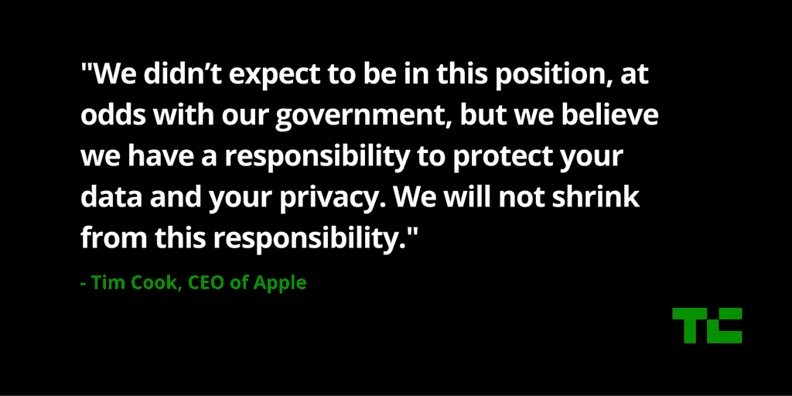

# 苹果公司的蒂姆·库克谈到 iPhone 解锁事件:“我们不会逃避这一责任”

> 原文：<https://web.archive.org/web/https://techcrunch.com/2016/03/21/apples-tim-cook-on-iphone-unlocking-case-we-will-not-shrink-from-this-responsibility/>

# 苹果公司的蒂姆·库克在 iPhone 解锁事件上说:“我们不会逃避这一责任。”

蒂姆·库克用一句令人惊讶的话开始了苹果的发布会。在宣布现在有 10 亿台活跃的苹果设备后，苹果首席执行官接着谈到了与联邦调查局的持续冲突。

“我们为你们——我们的客户——制造了 iPhone。我们知道这是一个非常个人化的设备，”库克说。“对我们许多人来说，iPhone 是我们自身的延伸。”

苹果已经明确表示，该公司不想解锁圣贝纳迪诺案件中涉及的 iPhone 5c，因为这将危及数百万用户的隐私。FBI 的后门是一个安全漏洞，黑客可以利用它。

“一个月前，我们邀请全国各地的美国人加入对话。我们可以决定作为一个国家，政府应该对我们的数据和隐私拥有多大的权力，”库克说。

通过[发布一封信](https://web.archive.org/web/20221206041006/http://www.apple.com/customer-letter/)，苹果在这个问题上采取了强硬的立场。在过去的一个月里，这已经成为公众辩论的一部分，该公司将于明天在加州举行首次听证会。

“对于我们从全国各行各业的美国人那里获得的大量支持，我深感谦卑和感激。我们没想到会与我们自己的政府发生争执，但我们坚信，我们有责任帮助你保护你的数据和隐私，”库克说。“我们欠我们的客户，我们欠我们的国家。这是一个影响我们所有人的问题，我们不会逃避这一责任。”

