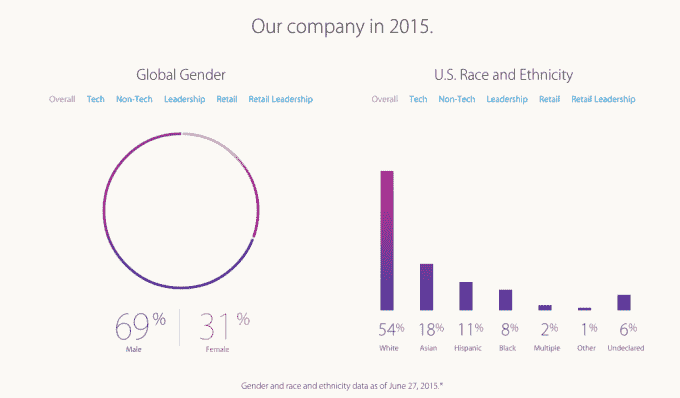

# 苹果公司的蒂姆·库克谈最新的多样性数据:还有“很多工作要做”

> 原文：<https://web.archive.org/web/https://techcrunch.com/2015/08/13/apples-tim-cook-on-latest-diversity-numbers-theres-a-lot-more-work-to-be-done/>

# 苹果公司的蒂姆·库克谈及最新的多样性数据:“还有很多工作要做”

苹果[刚刚发布了一份新的多元化报告，其中包含了该公司](https://web.archive.org/web/20230326205439/http://www.apple.com/diversity/)的种族、性别和民族构成数据。尽管该公司在美国仍然主要是白人(54%)，但令人鼓舞的是，在苹果去年招聘的员工中，11%是黑人，13%是西班牙裔，19%是亚裔。

在全球范围内，苹果公司的员工仍然以男性为主(69%)，尽管这一比例在过去一年中略有提高。在过去的一年里，苹果公司全球新员工中有 35%是女性。

更具体地说，苹果在美国雇佣了 2200 多名黑人员工，比苹果去年雇佣的人数多 50%，[苹果首席执行官蒂姆·库克在一封公开信中写道](https://web.archive.org/web/20230326205439/http://www.apple.com/diversity/)。在全球范围内，苹果雇佣了 1.1 万名女性，比前一年增加了 65%。

“总的来说，这是我们在一年中从代表性不足的群体中招聘的最大一批员工，”库克写道。

以下是苹果目前的多元化细分情况:

与去年相比:

这份报告是在苹果宣布与 CODE2040 合作的一天后发布的，CODE2040 是一家非营利组织，旨在增加科技行业中代表性不足的少数群体的数量。

尽管这些数字确实代表了微小的进步，但仍有更多的工作要做，库克承认:

> 我们为取得的进步感到自豪，我们对多元化的承诺坚定不移。但是我们知道还有很多工作要做。
> 
> 有些人会看到这一页，看到我们的进步。其他人将认识到我们还有多远的路要走。我们两者都看到了。比这些统计数据更重要的是，我们看到世界各地成千上万的苹果员工，说着几十种语言，一起工作。我们赞美他们的不同之处，以及我们和我们的客户因此而享受到的诸多好处。

[你可以在这里阅读库克的全部信件](https://web.archive.org/web/20230326205439/http://www.apple.com/diversity/)。