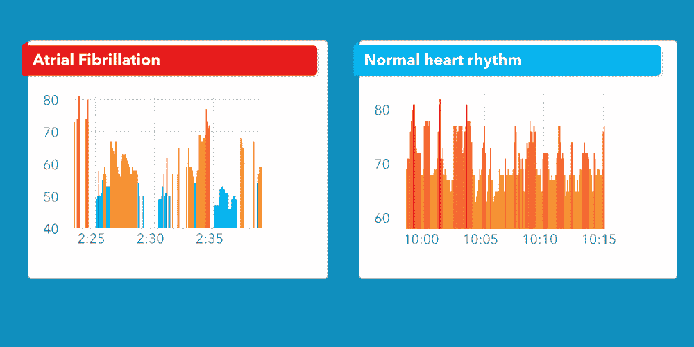

# UCSF 研究称，苹果手表能以 97%的准确率检测出异常心律

> 原文：<https://web.archive.org/web/https://techcrunch.com/2017/05/11/apples-watch-can-detect-an-abnormal-heart-rhythm-with-97-accuracy-ucsf-study-says/>

# UCSF 研究称，苹果手表能以 97%的准确率检测出异常心律

根据心跳测量应用程序 [Cardiogram](https://web.archive.org/web/20230316161113/https://cardiogr.am/) 和加州大学旧金山分校进行的一项研究，当与基于人工智能的算法配合时，Apple Watch 在检测最常见的异常心律方面的准确率为 97%。

这项研究涉及通过苹果手表上的心电图应用招募的 6158 名参与者。UCSF 健康电子保健研究的大多数参与者都有正常的 EKG 读数。然而，其中 200 人被诊断患有阵发性心房颤动(一种异常心跳)。工程师们随后训练了一个深度神经网络，从 Apple Watch 心率数据中识别这些异常的心律。

Cardiogram 在 2016 年与 UCSF 开始了这项研究，以发现 Apple Watch 是否可以检测到即将到来的中风。根据 Cardiogram 的联合创始人和 UCSF 电子心脏研究的数据科学家 Brandon Ballinger 的说法，大约四分之一的中风是由心律异常引起的。

Cardiogram 测试了它建立的深度神经网络与 51 次医院内心脏复律(一种恢复心脏正常节律的程序)的对比，并表示它在神经网络发现不规则心脏活动的能力方面达到了 97%的准确率。

到目前为止，这只是一项建立在初步算法基础上的研究，但它有望在未来尝试识别和预防中风。心房颤动是最常见的异常心律，导致四分之一的中风。巴林杰说，这些类型的中风中有三分之二是可以用相对便宜的药物预防的。

越来越多的人，包括最容易中风的老年人，开始使用 Fitbit 或 Apple Watch 等可穿戴技术，这些技术可以兼作心脏监测器。包括经过训练的识别心脏问题的算法可以帮助挽救这些高危人群的生命。

值得注意的是，移动 EKG 阅读器在过去几年里也取得了长足的进步。梅奥诊所[与](https://web.archive.org/web/20230316161113/http://www.qmed.com/mpmn/medtechpulse/alivecor-and-mayo-clinic-partner-dig-ecg-data)合作进行了一项研究，涉及人工智能和 AliveCor 版本的 EKG 阅读器，该阅读器贴在智能手机的背面，使用 Kardia 应用程序来确定异常的心律，并确定它与医生办公室使用的其他 EKG 设备一样好。梅奥诊所对这项研究的感受如此强烈，它在 AliveCor 的最新一轮 3000 万美元投资中进行了投资。

与此同时，Cardiogram 和 UCSF 将继续其电子健康研究，并计划进一步验证其深度神经网络，“根据多项黄金标准，将结果纳入 Cardiogram 应用程序本身，并调查检测房颤以外的健康状况的能力，”Cardiogram 表示。