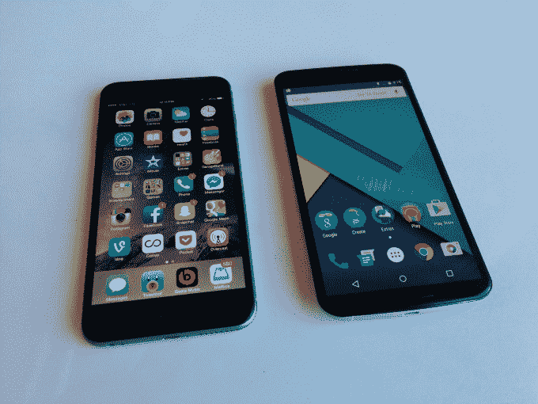
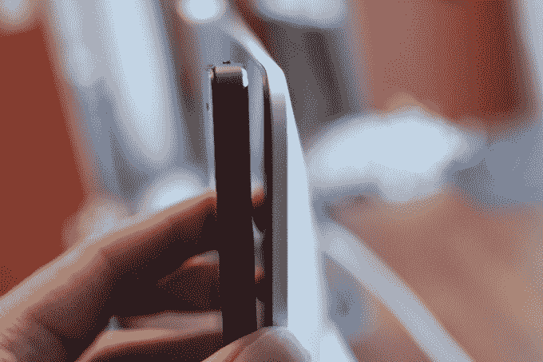
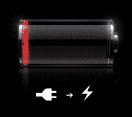
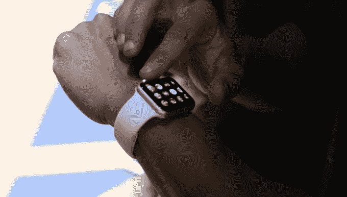

# 苹果精心制作的消失点 

> 原文：<https://web.archive.org/web/https://techcrunch.com/2015/01/17/apples-well-crafted-vanishing-point/>

苹果的标准做法是在更新换代时从其产品的腰部减去一些原子——让该公司的营销部门吹嘘更薄的旗舰产品，这些产品也具有更高的功率和更好的屏幕，或者两者兼而有之。

例如，如果关于 MacBook Air 下一代型号的传言可信，苹果计划将笔记本电脑的厚度减半，同时将显示屏尺寸从 11 英寸增加到 12 英寸，主要是通过减少边框，因此其整体尺寸几乎不会增加。

但是这种将更多装进更少的聚会把戏需要付出一些东西。对于传闻中的 MacBook Air 来说，这可能是某些物理端口的空间。然而，对于目前的 iPhone 旗舰产品，6.9 毫米厚(薄)[的 iPhone 6](https://web.archive.org/web/20221206221602/https://beta.techcrunch.com/topic/product/iphone-6/) 和 7.1 毫米[的 iPhone 6 Plus](https://web.archive.org/web/20221206221602/https://beta.techcrunch.com/tag/iphone-6-plus/) ，在追求实现 0 尺寸智能手机的过程中，显然已经失去了一定程度的外形完整性——因此出现了 [bendgate](https://web.archive.org/web/20221206221602/https://beta.techcrunch.com/tag/bendgate/) 传奇。

当人们把不那么薄的 iPhones 放在后口袋里坐上几个小时时，它们可能会更结实一些。但这些不是苹果公司生产的 iPhones。

然而，与最受抱怨的更轻薄设备的妥协:电池寿命相比，bendgate 只是小巫见大巫。限制物理尺寸不利于电池容量，因为容纳电池的空间可能也在缩小。年复一年，它肯定不会像气球一样膨胀。

尽管苹果通常会优化硬件和软件，以提供相同的电池寿命，或者有时略有改善，但在更新的设备中，它不会提供引人注目的数量级的改善。这种飞跃是为其新的芯片组或更好的显示屏或前述更薄的外形而保留的。

这部分是因为电池技术的进步比其他技术的发展更快。但这也是对苹果外部设计要求对 i-Devices 内部的限制的一种衡量。随着设备越来越纤薄，必须做出一些让步——那就是电池寿命的大幅提高。

如果苹果满足于“足够薄”的理念，它可以逐年增加设备内部的空间，为更大的电池腾出空间，以解决一个仍然非常主流的抱怨:设备在用户之前就用完了。

从智能手机获得一天的混合使用仍然是预期的标准。更小心地使用可以延长一点寿命。大量使用将需要您准备一个备用电池或充电器。因此，具有讽刺意味的是，最薄、最引人入胜的设备最终被拴在墙上或连接到辅助电池组上，以保持充足的电量。

任何生长在早期科技时代的人都明白，苹果公司迫切需要将设备瘦身。在那个时代，家用电脑通常需要占用你很大的桌面空间，而“便携性”意味着要拖着一个带手柄的重物到处跑。

但总有一天，规模肯定不再重要。现在，手机、笔记本电脑或电脑已经足够薄，即使是最时尚的小玩意拥有者也可以使用。然而苹果仍然很薄。

它的一致性使减肥成为一个明确的策略。但苹果精心打造的轻薄有什么逻辑？

# 压榨竞争对手

制造最薄的设备，或者至少是不断向这个方向推进并倡导轻薄，给苹果的竞争对手在自己的硬件设计上留下了很小的回旋余地。这使得苹果能够充分利用其在硬件和软件设计方面的专业知识，在自己日益紧缩的利润范围内工作，并迫使其竞争对手也这样做。或者尝试失败。

无法实现如此纤细比例的竞争产品不可避免地会在尺寸和重量上与 i-Devices 进行比较。这是苹果拥有市场的微弱优势。

另一方面，苹果可以说必须不断提高——或者说降低——高端奢侈品的标准，以保持领先于克隆人。所以这既是一场比赛，也是一场追逐。

# 细微的差别

另一个需要考虑的因素是，对于智能手机和平板电脑，甚至是笔记本电脑，硬件差异化已经不复存在。现在的计算设备大多是屏幕。或者屏幕加键盘。现有食谱中的物理成分如此之少，几乎不可能混合出一种独特的味道。尤其是苹果拥有极简主义。

因此，在计算硬件设计方面，少真的可以多。与极简高端设计相比，更具物理差异的设计可能会被视为杂乱、笨拙、丑陋或分散注意力。同样，苹果通过拥有市场的美学顶端而占据有利地位——这也意味着它需要继续制造更薄的产品，以遵循自己的简化规则。

让设备变得更薄也是在一个非常平淡无奇的领域让硬件脱颖而出的少数方法之一，这个领域基本上消除了其他物理缺陷。颜色是另一个选择，苹果也经常尝试，但通常用于非旗舰设备(如 iPods 或 iPhone 5c)或自有品牌配件。

它保持其真正高端的设备相对无色，专注于最简约的单色和金属色。因此，苹果需要逐年将设备做得更薄，以实现设计上的轰动。

# 更严格的控制

更薄的设备的另一个特点是它们自然地减少了用户的交互选择——这些设备的物理入口点更少。它们是闪亮的贝壳，鼓励人们更加依赖创造它们的围墙花园生态系统。物理端口和插槽被削减到最低限度。存储可能不是用户可扩展的。电池不可更换。

所有这些都限制了用户在 iOS 生态系统中可以做的事情，并使他们的行为更加可预测和可控。这反过来允许苹果构建一个更易访问的环境，用更少的可用选择支持一个更简单、更主流友好的界面。

如果用户不能自己扩展存储空间，或者购买替换电池，他们可以更容易地被苹果公司说服支付云存储费用，或者被鼓励升级到新的 i-Device。这一切都是为了沿着库比蒂诺控制的管道输送用户。

这些限制也有助于生态系统锁定。用户对 iOS 生态系统和苹果 iCloud 投入越多，他们就越被其硬件所束缚——相关数字内容的累积会阻止他们转向另一个平台。

因此，细长的还原设备是生态系统锁的视觉表达，这赋予了苹果公司持久的生命力。

# 有限的寿命

制造更薄的硬件也意味着 i-Devices 内部最易损坏的技术——电池——被锁在一个无缝外壳中。没有用户访问，移动设备的寿命变得与电池的总寿命不可分割地联系在一起。

你甚至可以说，受限的电池容量有助于鼓励用户更快耗尽电池的充电模式。智能手机用户通常每天晚上都要给手机充电，因为电池寿命是有限的，如果他们一天中使用手机太多，很可能会将手机完全放电。如果你想让锂离子电池持续使用，这并不一定是一个好方法… 

无论哪种方式，底线是苹果在设备用户升级时赚钱，鉴于其业务涉及销售由优质材料制成的昂贵设备，升级的最常见原因——当然是对苹果的移动设备而言——是电池磨损。因此，硬件的轻薄有助于苹果创造和管理经常性收入。

# 现在是苹果的下一个花招…

那么最终游戏是什么？苹果还能继续把 i-Devices 做得越来越薄吗？显然，它最终会达到一些原子极限，但在达到这一点之前，它仍有几毫米可以向薄之神做出牺牲——在其典型的年度更新周期中，这应该会在短期内保持这一战略。

与此同时，苹果正在制造一种新型的可穿戴设备，苹果手表[，将于今年三月上市。这是苹果的新领域，智能手表是其产品组合中核心计算设备的辅助。因此，它开启了其硬件理念的一点战略扩张的可能性。](https://web.archive.org/web/20221206221602/https://beta.techcrunch.com/topic/product/apple-watch/)

Apple Watch 是一款补充设备，它提供了一定程度的功能和设计亮点，同时允许苹果保持它打算与之配合使用的主 iOS 设备的纤细外形。

这也是一种补充，因为它旨在从现有 iOS 用户的钱包中拿出更多的钱。这当然是另一个 iOS 锁定激励。一种是通过将更多的个人数据点附加到用户身上，寻求扩大生态系统的范围和知识。虽然可穿戴设备作为一个消费电子产品类别，迄今为止一直相当无趣，但苹果将致力于打破这种模式——因为它有这样做的历史。

苹果公司也有乐于拆分自己业务的历史——例如，制造 iPhone 来吸收 iPod 的功能。最近还推出了平板手机大小的 iPhone，尽管与较小的 iPads 有很多重叠。目前还不清楚 Apple Watch 在这个功能重叠谱中的位置。这将取决于销量，以及与 iPhone/iPad 相比，这款应用的体验有多独特。但似乎有可能会出现一些自相残杀的情况。

不管怎样，这对苹果的硬件业务来说都很好，因为这款手表使用蓝牙连接——需要连接到 iPhone 才能工作。苹果在这方面的主要关注将是确保手表为佩戴者提供新的用途，以证明第二次购买的合理性。

Apple Watch 的部分用途可能是能够查看通知，而无需把手伸进包或口袋。甚至可能根本不需要观看屏幕(例如，触觉反馈通知手表佩戴者在行走时转弯)。所以不需要经常检查 iPhone。或者没有你想的那么多。

取决于苹果如何管理与 iPhone 的蓝牙链接，Apple Watch 可以有效地充当 iPhone 用户的可穿戴备用电池组——如果它最终将足够多的使用从主要移动设备转移到辅助可穿戴设备。

如果是这样的话，苹果 2015 年的派对把戏可能是更薄的 iPhones，电池寿命似乎有所改善——这要归功于一部分移动使用被重新路由到 Apple Watch——同时从其用户群中赚更多的钱。

如果苹果能成功的话，这是相当巧妙的手法。

