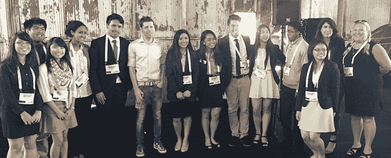

# 申请带你的学校或组织来扰乱柏林 

> 原文：<https://web.archive.org/web/https://techcrunch.com/2017/11/01/apply-to-bring-your-school-or-organization-to-disrupt-berlin/>

# 申请带你的学校或组织扰乱柏林

学生团体参加 12 月 5 日(周二)在柏林竞技场举行的[扰乱柏林](https://web.archive.org/web/20221006071130/https://beta.techcrunch.com/event-info/disrupt-berlin-2017/?utm_medium=ebsoftpost3daystop&utm_campaign=disruptberlin&utm_source=TC&unii-trigger-open=H9FCDY&ref=ebsoftpost3daystop)的申请[现已开放](https://web.archive.org/web/20221006071130/https://oathtechevents.typeform.com/to/z7mAlt)。该计划是 TechCrunch 的多样性计划【T4 包括】T5 的一部分，旨在为技术领域中未被充分代表的群体提供机会，以更好地进入初创企业。

在过去的几次中断中，TC 与一些组织进行了非正式和正式的合作，如[BUILD.org](https://web.archive.org/web/20221006071130/http://www.build.org/)、[创业教育网络(NFTE)](https://web.archive.org/web/20221006071130/https://www.nfte.com/) 、[软件工程学院](https://web.archive.org/web/20221006071130/http://afsenyc.org/)、[纽约计算机科学教育基金会](https://web.archive.org/web/20221006071130/https://csnyc.org/)、布朗克斯&阿斯托利亚、[红钩倡议](https://web.archive.org/web/20221006071130/http://rhicenter.org/)、 [Mission Bit](https://web.archive.org/web/20221006071130/https://www.missionbit.com/) 、 [Dev/Mission](https://web.archive.org/web/20221006071130/http://devmission.org/)

*Y Combinator 首席执行官 Sam Altman 与来自创业教育网络(NFTE)的学生在 Disrupt SF 2015*

作为该计划的一部分，年轻人将有机会与 TechCrunch 的一名编辑人员一起参观[创业胡同](https://web.archive.org/web/20221006071130/https://beta.techcrunch.com/event-info/disrupt-berlin-startup-alley/)，聆听主舞台上发生的讨论，并(在可能的情况下)与演讲者进行一对一的问答。

要获得资格，青少年必须达到中学年龄，在柏林的合理通勤距离内，并有一名成年监管人能够与他们一起参加。将优先考虑教师或从事技术人口统计不足的组织(女性，少数民族等)。传统班级、另类教育、导师项目、非营利项目等。欢迎所有人申请和参与。

申请将于太平洋时间 11 月 17 日星期五下午 5 点截止。各组将在 2017 年 11 月 22 日(星期三)之前收到参与状态通知。如有任何问题，请发电子邮件给 marketing@beta.techcrunch.com。

[今天就申请！](https://web.archive.org/web/20221006071130/https://oathtechevents.typeform.com/to/z7mAlt)