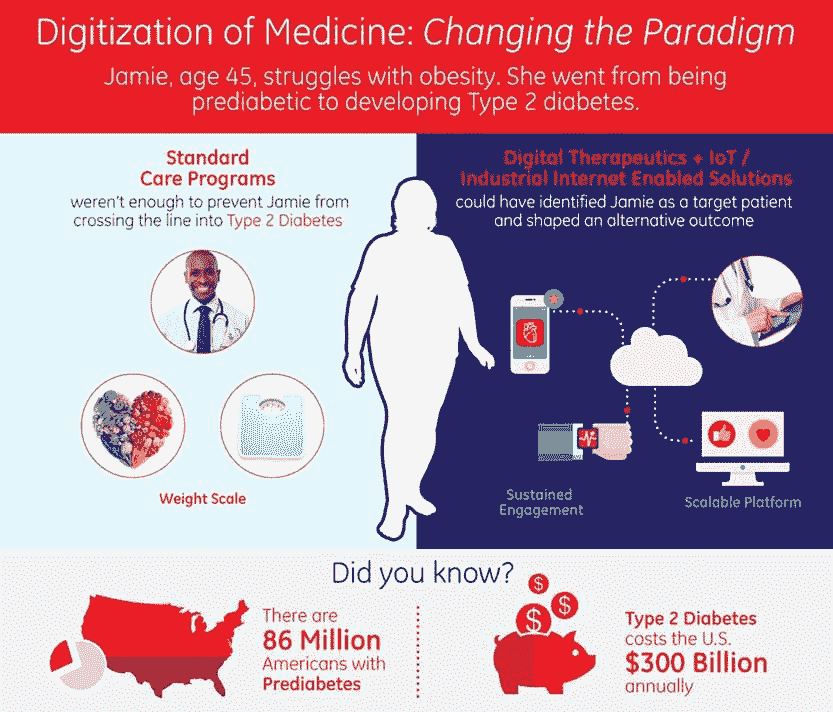
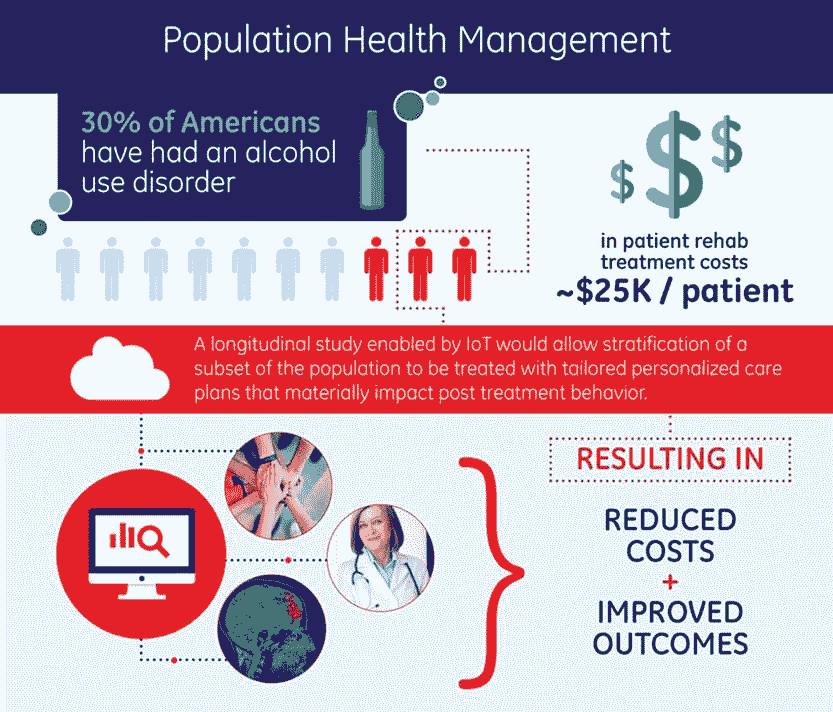

# 将分析应用于临床数据 

> 原文：<https://web.archive.org/web/https://techcrunch.com/2016/08/31/applying-analytics-to-clinical-data/>

More posts by this contributor

先进的技术和电子健康记录(EHR)的快速采用使物理世界与数字世界融合，导致临床数据的数量和质量呈爆炸式增长。

认知护理是应用分析将这种新获得的数字化临床数据转化为知识，从而彻底改变医疗保健(参见下面 Jamie 的例子)。

智能手机和应用经济的出现让消费者期望在多个行业获得便捷、高质量的服务，包括零售、旅游、教育、媒体和娱乐等。同样的革命还没有在医疗保健领域发生，但由于认知医疗，它即将到来。其结果将是医疗保健的转变，带来四大好处:个性化护理、基于价值的系统、随处护理和改善的结果。

## 个性化护理

根据最近一份 ONC 报告，2008 年只有 13.4%的非联邦急症医院使用电子病历。到 2014 年，这一比例上升至 83.2%。在这六年中，临床数据发生了翻天覆地的变化，从纸质记录到易于分析的数字文件。EHR 捕获纵向数据来跟踪一段时间内的患者，包括成像数据、医生观察检查、临床诊断和所有的“-组学”以及关于一个人的环境和生活方式的信息。

> 我们都认识到预防相对于治疗疾病的成本优势。

再加上精密的分析，这些患者数据为“精密医疗”奠定了基础，这是一种令人兴奋的疾病预防和管理新方法，将使医生能够定制和优化他们治疗患者/消费者的方式。

尽管有这样的前景，但当医疗记录被限制在一个提供商或一台机器的范围内时，临床数据的数字化价值有限。临床数据池的结合将使研究人员能够基于从人群水平分析中收集的见解开发新的最佳实践，从而扩展精确医学的能力。

临床数据数字化的另一个好处是患者医疗记录可以随着人从提供者到提供者以及从医院到诊所到家庭的流动。这实现了患者和提供者之间真正的双向协作。得益于患者与提供商的积极合作，结果将是更好的个性化护理。

## 基于价值的体系

在这个大选之年，我们经常被提醒，提供医疗保健的旧方式是不可持续的。2014 年，美国在医疗保健方面的支出达到了 3 万亿美元，但在婴儿死亡率和慢性病防治等方面，美国落后于其他工业化国家。认知护理将促进向基于价值的医疗保健体系的转变，该体系应解决支出和结果之间的一些不匹配。

更好的人口数据的可用性将降低成本(见酒精中毒的例子)并带来更好的医疗保健。我们都认识到预防相对于治疗疾病的成本优势。人群水平数据分析的关键好处之一将是在患者发展成疾病之前识别患者所需的洞察力。

这些转变已经发生了。我们开始看到保险公司脱离传统的收费服务系统，这种系统根据患者就诊和检查的数量向提供商支付每次交易的费用。

基于价值的薪酬迫在眉睫，并根据提供的护理的整体价值来确定——这是一个结果很重要的世界。提供者因长期保持病人健康而获得奖励。如果没有临床数据的数字化和对医疗保健的认知，这种基于价值的医疗保健将无法扩展。

医疗保健数字化的另一个启示是患者能够形成社区。直到最近，罕见病患者还是相对隔离的。现在有了像 [PatientsLikeMe](https://web.archive.org/web/20221225215154/https://www.crunchbase.com/organization/patientslikeme) 这样的在线社区，病人和医生可以更容易地在病例、诊断和治疗计划上进行合作。这实现了更基层的认知护理，有助于创建和培养有利于患者护理的社区。这就引出了我的最后两点:无处不在的关怀和改善的结果。

## 关心任何地方

在一个认知系统中，医疗保健设置将超越医院的四面墙，产生创新的新商业模式——这种转变已经在进行中。只要看看周围越来越多的“逐步减少”设施、家庭互联护理的使用以及无预约零售诊所的兴起。

最显著的变化之一是零售中心现在提供服务的方式。沃尔玛、沃尔格林和 CVS 都在其药店进行了先进的医疗保健亭或诊所的试点。这些诊所通常配备药剂师、执业护士和医师助理，不仅仅是注射流感疫苗和测量生命体征。他们越来越多地扩展他们的服务，进行年度体检，帮助监测病人的慢性疾病，提供诊断咨询，并提供健康和健康辅导。

> 创新不仅有助于提供无处不在的数据可用性，还能实现医疗保健的连续性。

与传统的医院提供的护理相比，这些降压设施为患者提供了更方便、更便宜的护理，同时也为药店增加了一个新的业务领域。

所有这些不同的护理环境都是通过技术进步实现的，如互联网、机器学习和远程医疗。这些创新不仅有助于提供无处不在的数据可用性，还能随着时间的推移和跨环境实现医疗保健的连续性。这有助于向医疗保健消费化的过渡:增加便利性、更好的患者跟踪和行为矫正，并最终以更低的成本改善结果。

## 改善结果

为了理解认知护理的力量，让我们来看看西班牙北部的巴斯克地区，那里快速老龄化的人口使国家公共卫生服务的资源捉襟见肘。[在那个地区](https://web.archive.org/web/20221225215154/https://www.accenture.com/us-en/success-basque-country-managing-increased-chronicity)，患有慢性疾病的老年患者占据了总医疗支出的 77%，医疗费用预计到 2020 年将翻一番。

为了遏制这些飙升的成本，该地区实施了一种新颖的整体护理解决方案，该方案以协议为导向，将临床医生从医院的四面墙移至社区，并在其中心提供基本的认知护理功能。基于云的多模式通信中心捕获遥感数据，实现随叫随到的临床医生访问，推动药物依从性并提供患者教育。

为了有效地确定资源目标，使用了预测分析引擎来识别那些可能在未来三个月内进入急诊室的患者，24/7 呼叫中心确保了临床医生、治疗人员和患者之间的协调，以推动主动护理并响应紧急需求。有了新系统，护士现在可以解决 80%以上的健康问题，慢性病患者的急诊量减少了，家庭护理激增了近 50%。结果是:两年内每年节省 7700 万美元，提高了患者消费者的满意度！

认知护理不是一些空想的概念；已经到了。市场中的新进入者已经开始挑战医疗保健领域的现有企业，其他创业公司肯定会紧随其后。医疗保健肯定有改善的空间，但就目前而言，似乎很明显的是，由互联网、机器学习、人工智能、传感器和云实现的对医学的认知将扰乱我们现有的范式。医疗保健曾经由“医嘱”决定，而我们现在正处于“病人指令”的新时代。