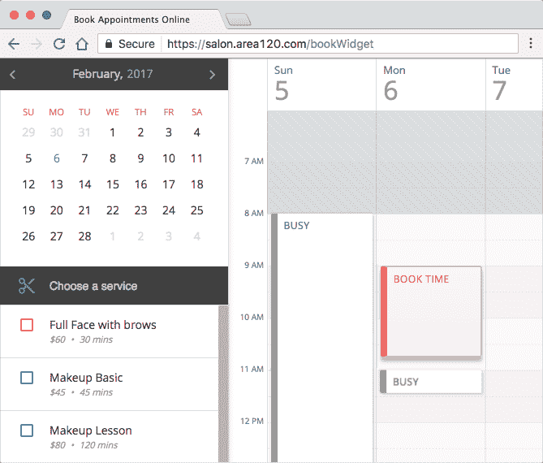
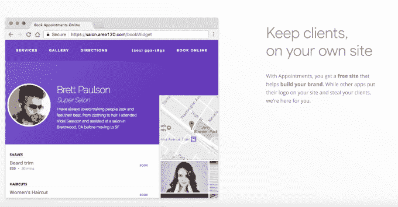
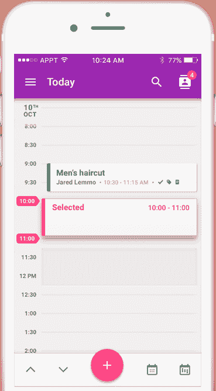

# 约会是谷歌内部孵化器 Area 120 TechCrunch 的最新应用

> 原文：<https://web.archive.org/web/https://techcrunch.com/2017/04/26/appointments-is-the-latest-app-from-googles-internal-incubator-area-120/>

谷歌的[内部创业孵化器](https://web.archive.org/web/20230130231102/http://www.businessinsider.com/google-is-building-an-in-house-startup-incubator-2016-4) Area 120 于去年推出，迄今为止已经催生了许多项目，包括一个私人造型师应用程序 Tailor、一个语音信使 Supersonic，以及最近的一个用于[一起观看 YouTube 视频的名为 Uptime](https://web.archive.org/web/20230130231102/https://techcrunch.com/2017/03/13/youtube-launches-uptime-an-experimental-app-for-watching-videos-with-friends/) 的应用程序。我们现在发现了另一个正在开发的应用程序，叫做约会，一个沙龙预订工具。

约会尚未在应用商店或网站上公开发布，但其项目页面目前在 salon.area120.com 的[上线。](https://web.archive.org/web/20230130231102/https://salon.area120.com/)

该应用似乎是更强大的日程安排服务的竞争对手，如 [Vagaro](https://web.archive.org/web/20230130231102/https://sales.vagaro.com/) 、 [StyleSeat](https://web.archive.org/web/20230130231102/https://techcrunch.com/tag/styleseat/) 、 [Square Appointments](https://web.archive.org/web/20230130231102/https://squareup.com/appointments) 、 [Mindbody](https://web.archive.org/web/20230130231102/https://www.mindbodyonline.com/overview) 等。然而，与一些竞争对手不同的是，该应用不仅提供在线预订系统，还包括一个面向参与企业的集成网站，以及一个将短信客户端文本转化为预订链接的工具。

该网站称，该网站和预订应用程序可以在线或通过移动设备工作，并将向客户显示一周的可用情况。同时，商业网站还可以包括其他信息，例如在该位置提供的服务、方向和地图、照片库、价目表以及联系信息，例如地址和电话号码。

由于该项目显然仍处于早期阶段，因此没有太多关于技术细节、项目背后的团队或更大的赚钱计划(如果有的话)的信息。该应用程序的下载链接，也还没有工作，但确实暗示它将是免费的。

尽管信息有限，但这个项目可能会引起谷歌的特别兴趣，谷歌今天正在谷歌搜索和地图上列出企业。今天，它还帮助企业建立他们的网络形象，从购买他们的[域名](https://web.archive.org/web/20230130231102/https://domains.google/#/)到设置他们的电子邮件，甚至创建[基本网站](https://web.archive.org/web/20230130231102/https://gsuite.google.com/products/sites/)和[使它们在移动设备上运行良好](https://web.archive.org/web/20230130231102/https://www.google.com/intl/en/services/#/test-my-site)。

然而，谷歌还没有提供专门用于在线预约的软件——随着微软去年宣布推出 Office 365 服务 Bookings 而进入这个领域。

如果约会成功，有理由认为它可能成为微软的替代解决方案，旨在适应谷歌自己的生产力工具套件。

当然，在这个时候，说未来的约会会变成什么样子还为时过早。

[gallery ids="1481935，1481933，1481939，1481938，1481937，1481936"]

作为背景，Area 120 项目旨在鼓励谷歌内部的创业精神，而不是让有价值的团队成员流失到初创公司。根据之前关于孵化器如何运作的报告，团队首先向谷歌提交商业提案，如果被接受，他们就可以加入这个项目，并为他们的产品工作几个月。他们也可能有机会向谷歌争取额外的资金。

这些团队设在谷歌的旧金山办公室，但目前没有专门的媒体联系人。试图通过主要媒体渠道向谷歌询问更多细节，但未获回应。