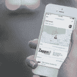
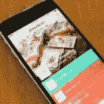
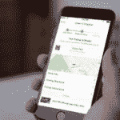

# 假日购物应用 

> 原文：<https://web.archive.org/web/https://techcrunch.com/2016/12/21/apps-for-holiday-shopping/>

# 假日购物应用

假期快到了，还有一点时间可以进行最后的购物。我们没有筛选你所有的折扣邮件，而是找到了一些应用程序，可以帮助你省钱，让你的在线和店内购物体验更轻松。

**[Slice](https://web.archive.org/web/20221006043440/https://itunes.apple.com/us/app/slice-automatic-package-tracker/id475854271?mt=8)**
网上购物者可能想结账切片，这样更容易监控发货情况。没有必要输入任何跟踪代码，因为该应用程序会与您的电子邮件同步，以通知您包裹何时在路上。你也可以通过价格下降提醒省钱，并查看预算图表，了解你的支出类别。Slice 还保存收据，并提醒您产品召回。这款应用是免费的，可以在 iPhone、Android 和 Apple Watch 上使用。

[**retail menot**](https://web.archive.org/web/20221006043440/https://itunes.apple.com/us/app/retailmenot-shopping-deals/id521207075?mt=8)
retail menot 保证你再也不会错过一次销售。该应用程序汇总了所有主要品牌的所有销售额，展示了数字和店内交易。无论你打算在梅西百货还是维多利亚的秘密购物，RetailMeNot 都会突出显示最优惠的交易，并保存所有优惠券代码的数据库。

还有一个交易地图，查看附近的折扣。对于那些在购物时感到饥饿的人来说，美食广场餐厅的优惠券可能会派上用场。这款应用在 iPhone 和 Android 上都是免费的。

路边购物最糟糕的部分就是排队，这也是我们对路边购物感到兴奋的原因。这款应用程序可以让你提前订购，并在大约一个小时内从商店外面取货。他们甚至会把它带到你的车上。Curbside 已经与 CVS 和 Sephora 等大品牌建立了合作伙伴关系，并正在努力扩展到整个美国。这款应用是免费的，可以在 iPhones 和 Android 上使用。