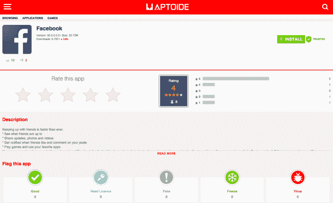

# Aptoide 斥资 400 万美元在新兴市场发展其替代 Android 应用商店 

> 原文：<https://web.archive.org/web/https://techcrunch.com/2016/01/05/aptoide-series-a/>

搜索应用商店是一件痛苦的事情，除非你知道你在找什么。如果你碰巧拥有一部 150 美元的智能手机，并通过预付费协议连接了移动互联网，就更是如此了，就像世界上许多来自新兴市场的新互联网人口一样。

这就是为什么专注于新兴市场的第三方应用商店 [Aptoide](https://web.archive.org/web/20230220181919/http://www.aptoide.com/) 已经筹集了 400 万美元，为 Android 提供替代产品，根据 Statcounter 的数据，[无疑是拥有近 70%全球市场份额的世界移动操作系统。](https://web.archive.org/web/20230220181919/http://gs.statcounter.com/#mobile_os-ww-monthly-201412-201512)

Aptoide 于 2011 年在葡萄牙成立，[目前提供安卓和安卓电视应用商店](https://web.archive.org/web/20230220181919/http://m.aptoide.com/installer)。该公司总部仍设在葡萄牙里斯本，并在新加坡和中国深圳设有办事处。在新加坡，该公司专注于东南亚业务。在中国深圳，该公司与手机制造合作伙伴合作，帮助拓展其在新兴市场的业务。(中国原始设备制造商越来越关注印度、东南亚、拉丁美洲和世界其他具有快速增长潜力的地区。)

Aptoide 在 2013 年筹集了 100 万美元的种子资金，这 400 万美元的首轮融资由 e.ventures 领投，中国的戈壁创投、东南亚的金门创投和现有投资者葡萄牙创投也参与了进来。该计划是用这笔钱在东南亚和拉丁美洲推进，增加用户群和应用数量，并获得更多的战略合作伙伴。

Aptoide 的联合创始人阿尔瓦罗·平托·首席运营官告诉 TechCrunch，2015 年有 1 亿人从该公司的应用商店下载了至少一款应用，而活跃用户平均每月下载 6 到 8 款应用。平托补充说，该公司在过去三年中同比增长了 100%，而仅去年一年就在东南亚增长了 200%，在拉丁美洲也出现了飙升。

“对市场来说，有一些谷歌正在做的事情的替代品是很重要的，”他解释道。

目前，Aptoide 有 50 万个应用程序，包括脸书、Instagram、WhatsApp Clash of Clans、VLC 等热门应用程序和一些独家应用程序，如允许 YouTube 视频下载的应用程序(这是谷歌在其商店中禁止的)。每个应用程序都使用初创公司自己的 SDK，这使 Aptoide 能够从应用内购买和其他支付中赚钱，尽管广告仍然是其最大的收入来源。

“这个(第三方应用商店的)市场很大，我们认为每个人都有空间，”平托在提到中国出现的许多商店时补充道，在中国，Google Play 受到当地对谷歌服务审查的限制。

然而，中国商店还没有向海外扩张，而这正是 Pinto 和 Aptoide 看到增长机会的地方。这就是为什么它在深圳建立了一个基地，深圳是中国的硬件中心，也是智能手机制造商的所在地，它故意确保其内容在全球范围内是合法的，以使这些 Android 制造商能够捆绑和集成其服务。平托说，到目前为止，该公司已经与 60 家运营商和原始设备制造商达成了协议，其中包括诺基亚([当它做 Android](https://web.archive.org/web/20230220181919/https://techcrunch.com/2014/07/17/disconnecting-people/) )、Jolla 等。

Aptoide 还发布了一个“精简版”,专门面向互联网连接不可靠的用户和存储选项有限的廉价设备。这是不到一个月前的事，所以该公司目前没有透露太多这方面的数据。

平托说，Aptoide 的目标是每年将其用户群和用户数量翻一番，除了合作伙伴关系，它还有一个有趣的社交功能，可以帮助新用户了解情况。任何人都可以在服务中管理自己的应用程序列表——当在社交媒体或其他方式上分享时，有助于提高知名度和吸引新用户。

在这方面，平托将这项服务比作 YouTube——这并不是一个显而易见的初步比较。

“YouTube 用户有自己的频道，可以创建播放列表，我们也类似。例如，用户可以选择一些摄影应用，然后分享。这一功能不仅被最终用户使用，还被分享他们工作的开发者或与他们的客户分享的公司使用，”他解释说。