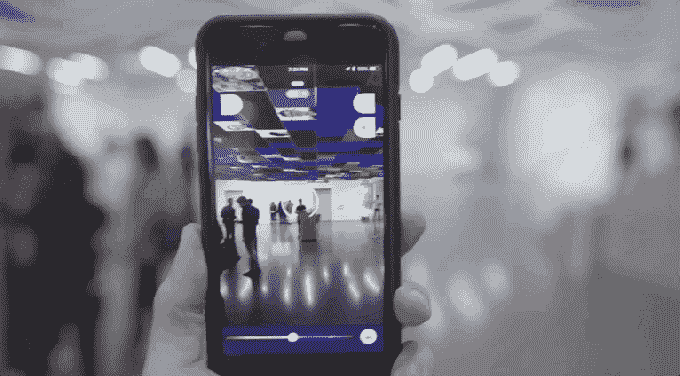
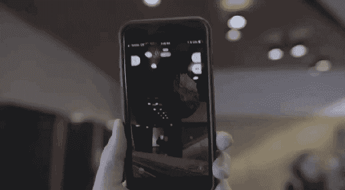

# AR 初创公司 Ubiquity6 获得 2700 万美元的 B 轮融资，以构建更加用户友好的增强现实 

> 原文：<https://web.archive.org/web/https://techcrunch.com/2018/08/14/ar-startup-ubiquity6-lands-27m-series-b-to-build-a-more-user-friendly-augmented-reality/>

# AR 初创公司 Ubiquity6 获得 2700 万美元的 B 轮融资，以建立一个更加用户友好的增强现实

尽管几乎每个科技巨头都公开宣布增强现实是下一个要征服的前沿，但产品的进展相对缓慢，因为事实证明，这些公司很难以消费者友好的方式解决非常基础的问题。

无处不在 6 是少数几家旨在解决目前大多数 AR 体验中缺失的后端功能积压的初创公司之一。这家快速发展的公司正在寻求建立工具，从本质上使用户能够创建基于云的现实世界的 AR 副本，并最终实现持久、动态的多人 AR 体验。

今天，这家初创公司宣布完成了由 Benchmark 和 Index Ventures 领投的 2700 万美元 B 轮投资。迄今为止，该公司已经筹集了 3700 多万美元，投资者名单中有许多知名风险投资公司，包括谷歌的 Gradient Ventures，First Round 和 KPCB——ubiquity 6 的首席执行官 Anjney Midha 此前曾帮助运营一只小型基金。随着这次加薪，基准全科医生米奇·拉斯基将加入无处不在的董事会。

多人 AR 工具集已经成为今年的一种趋势，因为谷歌、苹果和其他许多初创公司都希望专注于两个或更多用户如何以尽可能无缝的方式同步他们的世界地图。Ubiquity6 的一大工作重点是构建整个公共区域的 3D 网格地图，这样入职流程自然会变得即时。

这种策略对博物馆很有效，但对你的客厅来说就不那么有效了，但 Ubiquity6 希望他们应用程序中的体验可以具有情节效用，将他们与公共地理位置的事件紧密联系起来。

从多个方面来看，这家初创公司似乎正在借鉴 Snapchat 的 AR 方法，但也希望通过更努力、更快地进入聊天应用在很大程度上回避的硬 AR 技术，超越 Snap 的努力。该公司尚未推出的应用程序有一个类似旋转木马的应用程序选择器，可以启动单独的 AR 体验，就像人们通过 Snapchat 镜头进行切换一样。

本月早些时候，我有机会演示了这家初创公司的一些技术，尽管基于手机的 AR 通常仍有许多可用性挑战，但 Ubiquity6 能够提供一些有趣的场景，这些场景经过优化，可供多达 100 名用户同时使用。我给不断扩大的数字艺术雕塑添加立方体的演示当然很简单，但是在整个过程中没有明显的停顿。

本月早些时候，在进入马格里特展览之前，旧金山现代艺术博物馆的一晚公共测试体验在中庭和楼上大厅进行了预演。这种体验从艺术家那里获得了一些熟悉的主题，并允许手持手机的游客通过 ar 门户网站，这些门户网站借鉴了马格里特作品和超现实主义方面的标志性元素。这是一个有趣的概念，似乎特别适合超现实主义艺术家。

该公司的应用尚未大规模推出，但对测试这家初创公司的技术感兴趣的人可以在他们的网站上注册。