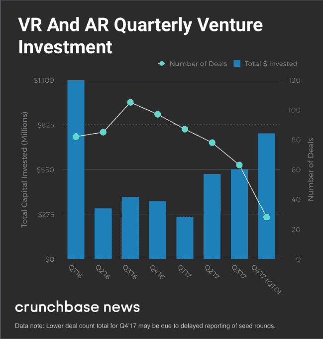

# AR/VR 初创公司去年筹集了 30 亿美元，由一些行业巨头 TechCrunch 牵头

> 原文：<https://web.archive.org/web/https://techcrunch.com/2018/01/05/ar-vr-startups-raised-3-billion-last-year-led-by-a-few-industry-juggernauts/>

# AR/VR 初创公司去年融资 30 亿美元，由一些行业巨头领衔

使用增强现实和虚拟现实技术的科技公司在 2017 年筹集了超过 30 亿美元的风险投资。这些数据来自分析公司 [Digi-Capital](https://web.archive.org/web/20221127014543/http://www.digi-capital.com/news/2018/01/record-over-3b-ar-vr-investment-in-2017-1-5b-in-q4/#.Wk_RUFQ-fOQ) ，并表明，尽管围绕着 AR/VR 领域的讨论已经逐渐减少，但注入该行业的现金总量仍在继续激增。

尽管该报告的数据强调了 2017 年美元投资比 2016 年显著增长，但交易流量似乎更小，其中一半以上的现金来自四笔大规模交易:

尽管像 Niantic、不可能和 Unity 这样的巨头今年能够通过毫无疑问触及 AR/VR 技术未来重要性的宣传活动从投资者那里筹集到数亿美元，但这些公司所拥有的强大、更传统的游戏产业支柱可能是他们现在获得这笔资金的关键。

Magic Leap 是这个行业最大的例外，现在我们已经知道他们的第一款产品会是什么样子了，它可能会看起来更像一家真正的公司。我们仍然不知道他们的产品什么时候上市，需要多少成本，但更关键的是，我们不知道相对于传统消费者，该公司有多少努力会偏向企业。

对于那些在 2016 年和 2017 年为其虚拟现实雄心筹集种子轮资金的较小公司来说，交易数量减少的趋势(Crunchbase 的调查结果[这里](https://web.archive.org/web/20221127014543/https://beta.techcrunch.com/2017/12/02/virtual-reality-gets-its-groove-back/)证明了这一点)表明，泡沫正在消退，可能会有更少的后续轮次和更多的 AR/VR 初创公司加入死池。

2017 年下半年，焦点从基于耳机的 VR 转移到基于移动设备的 AR，苹果的 ARKit 和谷歌的 ARCore 成为关注的焦点。接受度有限，因为基于这些平台开发的应用只偏向于可视化，结果非常糟糕。消费者 AR 耳机领域基本上是干巴巴的，因为各公司都在等着看苹果将这个行业引向何方，以及微软和 Magic Leap 将为 10 年后的消费者打造什么。

仍然有希望的迹象，但 2017 年的 AR/VR 炒作修正让 AR/VR 领域的许多帆都失去了风，而谷歌、苹果、脸书和微软是那些口袋足够深的人，可以看到剩下的东西。很高兴看到这么多钱流向初创公司，但当涉及到新兴技术时，看到交易流的这种下降趋势令人担忧。