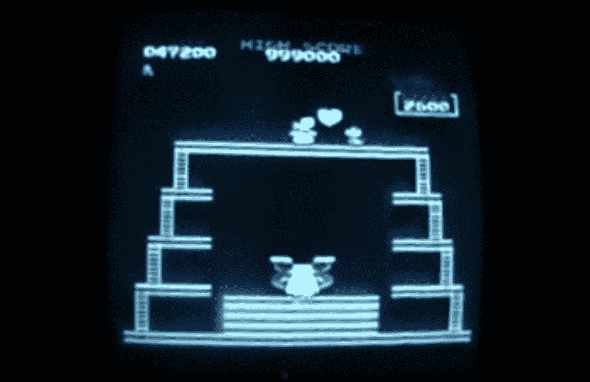
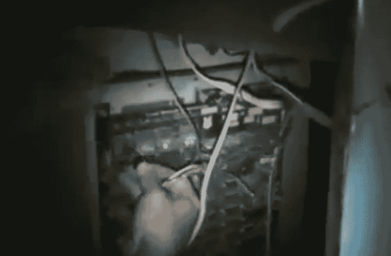
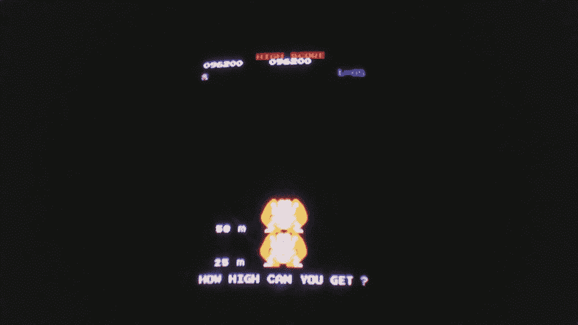
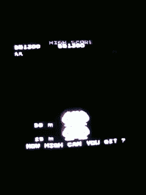

# 随着 Billy Mitchell 创纪录的大金刚评分被作废，街机的名声变成了耻辱 

> 原文：<https://web.archive.org/web/https://techcrunch.com/2018/04/12/arcade-fame-turns-to-infamy-as-billy-mitchells-record-setting-donkey-kong-score-is-invalidated/>

因纪录片*金刚*而闻名的解决*大金刚*街机对抗的创纪录分数被双生星系宣布无效，双生星系是街机世界纪录事实上的仲裁者*。更重要的是，比利·米切尔，这位偶尔有争议的球员创造了它和其他破纪录的分数，已经被永久禁止考虑未来的记录。*

这是一个巨大的颠覆，让人们对几十年的历史产生了疑问。其他类似的有争议的分数会被砍掉吗？有老派街机传奇安全吗？

首先，应该注意的是，虽然这听起来像是一个随机的小问题，但经典游戏场景是巨大的:数百万人密切关注它，并非常认真地对待它。打破一项有 30 年历史的游戏的最高分，或在激烈竞争的时间里缩短四分之一秒，可以而且将会被庆祝，就像该运动员赢得了一枚奥运会奖牌一样。人们永远不能低估在线社区的规模或诚意。作弊当然是不能容忍的。

也就是说，值得考虑的是，比利·米切尔的情况是独特的。毫无疑问，他是一名技术高超的球员，自 80 年代以来一直在创造纪录。但是，任何看过*金刚*的人都会了解到，他也有点见不得人，他的*大金刚*敏锐度还远未确立。

问题很简单，尽管他提供了创下某些纪录的比赛磁带——其中最著名的是在*大金刚*中第一个突破百万——但没有人亲眼见过他这样打*。*

 *这听起来可能像是一个危险信号，但在速度赛跑和创纪录的社区中，大量的练习是独自进行的，在一个空荡荡的拱廊中，或者在没有可信的目击者的情况下(尽管 Twitch 已经改变了这一点)。下班回家后，你可以在这个区域创造一项世界纪录，但除非是现场观看，或者是由中立方审查和验证的录音，否则这不算数。孪生星系是履行这一职责的最大组织，他们确实非常认真地对待它。

《金刚》中米切尔有争议的录像带的最终分数(前面的 1 被省略了，因为当你达到一百万时数字会滚动)。

你可能还记得在*金刚*的结尾，米切尔凭借一盘“直接捕捉”得分为 1，047，200 分的跑垒录像带，重新确立了他对勇敢的当地孩子史蒂夫·威伯的优势。这场比赛没有目击者。此后不久，他记录了 1，050，200 分，也没有人目睹。就在入选爱荷华州国际电子游戏名人堂的一周前，他还创下了大金刚和大金刚 2 的记录。

这就是事情变得危险(和古怪)的地方。

如果任何人认为事情有猫腻，他们可以正式质疑分数，双子星系团队可能会选择调查此事。杰里米·杨，又名切尔尼亚，早在二月份就在论坛上提出了两个部分的投诉。在其中的一部分，他提到了一些人对米切尔最后也是最高分的证据的怀疑，在一个叫 Boomers 的地方。

正如其他人已经指出的那样，不仅比赛本身和结果分数没有在视频中显示，而且裁判被认为是出了名的不可靠，时间表也不清楚，等等。然而，最糟糕的是，很明显，当米切尔的联盟炫耀性地将*大金刚*电路板(因此可以在其他地方得到证实)换成*大金刚*电路板(据推测米切尔当时创造了一项记录)，两家印刷电路板实际上都是后者。

双子星系用户罗伯特。f 在魅力网络论坛*隐语*中解释差异:

> 对于未经训练的训练人员来说，Dk 和 DKjr 看起来一样，事实上它们非常相似，除了一些明显的差异…DK pcb 上有白色文本，Dk jr 有香蕉黄色文本印刷在板上，DK pcb 是 1/2 数字和 1/2 模拟声音，Dk PCB 上有一个用于模拟声音的调节壶。 Dk Jr 板是全数字的，在 dkjr 板上完全相同的位置没有模拟声音调节锅，第三个明显的区别你会看到； 如果你仔细查看视频，Dk 与 Dkjr pcb 具有相同的 ROM 插座布局和相同数量的插座，但 Dkjr 有一个 ROM 插座是空的，，，，，

为什么要表演这种笨拙的戏法？这只是一个错误吗？为什么指出这个问题的人的评论会被从 YouTube 上删除？虽然可疑，但这些间接问题可以解释为当时的一点混乱，在创纪录的兴奋中说错了一个词，等等。幸运的是，这不是证据的范围。

您可能知道，模拟器是一种应用程序，用于运行旧软件(如街机游戏)，尽可能接近它在原始硬件上的运行方式。MAME 是迄今为止最复杂的，也许是最著名的模拟器；这个神奇的应用程序可以模拟从大金刚到更近的复杂 3D 图形游戏的一切。当然，MAME 赛跑不被接受为世界纪录——你可以很容易地操纵软件甚至游戏数据本身。需要真正的街机硬件。

但是 MAME 并不完美；它显示图形的方式有微小的差异——除非你在一帧一帧地观看比赛时特别寻找它们，否则你不会注意到这些差异。

这正是人们开始做的米切尔的没有证人，只有视频分数。

原来，最初的大金刚印刷电路板在图形转换期间有一种特定的渲染场景的方法，称为“滑门效应”，在像素更新的模式上与众不同。仔细检查 Mitchell 的磁带发现不是滑动门，而是 MAME 仿真的一个独特的人工制品，根据数据如何从内存加载，帧被分块呈现。

你可以在下面的 gif 中看到相似之处，[由 Young](https://web.archive.org/web/20221025230208/https://www.twingalaxies.com/showthread.php/176004-Dispute-Jeremy-Young-Arcade-Donkey-Kong?p=946633&viewfull=1#post946633) 提供证据。

首先是以 60FPS 拍摄的实际机器的镜头。请注意对角线上的“滑动门”,它从左上角向下展示了场景:

接下来，米切尔的 1050200 米跑:

最后，MAME 如何渲染类似场景:

看到那个图案中的梯子是如何同时进来的了吗，而且没有滑动门？如你所知，这是一个确凿的证据。当然，双子星系研究者们是这样认为的。在他们今天在论坛上发布的[结论中，他们写道(强调他们的):](https://web.archive.org/web/20221025230208/https://www.twingalaxies.com/showthread.php/176004-Dispute-Jeremy-Young-Arcade-Donkey-Kong-Points-Hammer-Allowed-Player-Billy-L-Mitchell-Score-1-062-800?p=964048&viewfull=1#post964048)

> *Twin galaxy 历史上用来证实这些分数并将其放入数据库**的 1047200(金刚之王“磁带”)和 1050200(抵押贷款经纪人分数)的录制的大金刚分数表演不是由原始的未经修改的大金刚街机 PCB** 的直接馈送输出产生的。*

他们拒绝说他们知道那是 MAME，但那只是一种顾虑——每个人都知道这是最有可能的情况。不管怎样，米切尔把非真实的镜头当作真实的这一事实足以打击他的分数，正如他们也宣布的那样，禁止他在系统中的任何地方进一步安置。

也许更重要的是，史蒂夫·维伯，在*金刚*中处于劣势的挑战者，已经被提升为第一个在游戏中*实际上*达到一百万分的玩家。迟到总比不到好！迟来的祝贺。(维基百科已经[更新过](https://web.archive.org/web/20221025230208/https://en.wikipedia.org/wiki/The_King_of_Kong)。)

**更新** : [维贝告诉综艺](https://web.archive.org/web/20221025230208/http://variety.com/2018/gaming/news/steve-wiebe-interview-1202752495/):“我不再是冠军了，但作为第一个一百万人得到认可是一个很大的安慰。这就是大约 11 年前我真正感到沮丧的地方。”

另一方面，米切尔在过去几个月的调查中一直不见踪影，基本上已经在街机世界中被彻底毁掉了。即使他今天要创造一项世界纪录(现有纪录保持者根据对他的表演的回顾怀疑他有能力做到这一点)，它也会被多年来证明的欺骗所玷污。社区不会原谅他的。

这也是其他人表达的担忧:调查人员会为其他多年来备受尊崇但没有像现代记录那样严格核实的乐谱而来吗？例如，任何没有被认可的证人或可靠记录的分数会被从列表中删除吗？

在他们的决定中，双子星系当局写道:

> Twin Galaxies 致力于从我们的历史数据库中彻底根除无效分数，无论我们在哪里发现它们。
> 
> 我们的方法让许多事情浮出水面，不仅与这个特定的分数有关，而且与其他分数以及一些以前从未讨论过的视频游戏相关的历史有关。
> 
> 我们必须重申，真相是第一位的。这是令人担忧的。不惜一切代价。

这场争论结束了，一个有争议但仍具有传奇色彩的游戏人物蒙上了耻辱的面纱(如果他有耻辱的话，他应该感到羞耻)。下一个会是谁？不管谁倒下了，这个社区无疑将继续繁荣；对这些旧游戏的热情是永恒的，正如新一代所显示的那样，这种热情并不局限于努力延续过去辉煌时代的 x 世代(尽管不可否认他们是其中的一大部分)。

如果你对这个奇怪的故事感兴趣，就像我对它感兴趣一样，那就开始吧。你可能会发现你有了新的爱好。只是不要试图伪装。顺便说一下，《大金刚》目前的最高分是 1，247，700，是罗比·莱克曼两个月前创造的。祝你好运。*