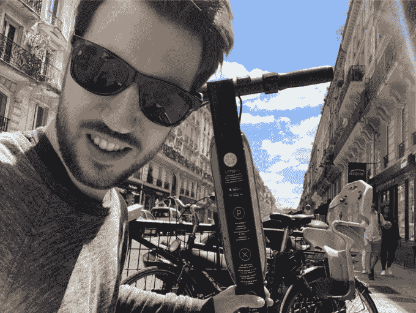
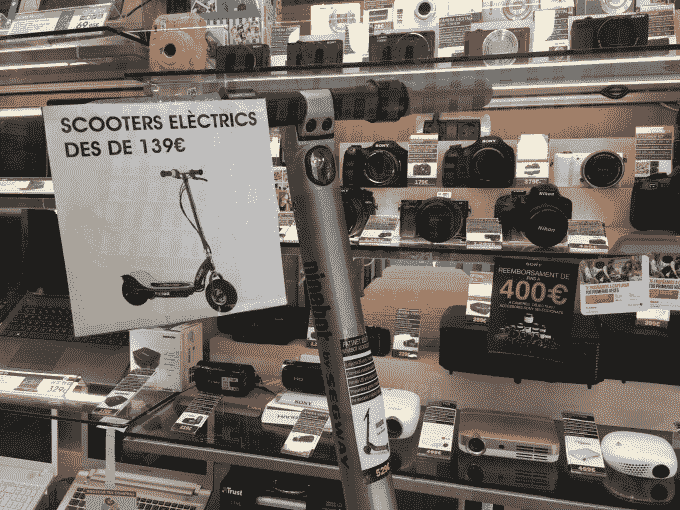

# 滑板车创业公司真的值几十亿吗？

> 原文：<https://web.archive.org/web/https://techcrunch.com/2018/06/23/are-scooter-startups-really-worth-billions/>

最近几个月，人们很难忽视踏板车创业大战在硅谷社会开启了新的、由技术推动的裂痕。[另一种风格的拼车骏马](https://web.archive.org/web/20230318030923/https://techcrunch.com/2018/02/08/bike-sharing-startup-spin-is-getting-into-scooter-sharing/)似乎在一夜之间出现，挤满了人行道——这引起了城市监管机构[的快速愤怒](https://web.archive.org/web/20230318030923/https://techcrunch.com/2018/05/24/bird-lime-spin-electric-scooters-san-francisco/)如果用传统的汽车形状的胶囊交付，显然对交通拥堵要宽容得多。

即使在他们最好的，最整洁的公关照片中，这些细长的电动滑板车的无码头粗心大意也带着一种漫不经心和特权的空气。好像在说:是的，我们把一个儿童玩具变成了电池驱动的儿童运输车——你打算怎么做？

更早的一批[电动滑板车共享创业公司](https://web.archive.org/web/20230318030923/https://techcrunch.com/2017/03/09/scoot-is-expanding-its-electric-scooter-operations-globally-with-a-white-label-service/)——提供全脂肪的公路助力车，这些车绝对需要驾驶执照(除非你疯了，还需要头盔)——无法与之竞争。最后一英里跑不完。

但是一个如此无缝操作的短途代步工具当然也很容易被破坏。或者挪用。或者两者都有。从踏板车战争前线的报道来看，加州出现了过多的踏板车被肢解/绑架的恐怖故事。把滑板车挂在树上可能是一种抗议。

滑板车品牌 Lime 在一次更新中添加了一个安全警报，机器人威胁任何笨手笨脚解锁的人报警，试图解决这个问题。可以肯定地说，在公共场所乱丢摩托车不是一种赢得朋友和影响他人的方式。

即使功能“正常”，即如预期的那样，骑踏板车也会渗出一种傲慢的权利。这种无汗的便利看起来可能是技术驱动的冲洗行为的又一个进步，因为一个穿着阿尔法书呆子 t 恤的人飞快地跑过去，吠着进入 AirPods，吸着外卖拿铁，同时打断了行人的耐心。

然而，这种快速播种的社会摩擦并没有抑制电动滑板车的创业势头。恰恰相反。他们已经在迅速膨胀的估值上筹集了大量投资(20 亿美元是伯德的最新估值)。

但是，购买大量的电动滑板车并任由人类的一时冲动摆布是一项尝试规模化的昂贵生意。因此，如果你要更换所有的运河浸泡哑弹，并保持足够快的比赛速度，大量的资金是必要的。

与此同时，除了价格和距离，一种电动滑板车的体验与另一种没有太大的区别。品牌化*也许*可以做到这一点，但之后你必须更加努力、更加快速地创造出一种流畅的体验，并膨胀出一个持久的品牌。(不用说，粘满粪便的滑板车绝对不是那样的。)

仍然羽翼未丰的初创公司肯定在争先恐后地扩大规模，其中一些已经进军国际市场。例如，Lime 刚刚在巴黎分散了大约 200 辆电动滑板车。它还在苏黎世悄悄试水。当伯德把他的小眼睛盯在欧洲领土上的时候。

支撑这些羽翼未丰的初创公司的一些非常肥胖的估值的想法是，在基于应用的便利性和城市对具有无排放效益的绿色交通选择的支持下，踏板车将成为城市交通的重新设计的多模式交通组合的关键组成部分。(尽管滑板车的环保程度取决于它们所取代的东西；如果是耗油的汽车就很好，如果是步行或兜售的人就不那么引人注目了。)

虽然投资者接受了许多城市居民将在未来骑行最后一英里的愿景，并押注于一些勇敢的滑板车初创公司将获得可观的价值——自 2 月份以来，超过 5 亿美元已被注入其中两个超薄滑板车品牌 [Bird](https://web.archive.org/web/20230318030923/https://techcrunch.com/2018/05/29/bird-150-million-1-billion-valuation/) 和[Lime](https://web.archive.org/web/20230318030923/https://techcrunch.com/2018/06/05/scooter-startup-lime-is-reportedly-raising-250m-led-by-uber-investor-gv/)——但也有怀疑的声音。

询问踏板车模式是否真的证明如此巨大的涨幅和令人兴奋的估值是合理的。怀疑一只羽翼未丰的 [鸟](https://web.archive.org/web/20230318030923/https://techcrunch.com/2018/05/29/bird-150-million-1-billion-valuation/) 已经是 2 头独角兽了，这是不是有点疯狂。

这些细长电动滑板车的熊市说，它们实际上只是解决了一个非常有限的城市机动性问题。如果你没有很远的路要走，那么太细长和不安全了，太平稳的步伐(和人行道空间的挑战)让你觉得不值得。当然，你不可能在直立的两轮车上载着你的孩子和/或很多行李。所以它们对家庭来说毫无用处。

与此同时，踏板车入侵在一些地方是非法的，在可能的地方，很快就会引起公众和监管机构的不安和摩擦——加剧了本已拥挤的人行道上的拥堵和危险。

本周，欧洲基金 Daphni 早期阶段的风险投资人 Willy Braun 开着 Lime 刚刚登陆的电动滑板车在巴黎兜了一圈后，离开时并不为所动。“在短距离内，我不觉得我真的节省了时间，因为在我们狭窄的人行道上总是有很多人，”他告诉我们。“想象一段更长的距离对我来说还不够舒服。而且它很贵(每次 1 美元，每分钟 0.15 美元)。

“最后:在租它之前，我阅读了两家新闻媒体，它们告诉我只能在人行道上使用它，它们告诉我们，我们应该只在入职期间在路上使用它——并且在没有提供头盔的情况下，必须佩戴头盔。相比之下，我宁愿毫不犹豫地使用电动自行车(或电动自行车)进行更长的旅程。”

“给我们跳吧，而不是石灰！”他补充说，检查自 4 月[日](https://web.archive.org/web/20230318030923/https://techcrunch.com/2018/04/09/uber-acquires-bike-share-startup-jump/)以来一直在优步旗下的电动自行车初创公司，为其城市移动弓添加一根更环保的绳子——并且也将前往欧洲[作为这家打车巨头正在努力振兴其在区域内遭受重创的品牌的一部分。](https://web.archive.org/web/20230318030923/https://techcrunch.com/2018/06/06/uber-is-bringing-its-jump-e-bikes-to-europe/)

“优步随时准备帮助解决德国城市面临的一些最大挑战:解决空气污染，减少拥堵，增加获得更清洁的交通解决方案的机会，”首席执行官 Dara Khosrowshahi 本月早些时候在柏林诺亚会议上推着一辆鲜红色的跳跃自行车上台时说。优步的 Jump 电动自行车将于今年夏天在德国上市。

电动自行车似乎比电动滑板车提供了更多的城市机动性。虽然滑板车可以说是一种比自行车更容易接近的有轮坐骑，但是你可以站在上面被移动。

但是在欧洲密集且动态的城市环境中——与美国不同，这里往往充满了公共交通选择(通常是各种价位)——个人交通选择往往首先基于经济因素。之后基本上就是个人品味和/或天气的问题了。

球场的城市交通马——取决于你的风险、便利和舒适阈值，感谢公共资助的奢侈选择。所以滑板车已经有了很多固有的竞争。

TechCrunch 的巴黎居民罗曼·迪莱特(Romain Dillet)是该市按需自行车服务(有很多)的经常用户，在此之前，该市有自己的基于码头的自行车租赁计划——本周也试驾了一辆 Lime 踏板车。离开时也感觉索然无味。

“这很糟糕，”他骑完马后说。“它很慢，你需要不停地刹车。但最糟糕的是，它感觉比自行车更危险。基本上你不能突然刹车，因为你只是站在那里。”

Index Venture 的马丁米尼奥本周也在巴黎，他也借此机会骑着 Lime scooter 兜了一圈——看看他的竞争对手，因为这家欧洲风险投资公司是一家 Bird backer。那么他是怎么想的呢？

“这种体验很酷。它比自行车稍微快一点，没有出汗。巴黎的天气非常好，非常热，所以就速度和省力而言，这是相当令人惊讶的，”他说，推出了关于共享滑板车的积极旋转的既得观点。“尤其是上山去巴黎北站。

“没有摩擦——只是为了上船开始。所以总的来说，我认为这是一次很棒的体验，我认为这是步行和按需自行车之间的一个非常有趣的利基……在巴黎，你还可以看到助力车。所以这是一种“中间产品”。我认为那里有很大的市场。我认为这在巴黎会很成功。”

米尼奥对 Lime 的踏板车与 Bird 正在部署的模型(他也是个人拥有的踏板车模型)的质量有点不以为然。但正如你所料，鉴于他的既得利益。

“显然我有偏见，但我会说小米滑板车/Ninebot 滑板车比 Lime 正在使用的质量更高，”他告诉我们。“我觉得莱姆一号的车把有点太高了。刹车有点太软了。可能是我用过的那个，我不知道。”

谈到一般的踏板车创业公司，他说投资者的兴奋归结于旅行频率——正是由于旅行是这些微不足道的最后一英里链接。

但这也是关于所有最后一英里跳跃可能成为赢得智能手机用户主屏幕上宝贵位置的捷径——因此，正在进行的底层游戏看起来像是在城市移动竞赛中争夺主要位置。

例如，Lime 在涉足滑板车和多种模式之前，以自行车租赁起家。因此，代步车共享开始看起来像是移动创业公司向注意力食物链顶端移动的一种策略——在那里他们被定位为提供全面的组合并获取更多价值。

因此，真正的滑板车可能主要是一种吸引人们应用程序注意力的工具。下次你看到人行道上躺着一个人时，想想这个。

“如果你看看旅行分布，你会发现非常有趣的是，大多数旅行都是短途的。所以很明显，如果你步行的话，绝大多数行程都不到三英里。这实际上是大部分移动性发生的地方。滑板车在那块地上玩得很好。因此，就旅行的绝对数量而言，我认为它将使任何其他类型的交通工具相形见绌。尤其是乘车服务，”米尼奥说。

“如果你看看人们使用优步、Lyft 或 Taxify 的频率……会比滑板车用户少得多。我认为这是使它成为如此有趣的资产的原因……频率将会更高——因此驱动踏板车的应用程序将会出现在主屏幕上。可以说，处于食物链的顶端。所以我认为这就是它超级有趣的地方。”

滑板车也受到了投资者的青睐，因为它与自行车(或者，嗯，非电动滑板车、滑板、旱冰鞋、公共交通工具等等)等其他可用的城市选择相比，在骑行过程中没有摩擦，无论是在上车(出发)还是推进(即骑行时不需要流汗)。

“这就是这些设备的高明之处，你只需按下二维码，就可以上路了，”他说。“自行车的不同之处在于，你不需要付出任何努力。我认为有些情况下自行车显然更好。但我认为，在很多情况下，人们会想要一些你不会流汗的东西。

“在那里你不会弄皱你的衣服。这样会快一点。而不去体验你需要戴头盔的助力车，这有点危险，很多人，尤其是女性，都不太熟悉。所以我认为踏板车作为一种外形令人兴奋的是它实际上非常主流。

“任何人都能骑它们。操纵起来非常简单。不是超级快，也不是太危险。它不需要任何肌肉力量——所以对于老年人或那些因为要去开会或做其他事情而不想流汗的人来说。这是一个非常棒的选择。”

Index 还投资了一家电动自行车初创公司( [Cowboy](https://web.archive.org/web/20230318030923/https://techcrunch.com/2018/04/24/cowboy-raises-3m-led-by-index-to-launch-a-smarter-e-bike/) ),该公司完全认同城市交通将是多模式的这一理念。因此，如果电动滑板车的估值有点过高，指数不会太受关注。城市里的人们显然会骑着什么东西。支持一个组合是一个聪明的方法来对冲任何一个选项比主要的城市骏马更多的昙花一现的风险。

大多数情况下，Index 认为人们会继续骑着机器马去城市球场。无论他们乘坐什么，这是一个相当安全的赌注，一个应用程序将参与寻找(因此，无码头是另一个注意力游戏)或解锁(扫描二维码！)移动设备——开辟了一个应用程序可以容纳多个移动选项的可能性，从而获取更多的整体价值。

“这不是一刀切。它们都是相辅相成的，”米尼奥在谈到城市交通选项时说。“我想说电动自行车可能更适合短途旅行，因为你是坐着的。但是这又需要一点时间，因为你必须调整马鞍，你需要开始兜售。上车和骑行时都有更多的摩擦。但是对于稍微长一点的距离来说，它们更好一点。我想说，对于较短的距离，没有什么比踏板车更好的了。”

他还指出，滑板车比电动自行车更便宜，体积也更小。因为它们占用更少的街道空间，至少在理论上，它们可以更密集地堆叠，从而产生所谓的便利，因为它们坐得足够近，可以说服某人不要走 10 分钟去咖啡馆或健身房，而是快速移动。所以滑板车纤细的外形也让投资者特别兴奋。(讽刺的是，即使它被用来敦促人们少走路。)

“我认为我们最终会拥有更多高密度的滑板车。这一点非常重要，”他继续说道。“最终，人们会倾向于乘坐他们能找到的交通工具。我认为最终他们更有可能得到一辆小型摩托车，而不是一辆电动自行车。只是因为它们占用的空间更少，价格也更低。”

但是，为什么那些确实被最后一英里滑板车的无汗津贴所吸引的人不干脆购买并拥有他们自己的车呢——而不是不断地花钱去分享？

与自行车不同，滑板车非常灵活，可以很容易地拿起来到处移动。这意味着他们可以和你一起进入你的家、办公室，甚至是餐馆，从而极大地降低了被盗风险。然而，与任何自行车所有者交谈，他们几乎总是会有至少一个盗窃悲剧的故事，这是自行车共享如此吸引人的关键部分:它消除了盗窃的担忧。

除此之外，你还可以在欧洲电子商店找到售价低至 140€的电动滑板车。因此，如果你想成为一名普通的摩托车手，那么拥有自己的摩托车这一纯粹的经济理由看起来相当有说服力。

在另一个人口稠密的欧洲城市巴塞罗那，人们骑着电动滑板车到处跑是一个非常常见的景象，巴塞罗那有非常适合滑板车的天气，但还没有滑板车创业公司。但是，除非是沿着海滨漫步的游客，否则大多数骑手都不会被共享:人们只是走进当地的电子商店，然后带着装在盒子里的滑板车走出来。

因此，除了电力公司之外，这些游乐设施没有为任何人产生重复收入。

当被问及为什么那些确实想滑板车的人不直接购买，而是租用时，米尼奥谈到了所有权的麻烦——这一点被他也是一名滑板车所有者的事实略微削弱了(尽管他声称对诸如轮胎经常漏气和夜间充电等问题感到不满)。

“你很快就会注意到:有两件事，一是维护，”他说。“现有的模型并不是非常稳健。也许是在非常平坦、非常光滑的道路上，也许是圣莫尼卡，也许不太真实，但我要说在欧洲，所需的维护费用相当高……我必须每周都做一些维护工作。

“另一件事是它需要一点空间。如果你必须把它带到餐馆或任何类型的拥挤场所，电影院或任何你要去的地方，办公室，会议室，它有点重，有点不方便。所以肯定会有人购买……但我也认为，在很多情况下，你宁愿按需购买。”

与米尼奥和 Index 不同，英国风险投资公司 Oxford Capital 的汤姆布拉德利(Tom Bradley)并不认同按需代步车热潮。

该公司本身没有进行任何电动滑板车投资，尽管移动性是一个“核心主题”，投资组合包括按需教练旅行初创公司( [Sn-ap](https://web.archive.org/web/20230318030923/https://www.sn-ap.com/) )，以及科技公司，如 [Morpheus Labs](https://web.archive.org/web/20230318030923/http://morpheuslabs.co.uk/) (无人驾驶汽车的机器学习)和 [UltraSoc](https://web.archive.org/web/20230318030923/https://www.ultrasoc.com/) (汽车零件的复杂电路，出售给特斯拉等公司)。

但它并没有在小型摩托车创业公司中销售。布拉德利将其描述为一个“未决问题”，即滑板车最终是否会成为“人们在未来城市中出行的重要组成部分”。他还指出，无人值守自行车共享计划存在盗窃问题，这在英国并不成功。

“我们不认为这是这幅画的基本部分，”他谈到踏板车共享时说。“这可能是问题的一部分，但我个人并不认为这是人们愿意为之付费的一部分。”

“我一直在想赛格威的例子，”他补充道。“这绝对是一款令人愉快的产品。太棒了。简直太棒了。在某种程度上，这些电动滑板车不是。但显然它要贵得多。这让人觉得有点奇怪。但这应该是答案——但它不是答案。也许还没到时候。”

当然，他也承认资本“正被用作武器”，用他的话来说，就是通过发动一场“营销战”，全力奔向共享电动滑板车在城市街道上成为常态的未来。

“风险投资的估值是某人愿意支付的价格。在这种情况下，人们看重的是潜力，而不是企业价值……因此(Bird and Lime)的估值最大程度上是由融资金额驱动的，”他表示。“因此，你决定一个关于什么是可接受的稀释的经验法则，如果你要筹集 4 亿美元或其他什么，那么估值必须在 16 亿至 20 亿美元之间，才能让这种融资有意义——并为之前的投资者和创始人留下足够的股权。因此，这里有一个因素，即估值受到融资额的驱动。”

牛津资本(Oxford Capital)对踏板车共享的悲观看法也受到该基金只投资于英国初创公司的限制。虽然布拉德利表示，它看到了许多当地的移动优势——特别是在汽车市场——但他承认，想象一家世界领先的滑板车初创公司从该国绿色宜人的土地上诞生，这更像是一种精神飞跃。尤其是因为在英国的公共道路或人行道上使用它们是不合法的。

“如果你看看像阿姆斯特丹、柏林这样的地方，它们在某种程度上是为自行车建造的。伦敦正朝着为自行车而建的方向发展……自行车是伦敦最大的成功故事之一。[代步车共享]会取代骑自行车吗？我不知道。不太相信…显然任何人都很容易上下车，不管是年轻人还是老年人。这很好，很包容。但这感觉有点像寻找问题的解决方案，人们谈论这些事情的各种旅行——在校园里，短途城市旅行。在许多城市中，很多都是步行或骑自行车旅行。那么有大众需求吗？

“这是 Segway 2 还是这辆自行车租赁 2……很难说。我们将讨论前者。我们不相信这将成为运输领域的基础部分。这将是一个功能，但不是一个很大的部分。”

但对米尼奥来说，城市交通注意力战争的早期意味着有很多东西可玩——而且很多东西可以被有利地改造，以适应滑板车的组合。

“整个事情，甚至按需自行车，实际上是一个两年前的现象，”他说。“所以我认为，无论是用户、公司还是城市，每个人都在努力学习、理解和适应这个新的现实。我认为这与汽车刚问世时非常相似。当时没有停车位，路上也没有规定。快进 100 年，它看起来非常不同。

“如果你看看已经投入的大量基础设施、努力和支出——我认为这远远超过了应该投入的——来打造一个对汽车友好的城市，如果你只是做同样数量的努力和支出的 100 倍，来为自行车和轻型两轮车腾出一些空间，我认为我们会没事的。

“这就是这种模式的美妙之处。如果你比较科技的空间，如果你看看移动人们与空间的效率，滑板车是最有效的，因为它们在地面上的足迹非常小。”

他甚至为滑板车在伦敦的良好运行提出了理由——认为城市的扩张放大了公用事业，因为人们必须进行太多乏味的最后一英里旅行。

甚至比在像巴黎这样人口密度更大的欧洲城市更是如此，他承认，在那里，考虑到更短的距离和所有其他可用的选择，骑踏板车可能更是一种“不错的选择”。所以，真的，就城市流动性而言，它实际上可以成为马匹的球场。

然而，现实是伦敦目前禁止像伯德和莱姆这样的人进入——这要归功于英国法律禁止这种无牌照的个人电动汽车进入公共道路和空间。

你可以购买电动滑板车在英国的私人土地上使用，但任何在伦敦尝试他们通常做法的滑板车初创公司都将直接陷入法律困境。

不仅仅是英国的天气恶劣。

“我真的希望 TfL[伦敦交通局]和运输部会让它成为可能，”米尼奥说。“我认为任何城市都应该张开双臂欢迎这一点。顺便说一下，有些城市。我认为，随着时间的推移，一旦他们看到世界其他地方的成功故事，我想他们都会这样做。但我希望伦敦是那些张开双臂欢迎新创新的前沿城市之一。我想现在，很不幸，它不在那里。

“有很多关于空气质量等问题的讨论，但实际上，到了紧要关头……你会遇到很多阻力和阻力……所以这有点令人失望。但是，你知道，我们最终会到达那里。”