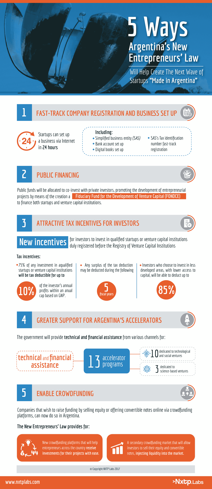

# 阿根廷政府正通过一项新法律吸引企业家 

> 原文：<https://web.archive.org/web/https://techcrunch.com/2017/06/21/argentinas-government-is-wooing-entrepreneurs-with-a-new-law/>

玛尔塔·克鲁兹是

[NXTP Labs](//web.archive.org/web/20221204182849/http://nxtplabs.com/)

，这是一只面向拉丁美洲科技公司的早期基金。

尽管多年的经济不确定性和缺乏适当的法律框架来帮助有前途的初创公司获得资本，阿根廷企业家正在建立一个充满活力的创业生态系统。

这个国家是许多拉丁美洲最大的创业成功故事的发源地，随着 T4 新法律的出台，通往成功的道路将变得更加容易。上个月，参议院一致投票批准了支持阿根廷创业活动增长的立法。

为了减轻企业家必须承担的官僚负担，在阿根廷企业家协会( [ASEA](https://web.archive.org/web/20221204182849/http://www.asea.com.ar/) )和阿根廷私募股权、风险和种子资本协会( [ARCAP](https://web.archive.org/web/20221204182849/http://www.arcap.org/) )的支持下，新的立法取代了旧的申请、批准和融资程序，企业家需要一年时间才能合法地开办他们的公司。

《企业家法》的通过正值阿根廷的关键时刻。这与毛里西奥·马克里总统推动开放阿根廷经济、让阿根廷再次融入全球市场的努力是一致的。但是，为了充分理解企业家法则的意义，理解阿根廷艰难而坚韧的创业历史是很重要的。

阿根廷巨头 Globant 的早期办公室

## 几十年的高峰和低谷

阿根廷的创业故事始于 20 世纪 90 年代，在经历了多年的高通胀后，阿根廷政府推出了“T2 新计划”来重新开放国家。这段时间恰逢 20 世纪 90 年代的网络泡沫，布宜诺斯艾利斯成为该国历史上一些最成功企业家的跳板。

在此期间，据估计[拉丁美洲 70%的风险资本都集中在布宜诺斯艾利斯。也是在这一时期，中国第一批大型互联网公司开始起步。](https://web.archive.org/web/20221204182849/http://www.apertura.com/emprendedores/Se-realizara-el-primer-Venture-Capital-Forum-Argentina-20150819-0009.html)

一群阿根廷企业家创建了 [MercadoLibre](https://web.archive.org/web/20221204182849/https://seekingalpha.com/article/3978238-mercadolibre-tech-bubble-time-capsule) ，拉丁美洲的易贝，于 2007 年首次公开募股，以及 [OfficeNet](https://web.archive.org/web/20221204182849/http://endeavor.org/entrepreneurs/entrepreneur-to-entrepreneur-connections-egypts-sasco-group-and-officenet-co-founder-santiago-bilinkis/) ，于 2004 年被史泰博收购。在接下来的许多年里，这些公司给有抱负的企业家带来了希望，在这个国家，攀登公司阶梯通常被视为进步或成功的唯一途径。

不幸的是，对阿根廷来说，20 世纪 90 年代的结局很糟糕，该国陷入了严重的经济危机，面临着严重的货币贬值，并在 2001 年出现了公共债务违约。自那以后，企业家们面临着艰难的商业环境，依靠耐心和极端的决心在资本匮乏的环境中为他们的企业筹集资金。

一些科技公司，比如阿根廷的 Craigslist 网站 OLX，以及现在上市的外包巨头 Globant，在 2000 年代都非常成功。然而，近年来，阿根廷创业生态系统的增长有些停滞，并带有太多的障碍，让今天的企业家无法真正成功。

正是在这段时间(2013 年)，邻国智利在一天内通过了一项类似的" [法](https://web.archive.org/web/20221204182849/http://pulsosocial.com/en/2013/01/24/in-chile-its-now-possible-to-start-a-business-in-just-one-day/)"该法允许智利企业家在短短一天内开始创业，并在网上完成所有必要的文书工作和注册要求。智利企业家协会(Asech)在完全由政府资助的项目“智利创业”(Start-Up Chile)出现之前，帮助通过了该法律，以重振该国作为全球创新领导者的地位。

这个项目已经成为全球创业社区有史以来最成功的加速项目之一。智利的创业生态系统爆炸式增长，圣地亚哥甚至被冠以“[智利谷](https://web.archive.org/web/20221204182849/https://www.theguardian.com/small-business-network/2016/dec/22/chile-accelerator-startup-grants)”的称号

到目前为止，初创企业智利已经帮助了超过 3000 名创业者，超过 30%的初创企业已经通过该计划筹集了额外的资金。 [CORFO](https://web.archive.org/web/20221204182849/http://www.english.corfo.cl/) 是智利政府的另一项举措，它在早期对该国的创新和创业进行了大量投资，并在将智利转变为全球创新和创业中心的过程中发挥了关键作用。

对于阿根廷的创业社区，以及像 ASEA、T2 和 T4 这样的组织来说，智利是一个最好的例子，表明了当企业家有政府的支持时会有什么样的可能。这就是为什么《企业家 T5 法》的通过是在如此关键的时刻。阿根廷的创新者总是在该地区脱颖而出，但是有了这个新的法律，该国的企业家终于可以超越仅仅是一个地区的成功故事，作为世界技术和创新的领导者向前迈出一大步。

在过去的几年里，新兴市场一直在从另一个项目中汲取创业法律的灵感，该项目被广泛认为是政府成功干预风险投资的主要模式: [Yozma](https://web.archive.org/web/20221204182849/https://www.crunchbase.com/organization/yozma-venture-capital) 。

1993 年，以色列政府创建了 Yozma，这是一个[、1 亿美元的基金中的基金](https://web.archive.org/web/20221204182849/http://business.financialpost.com/fp-comment/israels-yozma-an-example-for-canada)，在短短三年内催生了 10 个风险投资基金。该计划有三个促成其成功的关键特征。它支持许多小基金，它不试图选择赢家，最后，它帮助促进以色列和国际风险资本家之间的关系。

在墨西哥，INADEM 和 NAFIN 联手复制了 Yozma 模式，因为将资金分散到尽可能多的基金中有其优势。首先，风险投资资助的公司数量是创造就业和 GDP 增长的关键，而不是每家公司的实际投资额。更多的风险资本流动意味着更多的投资者有机会学习交易。

阿根廷新的《企业家法》包括许多措施，旨在通过提高经商的便利性，提供新的融资渠道，以及最重要的是，为那些有兴趣投资阿根廷初创企业和风险投资基金的人提供有吸引力的新税收减免和激励措施，来增加该国的企业家和投资活动。

以下是这些措施将如何在启动下一波“阿根廷制造”创业浪潮中发挥重要作用的概述。

**公司注册快速通道**

《企业家法》将通过允许他们在 24 小时内 通过互联网 以简化的商业实体(SAS)模式建立他们的业务，促进新公司的建立、推广和潜在增长。这包括开设一个银行账户，电子书籍和建立一个识别号码。简化股份公司(SAS)模式的另一个有趣的优势是，即使它允许阿根廷公司只有一个所有者，如果创始人希望增加一个合伙人，也没有必要修改合伙企业的类型。

目前，在阿根廷开办企业的整个过程可能需要六个月到一年的时间。这种设置时间现在大大减少，甚至为公司提供了一个临时地址。然后，创始人将有 6 到 12 个月的时间更换永久地址。

**新的融资渠道**

阿根廷将首次拨出公共资金与私人投资者共同投资，以促进企业项目的发展。《创业家法》将创建风险资本发展信托基金(FONDCE ),为风险企业和风险投资机构提供融资。在接下来的一年中，该基金将向三个风险投资基金提供高达 40%的资金(占承诺资金总额)，只要这些机构也提供对应资金。

还将建立一个正式的风险资本机构登记处，作为阿根廷各种机构和投资者注册和分享信息的场所。基金经理，私人投资者，以及基金和信托，无论是公共的还是私人的，都可以注册。这将使追踪该国的风险投资活动变得容易得多。

**对投资者有吸引力的税收优惠**

阿根廷的初创企业经常面临来自私营部门的融资机会短缺。因此，他们不得不依赖少数天使投资者、风险投资基金，当然还有更传统的 FFF 资本来源(朋友、家人和傻瓜)。)

随着新的《T2 企业家法》的出台，投资者现在有更多的动力投资于合格的创业公司或风险投资基金。对 SAS 公司或 SAS 认可的投资基金的任何投资的 75%将可获得投资者年度利润的 10%的减税。选择投资于欠发达地区的投资者，获得资本的机会较少，将能够扣除高达 85%的费用。

**加大对加速器、众筹平台的支持**

政府计划为 13 个加速器项目提供技术和财政援助——10 个致力于技术和社会风险投资，3 个致力于科学风险投资——创建一个新的种子基金项目。

财政援助将来自各种渠道，包括软贷款、无偿捐款和基金。在接下来的一年里，政府还计划与私营部门共同创建 10 个新的加速器，这对于帮助阿根廷企业家推动他们的公司向前发展的项目来说是一个令人兴奋的时刻。

最后，希望通过出售股权或通过众筹平台在线发行可转换债券来筹集资金的公司现在可以这么做了。《企业家法》使众筹平台能够注册他们的服务，并帮助全国各地的企业家轻松获得项目投资。需要指出的一个有趣的组成部分是,法律还允许实施二级众筹市场，允许投资者出售他们的股权和可转换票据，从而向市场注入流动性。

## 一股新的创业浪潮正在兴起

尽管经历了多年的政治和经济不确定性，阿根廷已经成功创造了一些拉丁美洲最大的创业成功故事。该地区九家最有价值的“独角兽”科技公司中，有四家在中国。但风投们是时候开始关注今天的创业者了。

尽管阿根廷仍处于这种新的政府与创业公司合作的早期阶段，但亲眼目睹阿根廷企业家在政府支持和更友好的经营条件下能够完成的所有不可思议的事情，将是令人兴奋的。

随着投资的增加，新一波公司也将能够创造就业机会，对国家的社会、环境和经济产生真正的影响。《T2 企业家法》将缓解阿根廷企业家曾经面临的困境；然而，完全消除这些障碍将需要来自创业社区的更多指导和支持。但是当地投资者现在有希望为他们提供这些。