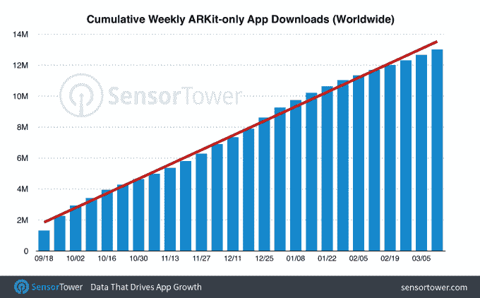
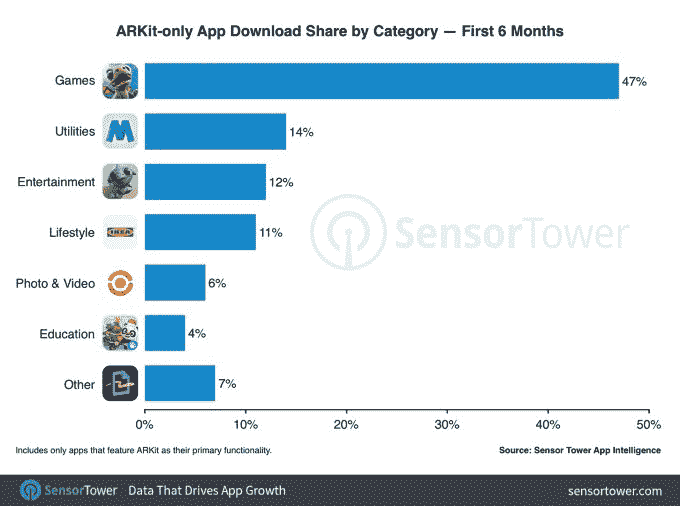
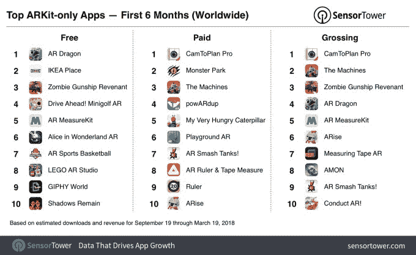
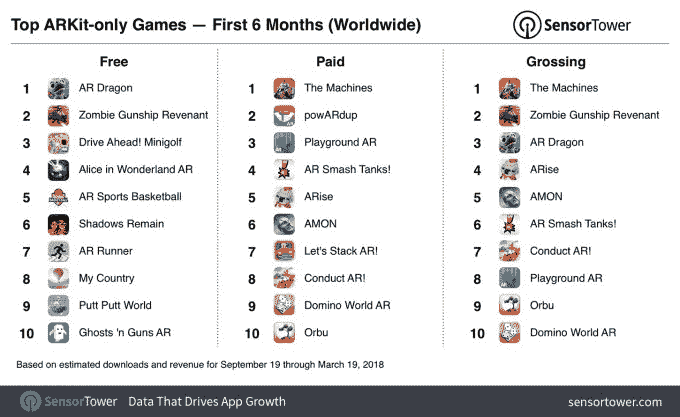
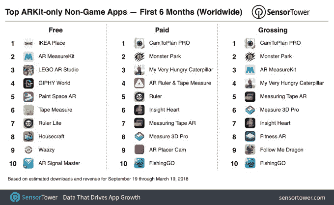

# 仅 ARKit 应用的安装量高达 1300 万，其中近一半来自游戏 

> 原文：<https://web.archive.org/web/https://techcrunch.com/2018/03/28/arkit-only-apps-top-13-million-installs-nearly-half-are-games/>

据应用情报公司 Sensor Tower 的[新数据](https://web.archive.org/web/20230130100805/https://sensortower.com/blog/arkit-six-months)显示，自 2017 年 9 月 19 日 iOS 11 发布以来，使用苹果 ARKit 开发的增强现实应用程序已被下载超过 1300 万次，该公司研究了 AR 应用生态系统的状态，现在它有时间变得更加成熟。它发现——正如应用领域的许多新发展一样——就 ARKit 的采用而言，游戏一直是最受欢迎的。

前六个月，全球 ARKit 专用应用下载量中有近一半(47%)是游戏，自推出以来一直领先于 ARKit 专用应用安装量。

iOS 11 发布一个月后，仅 ARKit 应用的下载量超过了 300 万次，其中游戏占下载量的 35%。六个月后，在目前 1300 万 ARKit 专用应用下载量中，游戏已经增长到 47%。

当然，在 ARKit 推出之前，游戏有助于推广增强现实。由于 Pokémon Go 在全球范围内的热潮，移动用户开始熟悉 ar 增强游戏的潜力，因为他们试图捕捉现实世界中出现的动画 Pokémon，只能通过智能手机相机的取景器看到。

免费下载量最多的应用是澳大利亚 PlaySide 工作室的虚拟宠物模拟器 [AR Dragon](https://web.archive.org/web/20230130100805/https://itunes.apple.com/US/app/id1270046606?l=en) 。付费和票房最高的 ARKit 专用应用程序是 Tasmanic Editions 的付费 AR 卷尺应用程序 [CamToPlan Pro](https://web.archive.org/web/20230130100805/https://itunes.apple.com/US/app/id1300697619?l=en) 。

如果你想知道为什么顶级应用不是 Pokémon Go，那是因为 Sensor Tower 的分析只关注 ARKit- *的*应用，而不是 ARKit- *兼容的*应用，这些应用在过去六个月中增加了一些 AR 功能。Pokémon Go 就是后者的一部分。

但 Sensor Tower 表示，如果你将所有 AR 应用程序结合起来，包括 ARKit 专用应用程序和 ARKit 发布时添加了新 AR 功能的应用程序，那么今天 App Store 上的 AR 应用程序将远远超过 2000 个。这也与苹果官方发布的[数据](https://web.archive.org/web/20230130100805/https://techcrunch.com/2018/01/24/apples-augmented-reality-tool-kit-can-now-detect-walls-and-2d-images-in-beta/)相符。

其他受欢迎的仅支持 arKit 的应用类别包括实用程序(如 AR [测量](https://web.archive.org/web/20230130100805/https://itunes.apple.com/US/app/id1300697619?l=en) [胶带](https://web.archive.org/web/20230130100805/http://www.magic-plan.com/)或[易贝寻找正确装运箱的工具](https://web.archive.org/web/20230130100805/https://techcrunch.com/2018/03/19/ebays-new-ar-tool-helps-sellers-find-the-right-shipping-box-to-fit-their-item/))、娱乐应用程序(如 AR 儿童读物、[我非常饥饿的毛毛虫](https://web.archive.org/web/20230130100805/https://itunes.apple.com/us/app/my-very-hungry-caterpillar-ar/id1277085142?mt=8))、生活应用程序(如现在众多通过 AR 帮助消费者在自己房间放置物品来购买家具的应用程序)、照片和视频应用程序(如[赫萝](https://web.archive.org/web/20230130100805/https://itunes.apple.com/us/app/holo/id1194175772?mt=8))以及教育应用程序。

除了游戏之外，仅支持 ARKit 的生活方式应用程序的下载量也出现了可观的增长，继[宜家](https://web.archive.org/web/20230130100805/https://techcrunch.com/2017/09/12/ikea-place-the-retailers-first-arkit-app-creates-lifelike-pictures-of-furniture-in-your-home/)、[豪兹](https://web.archive.org/web/20230130100805/https://techcrunch.com/2017/09/19/a-new-arkit-app-from-houzz-brings-500000-objects-to-moveable-life/)、 [Wayfair](https://web.archive.org/web/20230130100805/https://techcrunch.com/2018/03/20/wayfairs-android-app-now-lets-you-shop-for-furniture-using-augmented-reality/) 和其他应用程序发布之后，它们在 AR 应用程序安装中的份额从 5%增加到 11%，增长了一倍多。与此同时，公用事业公司的下载份额从 19%下降到 15%。

ARKit-only 游戏排行榜与六个月前基本相同，然而，除了一些新增内容，如《水果忍者》和《Jetpack Joyride》背后的游戏工作室 Halfbrick 的 [Shadows Remain](https://web.archive.org/web/20230130100805/https://itunes.apple.com/US/app/id1292142288?l=en) 。其他新闻条目还包括 [AR 粉碎坦克！](https://web.archive.org/web/20230130100805/https://itunes.apple.com/US/app/id1286732547?l=en)、[游乐场 AR](https://web.archive.org/web/20230130100805/https://itunes.apple.com/US/app/id1305282341?l=en) 、 [Orbu](https://web.archive.org/web/20230130100805/https://itunes.apple.com/US/app/id1271707085?l=en) ，这些都得益于苹果的推广。

AR Dragon 几个月来一直位于免费游戏排行榜的首位，而 Machines 一直是付费和票房收入最高的游戏。

在非游戏领域，儿童友好的 ARKit 应用占据主导地位。排名第一的免费 app 是乐高 AR 工作室，紧随其后的是熊猫博士 AR 圣诞树(#3)，喵！(#4)、数学忍者 AR (#9)、跟我学龙(#10)。

其他顶级应用包括 IKEA Place(排名第二)和 GIPHY World(排名第五)。付费和总收入最高的应用程序图表反而堆满了实用工具，通常是 AR 尺子和卷尺。

苹果在推动 ARKit 的采用方面发挥了重要作用，从[台上演示](https://web.archive.org/web/20230130100805/https://www.theverge.com/2017/9/12/16272904/apple-arkit-demo-iphone-augmented-reality-iphone-8)到 App Store [功能](https://web.archive.org/web/20230130100805/https://itunes.apple.com/story/id1288297581/)，甚至最近将[集成到苹果的儿童学习代码应用 Swift Playgrounds 中。](https://web.archive.org/web/20230130100805/https://techcrunch.com/2018/03/27/apples-learn-to-code-app-swift-playgrounds-adds-ar-lessons/)

但 AR 应用行业仍处于早期阶段，随着 ARKit 本身的发展，也有更多类型的 AR 应用出现的空间。

ARKit 1.5 的一个潜在的有趣升级是增加了对墙壁检测的支持。有了这个功能，ARKit 现在可以识别垂直表面，并将对象放在这些表面上。该套件还通过更好的水平绘图、1080p 视频和基于计算机视觉的图像识别进行了改进，这意味着 ARKit 应用程序现在可以“看到”像 2D 物体这样的东西，如墙上的海报或艺术，然后将相关物体放在附近。

苹果并不是唯一一个推动 AR 应用的公司。谷歌也在今年早些时候与 ARCore 一起发布了其对 ARKit [的](https://web.archive.org/web/20230130100805/https://techcrunch.com/2018/02/23/google-publicly-launches-arcore-1-0-on-13-phones-will-begin-expanding-lens-availability/)[答案](https://web.archive.org/web/20230130100805/https://techcrunch.com/2017/08/29/google-shows-off-arcore-its-answer-to-apples-arkit/)。在那之后的几个月里，许多只支持 ARKit 的应用也争相让自己的 Android 版本与 ARCore 兼容。上周，谷歌表示,[的 Play Store](https://web.archive.org/web/20230130100805/https://www.engadget.com/2018/03/20/android-arcore-adds-60-new-apps/) 上现在有超过 60 款 ARCore 应用，其中很多是游戏。

*图片/图表鸣谢:传感器塔*