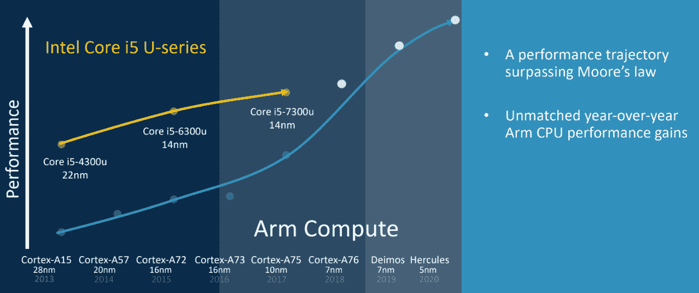
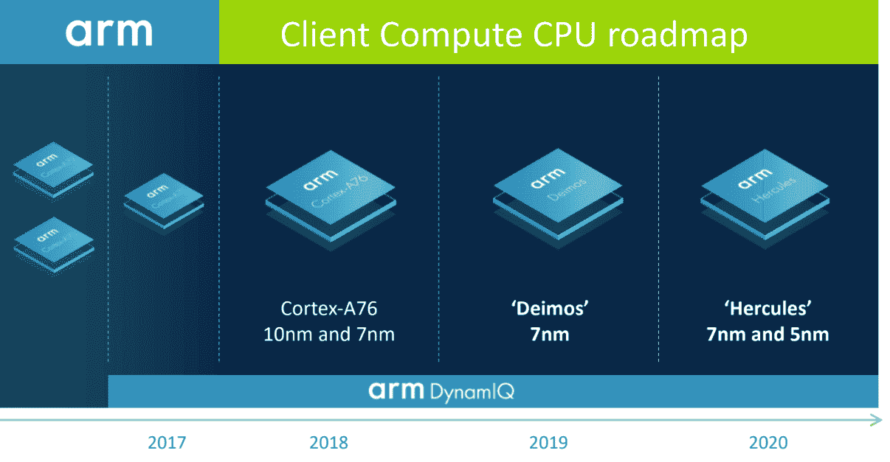

# Arm 希望为您的下一台笔记本电脑提供动力 

> 原文：<https://web.archive.org/web/https://techcrunch.com/2018/08/16/arm-wants-to-power-your-next-laptop/>

Arm 是一家设计为几乎所有智能手机和物联网设备提供支持的芯片的公司，今天发布了未来两年的路线图。这是 Arm 第一次这样做，此举的原因似乎是该公司希望突出其将芯片应用于笔记本电脑的雄心。

到目前为止，基于 Arm 的笔记本电脑还很遥远，尽管微软最近在这个方向上取得了重大进展，这要归功于它对始终连接 Windows 笔记本电脑的推动。虽然这在理论上听起来很棒，但对于只需要一次充电就可以运行一整天的笔记本电脑来说，与使用 x86 芯片相比，仍然需要付出性能代价。Arm 表示，这一差距正在迅速缩小，同时提供了更好的性能/电池寿命平衡。

事实上，Arm 营销项目高级总监 Ian Smythe 并不避讳将其下一代架构与英特尔的中端酷睿 i5 处理器进行比较。

“我认为很明显，我们正走在一条变革的道路上，”斯迈思在今天宣布之前的新闻发布会上说。“这是一次计算之旅，它正在改变计算机在大屏幕外形设备中的交付方式。我们的愿景很大程度上围绕着我们将如何从移动创新基地推动笔记本电脑的性能，以及我们将如何与代工合作伙伴合作，在当今和未来的领先工艺中提供这种性能。”

那么 Arm 的路线图是什么样的呢？细节仍然很少，但今年，该公司将推出其 Cortex-A76 架构，其合作伙伴可能会使用 10 纳米和 7 纳米工艺构建该架构。明年，它将推出戴莫斯 CPU，很可能全部采用 7 纳米工艺制造。到 2020 年，它将推出 7 纳米和 5 纳米工艺的 Hercules 处理器。

在原始计算性能方面，A76 可以与一些英特尔 i5 芯片竞争，Arm 承诺低于 5W TDP。当然，基于单一基准的原始计算能力并不是让电脑流畅运行的全部，但这标志着 Arm(及其合作伙伴)在争夺笔记本电脑市场方面的雄心——同时也让智能手机变得更加强大。

然而，基于 Arm 的处理器真的能在笔记本电脑市场上占有一席之地吗？斯迈思肯定这么认为。“我认为每一次中断都创造了一个机会，”他说。当你能展示其优势时，这种(在笔记本电脑市场的)立足之地就会扩大。我认为，随着 Arm 设备上的第一批 Windows，我们正在分享这种能力，随着我们转向基于 Cortex A76 的设备以及更高的设备，我认为这种能力和颠覆提供了超越我们今天的机会。"