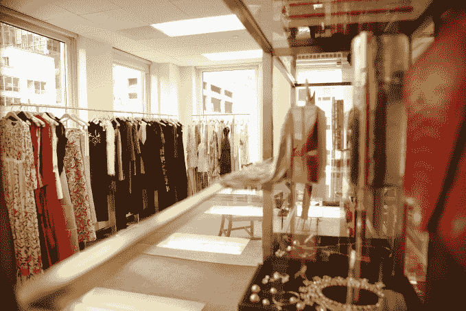

# Armarium 让你从智能手机上借用奢华时尚

> 原文：<https://web.archive.org/web/https://techcrunch.com/2016/06/01/armarium-lets-you-borrow-luxury-fashion-from-your-smartphone/>

许多初创公司希望让穿着最新——在某些情况下是奢侈——的时装变得更实惠，包括 Rent the Runway、Le Tote、Gwynniebee、Ms. Collection 等。这些公司提供出租服装，而不是出售新的服装。今天，欢迎最新加入这一人群:一款名为 [Armarium](https://web.archive.org/web/20230320073424/http://armarium.com/) 的新点播应用即将推出，为那些品味稍贵的人提供服务。与竞争对手相比，它的系列产品价格更高，并承诺只出租当季或上一季的产品。

相比之下，租借时装秀的服装可以有四季之久，而且当你选择购买时，价格要便宜得多。但 Armarium 的声明件租金为 300 至 500 美元，零售价为 3000 至 5000 美元，因为它们来自更高端的品牌。

这使得它对主流人群来说有点遥不可及，但对有抱负的时尚人群来说却是有吸引力的。

这家初创公司由时尚业资深人士组成的团队创建，其中包括联合创始人特里莎·格雷戈里(Trisha Gregory)，她是萨瓦托·菲拉格慕公司北美地区的前公关主管；时装设计师兼企业家亚历山德拉·林德·罗斯。机上还有 21 名时尚和名人[造型师](https://web.archive.org/web/20230320073424/http://armarium.com/stylists)，包括希奥纳·图里尼、卡拉·马丁内斯·德·萨拉斯、娜塔莉·乔斯等，你可以额外付费预订他们的时间。

Armarium 的团队共同策划了一系列服装和配饰，为人们提供了更多接触顶级奢侈品牌的机会，如阿尔伯塔·法拉帝、埃特罗、Jimmy Choo、尼娜·里奇、安东尼·瓦卡雷洛、彼得·皮洛托、索尼亚·里基尔、罗伯托·卡沃利等。

虽然这个想法是给任何人带来时装秀的外观，但服装包括从街头风格的日间服装到黑色领带的一系列产品。

目标是通过将价格降至零售价格的 10%至 20 %,使这些商品更实惠。(配饰 40 美元左右，成衣 200 到 800 美元)。这有助于 Armarium 确定其在该领域的定位，因为竞争对手往往会避开非常高端的产品，以努力使其每月价格更实惠。

但是 Armarium 的商业模式是不同的。尽管今天的许多服装租赁服务都是以订阅的方式运营的——也就是说，你每月支付一笔固定费用来租赁服装——但 Armarium 的用户只需为他们个人借用的服装付费。

Gregory 解释道:“多年来，我一直为全国各地的 VIP 女性设计菲拉格慕时装秀的标志性单品，看着她们在穿上其中一件后爱上这个品牌和设计师，我知道我想创建一个平台，为更多女性提供这种接触方式。”。

“最好的作品经常被取消生产，在市场上找不到。她补充说:“共享经济中也没有奢侈品时尚的参与者，我们希望通过我们的平台教育和介绍新顾客接触奢侈品高级时尚。”。

格雷戈里说，理想的客户是一位社交活跃的女性，她既想要高端的陈述作品，也想要科技带来的便利。然而，他们可能没有高级时装的经验，将使用医疗设备作为他们进入这些品牌的入口。

[gallery ids="1330272，1330271，1330270，1330269"]

要使用这项服务，客户需要下载应用程序并注册一个账户。然后，您可以浏览物品并提出借用请求。租赁期相当短——你可以租四天，但不能像其他网站那样租一个月或无限期。

此外，Armarium 提供了一种更实用的造型方法。该公司提供了一个造型师团队，他们通过聊天、在展厅甚至在纽约、洛杉矶和旧金山的私人家中帮助客户。它还提供“室内造型师”服务，你可以打电话给他们询问关于合身和风格的最后问题。

当你处理完有问题的物品后，你把它运回去，Armarium 会处理干洗。

然而，医疗设备的目标不仅仅是出租；它还试图将自己树立为一个生活方式品牌。这反映在该公司的网站上，网站上有风格灵感、对设计师的采访、由其团队设计的照片，以及“Armi 400”，专注于商业、艺术和娱乐领域的有影响力的人。例如，它已经展示了来自惠特妮·波特的关于婚礼风格的内容，以及来自 T2 的贝蒂娜·安德森的棕榈滩之旅的简介。

该公司从今年早些时候开始在邀请的基础上与 3000 名用户一起运行[私人测试版](https://web.archive.org/web/20230320073424/http://wwd.com/retail-news/direct-internet-catalogue/armarium-to-launch-invitation-only-mobile-app-on-friday-10403690/)，并报告平均回头客趋势为 28%，平均租金为 1.25 美元左右。

Armarium 在 5 月份获得了 125 万美元的种子资金，这些资金来自变质风险投资公司、卡门·布斯克茨(Net-a-Porter 的投资者)，以及各种天使和战略合作伙伴。

该应用可在 iTunes 下载[。](https://web.archive.org/web/20230320073424/https://itunes.apple.com/us/app/armarium-luxury-fashion-on/id1098272079?mt=8)