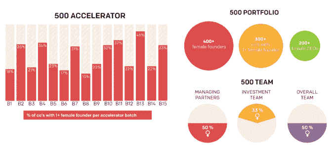

# 随着 500 家初创公司在 2016 年大举扩张，多元化成为首要议题 

> 原文：<https://web.archive.org/web/http://techcrunch.com/2015/12/24/as-500-startups-eyes-aggressive-expansion-in-2016-diversity-tops-the-agenda/>

加速器 [500 Startups](https://web.archive.org/web/20230130003305/http://500.co/) 在 2016 年瞄准了一个积极的全球扩张计划，在全球范围内计划了 10 个新的微型基金，随着投资公司规划其下一步，创始人兼董事总经理 Dave McClure 表示，基金及其投资组合的多样性是重中之重。

麦克卢尔指出，500 现有团队的地理范围和跨国构成表明，该公司目前致力于超越硅谷创始人和投资者的典型形象。

麦克卢尔表示:“如果你看看硅谷一些更具前瞻性思维的风投公司的花名册，你会发现他们仍然是白人和男性居多。”。

虽然麦克卢尔很快指出，当公司优先考虑投资组合公司和公司本身的多样性时，这不是为了促进社会议程。

“对于我们正在做的事情，没有一个强有力的道德论点。我们在管理别人的钱，我们是来赚钱的。这纯粹是一种贪婪和自私的想法，”麦克卢尔说。“妇女和少数民族是被低估的资产。你可能会说，我们为了自己的利益，在全球范围内对种族主义和性别歧视进行仲裁。”

基金和小额基金的 500 家创业公司集合肯定是全球性的。事实上，500 的运作是日不落的。

麦克卢尔表示，该公司在中国、印度、非洲、拉丁美洲和中东拥有基金和投资组合公司，对全球趋势的了解可以说是加速器中无与伦比的，对世界市场的了解让该公司对人才发展和机会有了不同的看法。

“我认为对我们来说，多样性不仅仅是性别、性取向或肤色的问题。对我们来说，有一点非常不同……我们团队中相当大一部分人不是在美国出生的，”麦克卢尔说。

**性别多样性**

最近，500 家初创公司和其他公司希望在硅谷提高声誉，并更多地接触更广泛的企业家群体，他们的主要推动力是投资更多的女性企业家。

数据显示，该公司投资了 400 多名女性创始人和 300 多家至少有一名女性联合创始人的公司(其中 200 多家公司的创始人还是首席执行官)。该公司自己的员工大约有 50%是女性，这在硅谷以任何标准来看都是罕见的。

最近的事件表明这一论点是成功的。500 是 Michelle Phan 的化妆品公司 [Ipsy](https://web.archive.org/web/20230130003305/https://www.ipsy.com/) 的首批投资者之一，该公司[于 9 月融资 1 亿美元](https://web.archive.org/web/20230130003305/https://techcrunch.com/2015/09/14/makeup-subscription-delivery-service-ipsy-raises-100m/#.emy3j4v:vnha)。

“我们如此广泛地投资于女性和少数族裔的原因是，我们认为其他投资者是愚蠢的，”麦克卢尔说。“即使投资不成功，从经济角度来说，这对我们来说也是一个日夜不停的广告。”

麦克卢尔的愤世嫉俗与其说是真实的，不如说是做作的。

在周游世界的过程中，这位 500 家初创企业的创始人一直坚持招募女性进入公司的投资团队。尽管他对公司的工作轻描淡写，但他承认，科技公司高管中女性代表不足是一个需要在全球范围内解决的问题。

麦克卢尔说:“其他地区的问题更为严重。”。“这是一个全球性的问题，我们对正在发生的事情感到非常兴奋，但还有很多事情要做。”

**投资者教育**

在寻找扩展其工作的方法时，500 正在鼓励投资者和潜在投资者将他们自己的队伍和投资组合多样化，作为其[风险资本解锁:硅谷的秘密](https://web.archive.org/web/20230130003305/http://500.co/venture-capital-unlocked-500-startups/)课程的一部分。该公司还将资金投入到一个新项目中，该项目将为 42 人课程中的多达 15 名学生提供 12，000 美元的奖学金。

据该公司称，这些奖学金将提供给那些希望投资的资产在 100 万美元以下、来自不同种族、民族和地理背景的潜在风险投资家。

管理合伙人 Bedy Yang 表示，培养一批新的投资者对该行业的健康发展至关重要。“这对于长期来说非常重要，”她说。

她说，通过突出多样性作为新项目标准的一部分，500 希望鼓励拥有更广泛经验的新一代投资者。杨表示，这个班(与斯坦福大学(Stanford University)合作)的学生是从影响力投资者、非营利组织和小型家族理财室、基金、基金的基金和天使投资者中挑选出来的。

**结构变化**

除了该公司努力解决困扰投资界的多样性问题，500 Startups 还制定了重大计划来改变风险投资模式本身。

麦克卢尔从不羞于批评风险投资拒绝扩大规模，但该公司越来越希望把钱用在麦克卢尔所说的地方。

该公司的创始人表示，他正在考虑在 500 家初创公司中建立一个并购商店——这可能只是一个开始。

“如果我们不能成为这个星球上最大的风险投资公司……如果我们不能在 10 年内达到 1000 人……那么我就做错了，”麦克卢尔说。

对他来说，风险投资中最大的虚伪之处在于，那些自称从事扩大业务的公司无法实际扩大业务。"

麦克卢尔说，最终，这可能涉及到风险资本本身的某种更具流动性的市场。

“作为风险投资基金的挑战之一是，它们大多是 10 年期非流动性工具，这不是一个好的选择，”他说。"如果你确实有可交易实体结构的风险投资基金，那就更好了."