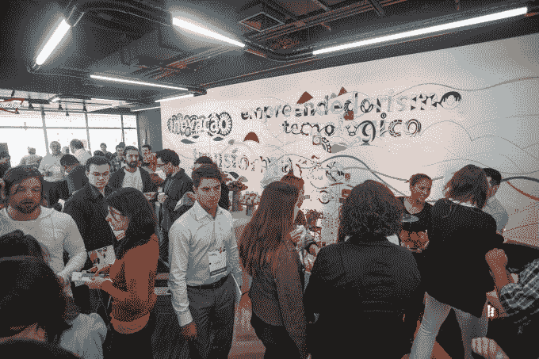
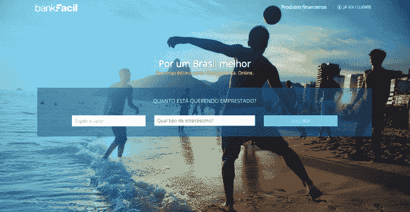

# 随着巴西经济陷入危机，技术正以两位数增长 

> 原文：<https://web.archive.org/web/https://techcrunch.com/2015/09/27/as-brazilian-economy-descends-into-crisis-tech-is-growing-double-digits/>

More posts by this contributor

尽管宏观经济形势糟糕，包括近 100 年来最严重的经济衰退，巴西有史以来最大的腐败丑闻，以及要求弹劾总统迪尔玛·罗塞夫(Dilma Rousseff)的呼声，但巴西的科技产业正在蓬勃发展。

坏消息传来的同时，初创公司也在大量发布融资公告，仅今年夏天就有超过 1.5 亿美元的公告。

圣保罗红点事件公司(Redpoint eventures)的创始合伙人、风险投资家安德森·希斯(Anderson Thees)表示，电子商务和网络行业的年增长率超过了 20%，而巴西的国内生产总值(GDP)却保持不变，科技行业几乎肯定会继续增长。

虽然巴西只有一半的人口上网，但它已经是世界第五大互联网和移动经济，是脸书、谷歌和推特的前五大市场，也是全球增长最快的智能手机市场之一——另有 1 亿人开始上网。

上周，当巴西因标准普尔(Standard & Poor)出人意料地决定降低该国债务评级而感到震惊时，该国顶级风险资本投资者和企业家聚集在圣保罗，庆祝为初创企业家提供的 5 万平方英尺(约合 10 万平方米)技术中心 Cubo 的启动。

Redpoint eventures 和银行业巨头 Itau 之间的非营利性合资企业是我见过的除纽约市[市政厅](https://web.archive.org/web/20221208174951/http://civichall.org/)之外最雄心勃勃的合作空间，为 250 名企业家和 50 家初创公司提供办公空间，位于圣保罗奢华的 Vila Olimpia 区的五层黄金商业地产上，外加一个活动礼堂和一个向公众开放的屋顶，以鼓励将该空间用作技术社区的中心。

红点事件 Cubo 发布会

相比去年，今年巴西的风险资本投资没有确切的数字，部分原因是巴西企业家(和他们的投资者)以不愿透露投资轮次或金额而闻名。但是自 2010 年以来，拉丁美洲的风险资本投资增长超过[800%](https://web.archive.org/web/20221208174951/https://beta.techcrunch.com/2015/08/11/top-vcs-chasing-digital-companies-in-latin-america/)，总计超过 6 . 5 亿美元。

在巴西，最近几个月，初创公司每周至少宣布一笔融资交易，今年夏天，当地和国际风险资本家联手在移动、电子商务、教育、银行、航运、服务和安全领域投资至少 1.5 亿美元。

“有点奇怪，但非常有益的是，数字经济在这场危机中的表现，”希斯说。

Redpoint eventures 最近几个月宣布了六项交易:对 [Olist](https://web.archive.org/web/20221208174951/http://olist.com/) 、 [Escale](https://web.archive.org/web/20221208174951/http://www.escaleseo.com.br/) 和 [Intoo](https://web.archive.org/web/20221208174951/https://intoo.com.br/) 的种子投资，与 Accion 的 Frontier Investments Group 和 QED Investors 在 BankFacil 的 300 万美元首轮投资，以及数字营销平台 Resultados Digitais 和数据分析公司 Cortex Intelligence 的 B 轮投资。

> “如果危机持续太久，它可能会影响到我们，但就目前而言，我们在创业生态系统和宏观经济之间存在脱节。安德森·希斯，红点事件创始合伙人

希斯说，该公司的交易总数与去年大致相同，但现在机会更好了，因为巴西的一些传言已经平息。“那些从大公司跳槽过来、期望在六个月内发财的人——已经一去不复返了。”

“如果危机持续太久，它可能会影响我们，”希斯说，“但目前我们所拥有的是创业生态系统和宏观经济之间的分离。如果我们没有它会更好，但实际上我们可能会因为它而走得更快。因为当一切都很好的时候，人们往往不会改变行为。人们现在更可能关注效率，他们可能更愿意尝试新事物。”

帮助巴西人确定和获得低息融资的在线贷款平台 BankFacil 是准备从经济衰退中受益的初创公司之一，它帮助巴西人节省了高达 70%的贷款还款。BankFacil 创始人兼首席执行官 Sergio Furio 表示，巴西人支付的债务利息是美国消费者的十到二十倍:消费贷款的 120%(相对于 11%)，信用卡的 300%(相对于 14%)，抵押贷款的 58%(相对于 6-7%)——家庭债务约占巴西整个 GDP 的 25%。

“我们正在利用技术在效率极低的流程中创造效率，”Furio 说。

布宜诺斯艾利斯的投资巨头 KaszeK Ventures 也在投资经济效率，宣布对 T2 进行 A 轮融资，这是一个为小企业和自由职业者提供会计服务的平台，旨在帮助他们应对全球最官僚的税法之一。比去年增长了 350%。

创始人兼首席执行官熊伟·托雷斯表示:“我认为目前最具创新性的功能是以当前成本的一小部分提供高质量的服务。”。“通过将狂热的会计师与智能软件相结合，我们提供了一种完全替代传统会计师的高质量、高性价比的服务。我们是中小型企业市场全面管理其在线业务所需的最后一个重要部分。”

Contabilizei 是 KaszeK Ventures 今年迄今在巴西进行的十几项首轮投资之一。其他[轮最近的投资](https://web.archive.org/web/20221208174951/https://beta.techcrunch.com/2015/04/15/in-latest-deals-brazilian-investor-kaszek-ventures-doubles-down-on-women-entrepreneurs/)包括时尚电子商务初创公司[服饰&Go](https://web.archive.org/web/20221208174951/https://www.dressandgo.com.br/)；雇主评审现场[love Monday](https://web.archive.org/web/20221208174951/http://lovemondays.com.br/)； [NuvemShop](https://web.archive.org/web/20221208174951/https://www.nuvemshop.com.br/) ，拉丁美洲最大的小型企业电子商务商店解决方案提供商；开创了点对点宠物寄宿市场 [DogHero](https://web.archive.org/web/20221208174951/https://www.doghero.com.br/) (巴西是仅次于美国的世界第二大宠物市场)。

KaszeK 合伙人 Hernan Kazah 表示:“在‘危机’之后，智能手机的采用不断增长，‘消费者互联网’不断发展，公司正在采用更多技术来降低成本，寻求成本效益或提供更好的服务。”。

“拥有好项目和团队的公司可以利用这一时机进行整合。总的来说，越来越少的竞争者会获得资金。投资营销的公司越来越少，因此收购成本也越来越低。获得优秀人才的难度较小。美元成本更低，因此公司的美元“消耗”也更低。分心的事情更少，所以我们可以专注于战略要点。”

卡泽克还加入了 Tiger Global 和 Monashees，以 1300 万美元参与横向服务市场的 B 轮融资 [GetNinjas](https://web.archive.org/web/20221208174951/http://www.getninjas.com.br/) 。GetNinjas 每月为超过 10 万名注册服务提供商(从油漆工到婚礼策划师)提供约 320 万美元的合同工作。

“对于巴西的标准来说，这是一个大回合，”GetNinjas 首席执行官 Eduardo L'Hotellier 说。“一些投资者，尤其是外国投资者，对巴西表现出担忧。但是危机来了又去，我们的企业有我们需要的东西来度过动荡并保持增长。我们每个月都在以两位数的速度增长，所以经济收缩对我们几乎没有影响。”

GetNinjas 是今年夏天完成更大规模融资的众多创业公司之一。巴西下载量最大的安全初创公司 [PSafe](https://web.archive.org/web/20221208174951/http://www.psafe.com/) 完成了 Redpoint eventures、Pinnacle 和 Quihoo360 的[3000 万美元 C 轮投资，使 PSafe 成为拉丁美洲第一家达到 1B 估值(约 3.2 亿美元)的移动初创公司。](https://web.archive.org/web/20221208174951/https://beta.techcrunch.com/2015/07/09/expanding-in-latin-america-brazilian-anti-virus-startup-psafe-raises-30m/)

拉丁美洲移动商务巨头 Movile 和全球在线外卖服务 Just Eat 向巴西领先的食品配送服务 iFood 投资了 5000 万美元。纽约州一家未披露的私募股权公司向巴西 430 亿美元美容产业中领先的美容电子商务初创公司 [BelezaNaWeb](https://web.archive.org/web/20221208174951/http://belezanaweb.com.br/) 注资[3000 万美元](https://web.archive.org/web/20221208174951/https://beta.techcrunch.com/2015/06/15/belezanaweb-raises-30m-to-bring-brazils-beauty-market-online/)。

自 2013 年与 KaszeK Ventures 和 Tiger Capital 完成 1000 万美元的 B 轮融资以来，该公司的年增长率为 50-60%，今年的销售额有望达到 1 亿雷亚尔(3200 万美元)。

教育部门也有一些大的投资——全部来自外国基金。Valor Capital、Amadeus Capital 和 Social Capital Partners 联手对 Descomplica 进行了 800 万美元的 B 轮投资，这是一个完全开放的在线教育平台，有 1200 万活跃学生每月支付不到 5 美元来访问巴西大学入学考试的备考材料。

一家未披露的美国公司对一个拥有 400 万学生的学术社交网络 Passei Direto 进行了 2300 万雷亚尔(700 万美元)的 B 轮投资，拥有巴西 50%的大学市场份额，迄今为止零收购成本。

> “如果危机持续太久，它可能会影响到我们，但就目前而言，我们在创业生态系统和宏观经济之间存在脱节。安德森·希斯，红点事件

Valor Capital 还与圣保罗的 Monashees 公司合作，对按需航运平台 manda(T12)进行了 150 万澳元的首轮投资。Mandaê CEO Marcelo Fujimoto 说:“在我们的情况下，在这个阶段，经济衰退不是一个因素。“Mandaê在一个非常大的市场中运营，我们也解决了数百万人共有的一个非常真实、非常大的痛点。因此，我们呈现出非常快速的增长，每月增长 30%。对于我们的首轮融资，我们吸引了很多投资者(包括国内和国际投资者)的兴趣，我们有能力进行选择。”

藤本说:“巴西的幕后正在发生惊人的大事。“虽然 2010 年外国对这里的潜力的看法可能过于乐观，但现在却过于消极，这也是不准确的。”