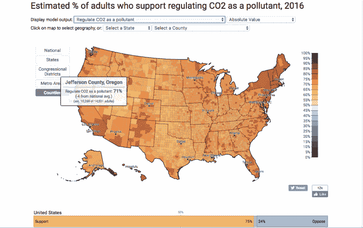
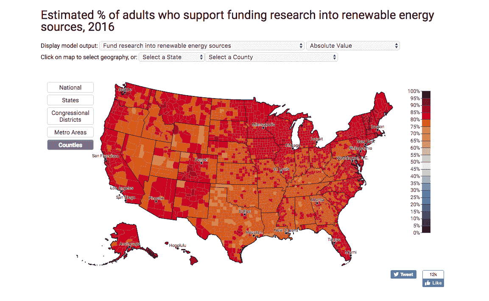

# 气候变化经济学可能胜过政治学 

> 原文：<https://web.archive.org/web/https://techcrunch.com/2017/05/07/as-environmental-battles-shift-to-states-renewable-energy-adoption-could-come-down-to-good-ole-economics/>

上周，成千上万的美国人走上街头，抗议他们所看到的环境立法的空洞化和美国遏制气候变化的努力的倒退。

华盛顿、波士顿、纽约、旧金山、芝加哥、西雅图和其他美国城市的抗议活动恰逢唐纳德·特朗普总统第一个 100 天的高潮。在那段时间里，[新政府取得的大部分政治胜利](https://web.archive.org/web/20221006085433/https://www.nytimes.com/2017/04/29/us/politics/trump-presidency-accomplishments.html?rref=collection%2Fsectioncollection%2Fclimate&action=click&contentCollection=climate&region=stream&module=stream_unit&version=latest&contentPlacement=8&pgtype=sectionfront)都是围绕着环境和气候科学——主要是[撤销前任奥巴马政府制定的政策](https://web.archive.org/web/20221006085433/https://www.nytimes.com/interactive/2017/05/02/climate/environmental-rules-reversed-trump-100-days.html?rref=collection%2Fsectioncollection%2Fclimate&action=click&contentCollection=climate&region=rank&module=package&version=highlights&contentPlacement=1&pgtype=sectionfront)。

随着战线从联邦政府转移到各州，地方政治现实和深刻变化的美国经济的新基础可能会揭示现任政府在气候问题上改变国家进程的权力有多大。

根据耶鲁大学气候交流项目的一项研究，在政治方面，美国每个国会选区的大多数成年人都支持一些法规，如限制煤电厂的二氧化碳排放，要求州公用事业使用 20%的可再生能源，以及将二氧化碳作为污染物进行监管。

“各州有很多很多的杠杆，”马克·穆洛说，布鲁金斯学会*大都会政策项目的高级研究员兼政策主任。*“公用事业委员会是国家[实体]。他们控制着州一级的土地使用，可以说他们实施了我们最成功的需求侧政策。”

这些公用事业委员会的任务是控制消费者支付的能源费用。保持低价格，同时确保公用事业建设足够的新发电来满足家庭和企业的需求，这符合他们的利益。

**能源成本**

近年来，价格控制的形式是能源效率计划(Muro 提到的需求方政策)、更多的天然气发电厂以及风能和太阳能等可再生能源。

最重要的是[一个不断变化的美国经济](https://web.archive.org/web/20221006085433/http://www.slantmarketing.com/top-industries-fortune-500/),与传统制造业相比，它更倾向于低排放行业，如银行和金融服务、计算、医疗保健、零售和服务以及电信(值得注意的是，汽车和石油天然气仍然是美国最大的行业)。

随着美国经济变得不那么能源密集，价格的巨大变化使得排放严重的煤电厂比其他更环保的选择更加昂贵。

[Enel Green Power](https://web.archive.org/web/20221006085433/https://www.enelgreenpower.com/en.html) 的业务发展主管 Antonio Cammisecra 说:“我们认为可再生能源行业不会受到美国监管或政策波动的影响，因为通过技术改进、效率和性能已经达到了竞争力。

尽管如此，许多州的保守派[正在推进立法](https://web.archive.org/web/20221006085433/https://www.bloomberg.com/politics/articles/2017-05-05/states-move-to-roll-back-environmental-rules-in-trump-s-wake)以在当地收回清洁能源友好倡议。

Muro 说，虽然有可能消除足够多的价格障碍，使煤炭在短期内回到与其他能源竞争的价格范围内，但必须投资电力的公司将目光放在四年(甚至八年)以后。

“由于目前天然气相对于煤炭的成本结构…监管倒退不会立即阻碍进展，”Muro 说。“随着时间的推移，或者到了天然气价格上涨的程度，这可能会成为一个问题，这可能会使监管机构在恢复煤炭供应的目标上更加成功。”

对于那些为了创造就业机会而寻求重建煤炭经济的州，Muro 说，煤炭行业的任何复苏都可能不会创造就业机会。“这在开采方面是有帮助的，”他说。“大多数最新的做法将有助于进一步减少开采一吨煤所需的员工人数。股票已经上涨，因为它们将被释放到采掘方面，以拥抱越来越高效、更具成本效益的采掘……这意味着更多的机器人、更多的自动化卡车、更多的露天采掘、更多的山顶移除，而不是更昂贵的地下工作。”

开采出来的煤很少会进入美国电网，因为全国各地将煤转化为电力的工厂正在关闭。Muro 并不认为短期的价格波动会影响建设新的燃煤电厂的决定。

“三到五年内几乎不会发生什么，”Muro 说。"这些决定中有许多是针对 40 年的时间窗口做出的."

**可再生能源和就业机会**

除了可再生能源和天然气发电享有较低的价格之外，煤炭友好州的政治家们应该注意到，对新的可再生技术的投资在全国范围内享有压倒性的支持。

来自布鲁金斯学会(T2)的一份新报告表明，由于可再生能源专利申请(新技术进步和潜在经济增长的指标)在全国范围内下降(T4)，这种地方支持可能至关重要。报告指出，那些正在申请的专利——或者正在进行的创新——也被外国公司抢走了。

> **近年来，外国公司拥有的美国清洁技术专利份额不断增长，这引发了人们对美国公司全球竞争力的担忧。**2001 年，美国公司和外资公司各自产生了大约 47%的清洁技术专利。到 2016 年，51%的清洁技术专利由大型外国跨国公司拥有，而只有 39%由美国公司产生。这一趋势反映了清洁技术产业的全球化，特别是在发达和发展中的亚洲经济体，迫切需要减少碳排放和垄断不断增长的清洁技术市场。

Muro 说，随着可再生能源和效率成为越来越大的生意，日本、中国和韩国公司都在试图购买这一知识产权。

“从全球来看，这是一个巨大的市场，”Muro 说。“真正让美国再次伟大是要在世界主要新兴产业中占据重要位置。这是一条通往强大竞争地位的清晰道路，放弃它将是一种耻辱。这些都是可以带动当地就业的行业。他们可以在未来产生重大创新，他们可以为贸易平衡做出贡献，这是美国制造业专业知识的一个来源。”

事实上，根据最近《纽约时报》的报道,可再生能源近年来在发电领域创造的就业机会比石油、煤炭和天然气加起来还多。

艾尼路高管 Cammisecra 表示，可再生能源产品的零部件制造也越来越多地成为一种本地游戏。

“必须指出的是，这个行业的大部分都是本地的，”Cammisecra 说。“涡轮机是在美国制造的，其他部件也是在美国制造的。我看不出有什么能促使政策制定者通过削减可再生能源项目来损害美国的产业”。

**国家的权利**

特朗普政府的政策在一些州受到庆祝，但在美国人口最多的两个州，气候变化问题是首要问题。

由于加州和纽约州的经济规模和实力，它们完全可以为国家制定事实上的政策。加州长期以来一直是可再生能源政策的领导者，任何希望在该州销售产品和服务的公司都需要遵守美国最严格的环境标准。

这已经导致了与前任政府的冲突，前任政府没有分享加州的环保热情。

其他 13 个州[已经采用了加州的清洁空气标准](https://web.archive.org/web/20221006085433/https://phys.org/news/2017-03-california-war-trump-environment.html)(约占美国汽车市场的三分之一)。因此，即使更广泛的国家标准在特朗普政府下被取消，汽车制造商也很可能决定维持他们的减排计划。

**业内称**

除了政策和定价，许多美国企业已经开始考虑气候变化。

本周末在奥马哈举行的伯克希尔·哈撒韦年度股东大会上，沃伦·巴菲特再次重申了公司对可再生能源项目投资的兴趣。

正如美国消费者新闻与商业频道报道的那样:

> “我们对风能和太阳能有很大的兴趣，”巴菲特周六在 [Berkshire Hathaway](https://web.archive.org/web/20221006085433/http://data.cnbc.com/quotes/BRK.A) 年度股东大会上说。
> 
> “如果明天有人带着一个太阳能项目走进来，它需要 10 亿或 30 亿美元，我们准备好了，”他说。“越多越好。”

降低能源和材料消耗也削减了制造成本，这导致许多公司不顾联邦要求制定可持续发展政策。

Muro 说:“其中许多都是作为几乎独立于监管要求的最佳实践而建立的。“许多专注于清洁技术和先进经济的公司已经接受了这些做法，不懈地试图将碳和污染从供应链中剔除。他们将此视为更广泛的消费者诉求，并不顾眼下的监管混战而继续前进。”

华尔街银行和大型保险公司也在推动政策，鼓励企业考虑他们的气候应对措施。

保险业[开始看到气候相关事件](https://web.archive.org/web/20221006085433/http://www.crainsdetroit.com/article/20170219/NEWS/170219850/insurance-industry-grapples-with-potential-losses-from-climate-change)造成的损失上升，他们希望鼓励客户采取更多措施来应对这些影响。

与此同时，投资基金开始减持化石燃料股票。《纽约时报》12 月份的一篇报道指出，出于多种原因，许多大投资者在其传统能源投资组合中嗅到了麻烦。

“投资者群体对搁浅资产有一种整体的担忧，”Muro 说。“气候变化是投资者群体在许多领域的一个关键问题……有许多问题已经不再争论，但正在被投资群体定价或被投资群体坚持。”