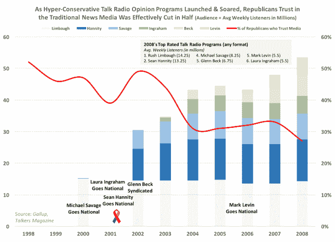
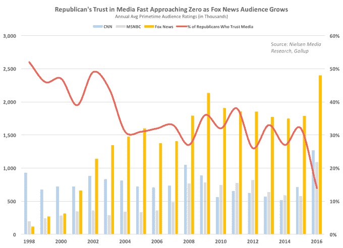
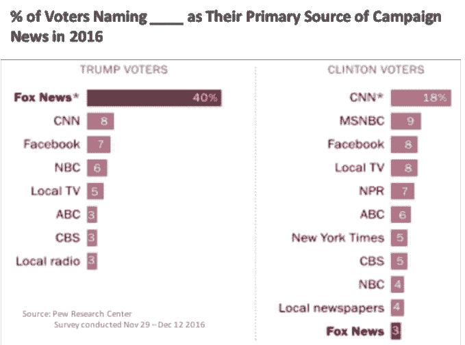

# 随着极端保守的媒体激增，共和党人对新闻的信任受到重创 

> 原文：<https://web.archive.org/web/https://techcrunch.com/2017/03/19/as-hyper-conservative-media-surged-republicans-trust-in-news-cratered/>

肯·米勒是奥米迪亚网络公司的技术合伙人。此前，他是 PayPal 和 Intuit 的高管，也是 Square 的早期董事会顾问。

More posts by this contributor

研究表明，美国对媒体的信任度正处于历史最低点，而且十多年来一直呈下降趋势。虽然这是一个持续了几年的话题和问题，但对媒体的不信任感的增长速度如此之快，以至于现在的情况近乎令人担忧。我们的新总统令人眼花缭乱的攻击速度让事情变得更加糟糕，他对媒体的攻击已经升级到了如此的程度，以至于他最近甚至将新闻媒体称为“美国人民的敌人”

为了量化，盖洛普 2016 年 9 月发布的一项研究显示，只有 32%的美国人表示他们信任媒体。这比一年前的 40%和 2005 年的 50%有所下降。在 20 世纪 90 年代末和 21 世纪初，这一数字通常徘徊在 50%左右。但真的是所有美国人越来越不信任媒体吗？不完全是。盖洛普进一步按政党细分了这些数字，揭示了一些有说服力的结果。

2000 年，共和党人、民主党人和无党派人士对媒体的信任度相差不到 6 个百分点，从 47%到 53%不等。但从那时起，无党派人士和共和党人的数字都在下降，共和党人的下降速度通常更快。2016 年，共和党的支持率下降幅度最大，一路跌至 14%。

为了理解这是如何发生的，看看共和党人消费新闻的演变是有帮助的。检查 2003-04 年的最初下降，你会发现这些下降恰好与两个不同的，但重要的和相关的事件相吻合——第一个是 2001 年 9 月 11 日的袭击，第二个是在一个压缩的时期推出几个高度保守的长篇谈话广播节目。

在 9/11 之前，拉什·林堡已经统治国家谈话广播达十年之久。但在拉什之后(在某种程度上还有劳拉·施莱辛格博士)，大多数其他顶级演员都是像霍华德·斯特恩和唐·艾默斯这样的晨间秀人物。

但是，一旦国家遭到攻击，美国公民发现自己立即对他们能得到的任何分分秒秒的新闻和信息如饥似渴。任何潜在的信息，甚至只是猜测，都是受欢迎的，尤其是那些长时间通勤甚至以开车为生的听众。他们也发现了一些安慰，谈话广播节目经常作为一个出口来表达他们自己的意见和愤怒。

地区极端保守的电台名人注意到了这一点，并迅速介入填补空白。迈克尔·萨维奇、劳拉·英格拉哈姆、肖恩·哈尼蒂和格伦·贝克都在 2001 年 9 月之前、期间或之后推出了全国性的联合节目，这证明了他们有着无可挑剔的时机。

马克·莱文很快就跟上了。这些政治突击队员都抓住了这个时机……张开双臂，吸引了一大批听众，他们在充满困惑的后 9/11 世界中既愤怒又脆弱。他们的收视率飙升(尽管其他电台听众开始恢复旧习惯)，到 2008 年，这五人加入了 Rush，成为整个国家排名前六的谈话广播节目(任何和所有形式，不仅仅是政治节目)。

除了追求更高的收视率，这六种人格也有一个共同的驱动力，败坏和边缘化的标准新闻报道。随着数千万听众的不断增长，广播被证明是后 9/11 时代传递这一信息和培养可塑听众的完美媒介。一些反媒体方法的例子包括:

*   林堡无情地领导了最初的反新闻指控，可以追溯到 20 世纪 90 年代，他经常告诉他的追随者不要追随主流媒体。
*   萨维奇经常将媒体称为“没有脊梁骨的动物”，最近他告诉他的追随者，“媒体入侵美国人和世界其他人的思想所造成的伤害远远超过普京入侵克里米亚所造成的伤害。”
*   英格拉姆和莱文一再指责媒体不诚实，英格拉姆甚至声称主要的新闻网络和报纸“比无关紧要更糟糕”。
*   特朗普总统的非正式顾问汉尼蒂(Hannity)似乎与白宫一起扮演了副驾驶的角色，以无休止的不诚实和“虚假”的说法攻击媒体。

9/11 事件之后，人们对恐怖主义的关注被放大，这对于媒体消费来说是一个决定性的、不断变化的时刻，其历史意义至今可能仍未得到充分认识。这群电台脱口秀主持人不仅成功地控制了电台上的全国政治对话，而且他们中的两个人(汉尼提和贝克)作为他们自己的福克斯新闻频道节目的主持人也在电视上取得了巨大的成功。

并非巧合的是，在袭击发生后的几个月和几年里，福克斯新闻频道的观众和市场份额都有所增加。事实上，就在袭击发生后两个月，福克斯新闻频道在有线新闻提供商中占据了第一位。正是在 21 世纪初，福克斯新闻频道开始提供一个电视平台，默许极端保守的言论，同时接管了电台。

就像保守派谈话类节目的大爆炸一样，对传统媒体的信任度下降和福克斯新闻频道收视率的增长已经形成了一种相互依赖的关系。

虽然福克斯新闻频道频道是一家有声望的新闻供应商，但多年来似乎有意模糊了观点和新闻节目之间的界限。这导致观众被他们认为是新闻来源的东西告知其他新闻来源是不合法的。

但是，对单一信息来源的依赖，同时越来越排斥其他来源，反过来会不成比例地影响投票模式。例如，在 2016 年，特朗普总统 40%的选民报告说，福克斯新闻频道是他们 2016 年竞选的主要新闻来源。

除了电视，福克斯新闻频道通常也是保守派和共和党的主要网上信息来源。也就是说，直到刚刚过去的选举季节。本月早些时候,《哥伦比亚日报评论》( CJR)的一项有趣的研究分析了推特和脸书上 125 万条与选举相关的报道。

在这项研究中，他们专门研究了与分享所有 125 万篇报道的读者相关的模式，以及这与那些同时分享唐纳德·特朗普或希拉里·克林顿帖子的读者之间的关联。

他们的数据中最有趣的发现之一是，在 2016 年，Breitbart.com(一个由现任白宫首席策略师史蒂夫·班农运营的超保守网站)已经有效地取代了 Foxnews.com，成为政治光谱中大多数右翼人士在线消费政治信息的[重心](https://web.archive.org/web/20221215152255/https://cdn.cjr.org/wp-content/uploads/2017/03/Facebook-Image-1.jpg)。布莱巴特——班农在去年夏天的一次采访中将其描述为“另类右翼的平台”——因制作了“加比·吉福兹:枪支控制运动的人体盾牌”等头条新闻而受到读者的喜爱

CJR 的链接分析按照分享量和来自克林顿和特朗普支持者的分享百分比对网站进行细分，后一部分分为五组:(1)克林顿支持者以 4:1 或更高的比例分享的文章，(2)克林顿支持者以 3:2 的比例分享的文章，(3)双方平均分享的文章，(4)特朗普支持者以 3:2 的比例分享的文章，以及(5)特朗普支持者以 4:1 或更高的比例分享的文章。

从他们的调查结果中挑选出排名前八的网站(其中有八个网站的访问量远远超过了他们所查看的 25000 份出版物中的其他网站)，并将它们与过去 15 个月中网站流量的变化进行映射，你很快就会看到一幅发生了重大受众转变的惊人画面。这一变化可能进一步导致共和党人对传统新闻的信任度骤降至 14%。

进入 2016 年，布莱巴特是互联网上第 1000 个^(最活跃的)目的地。但在这一年中，随着网站流量的飙升，事情发生了迅速的变化，“你希望你的孩子是女权主义者还是癌症患者？”publisher 现在已经成为美国第 42 ^(和第 231 ^(和第 231)最受欢迎的网站。从更长远的角度来看，这将使布莱巴特的网站比 Yelp 更受欢迎，并迅速接近沃尔玛之类的网站。)

布莱巴特咄咄逼人地将传统新闻机构置于他们的目标之下，同时让他们的观众相信他们自己也是一个新闻机构(他们的实际名称甚至是 Breitbart 新闻网)。可能是为了抢占右翼的有利位置，2016 年，他们甚至将福克斯新闻频道加入他们的靶心，一度将他们称为反特朗普网络。

但是，不管保守派出版物之间的任何争斗，这个目标现在看起来是一个接近完成的任务。

在短短的 15 年里——只有 14%的共和党人还在坚持——保守的右翼电台人士与飙升的福克斯新闻频道以及现在的布莱巴特的共同努力，成功地说服了整个主要政党的大部分人只信任他们。