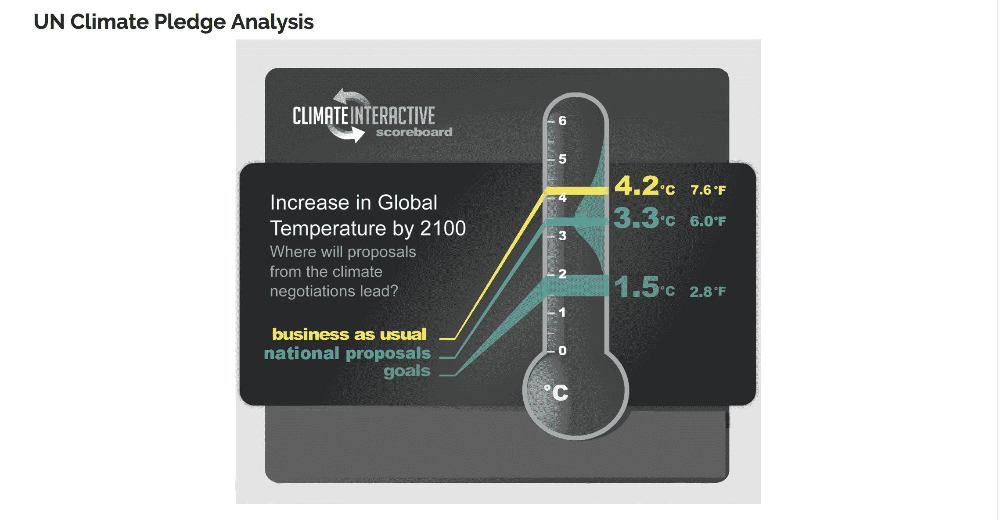

# 由于其自身的报告揭示了气候不作为的灾难，特朗普提出了气候不作为 

> 原文：<https://web.archive.org/web/https://techcrunch.com/2018/09/28/as-its-own-reports-reveal-the-disaster-of-climate-inaction-trump-proposes-climate-inaction/>

如果现任总统政府应对气候变化的方法可以用一句话来概括，那句话似乎应该是“如果你得到了他们，就抽他们。”

根据政府自己的估计，按照目前的趋势(如果世界各国不采取更多措施来应对气候变化的威胁)，到本世纪末，地球将变暖 7 度。正如一位 Twitter 评论者指出的，这意味着气候变化不仅是真实的，而且是灾难性的…而应对措施是燃烧更多的碳，因为我们反正都是死路一条。

如果全球气温上升 7 度，美国大部分沿海地区将被淹没。海洋酸化将会溶解珊瑚礁，世界将会遭遇更强、更具破坏性的风暴以及更严重的干旱和热浪。

然而，正如《华盛顿邮报》报道的那样，对世界气候状况的可怕评估并不是为了试图找到解决问题的办法，而仅仅是为了说明这个星球已经注定要毁灭。

美国国家交通公路安全管理局(National Traffic Highway Safety Administration)的一份长达 500 页的研究报告掩盖了我们地球命运的真相，该报告旨在证明特朗普总统决定降低 2020 年后制造的汽车和卡车的燃油效率标准是合理的。

政府的论点是:如果没有人做更多的事情来应对气候变化，那么世界无论如何都会被毁灭，所以做任何事情来应对气候变化都是没有意义的。

这种(缺乏)逻辑解释了为什么政府降低了对甲烷(来自石油和天然气钻探和工业动物养殖)、二氧化碳(用于燃煤电厂)和氢氟碳化合物(用于冰箱和空调)的减排要求。

NTHSA 的报告预测，无论燃料效率标准的规定是否得到实施，全球气温将比气候变化开始影响之前(1986 年至 2005 年之间)的最后平均气温上升约 3.5 度。

奥巴马政府对当前形势的评估没有错，但认为当前形势以某种方式反映了未来现实的想法是错误的。

正如分析指出的那样，世界将不得不大幅削减碳排放，以避免灾难性的变暖情景。然而，分析得出的假设(如*《T2 邮报》所引用的)是，减少排放“与今天的水平相比，需要大幅增加技术创新和采用，并需要经济和车队放弃使用化石燃料，这在目前技术上或经济上都不可行”，这似乎是错误的。*

这也公然对抗了总统一再宣称的气候变化是一个骗局。

通过承认气候变化的存在，并表示无法阻止它，新报告为保守派立法者和总统内阁为削减工业成本而采取的所有措施提供了一个掩护。

与此同时，卡罗莱纳州[仍然被佛罗伦萨飓风带来的洪水淹没](https://web.archive.org/web/20221025230404/https://www.nbcnews.com/news/us-news/flooding-persists-carolinas-nearly-two-weeks-after-florence-n914506)([以下是捐款方式](https://web.archive.org/web/20221025230404/https://www.vox.com/2018/9/14/17861982/hurricane-florence-donations-charity-disaster-relief)),而西部[野火的风险](https://web.archive.org/web/20221025230404/https://www.ucsusa.org/global-warming/science-and-impacts/impacts/infographic-wildfires-climate-change.html#.W65orBNKhAY)继续增加。

这很好。