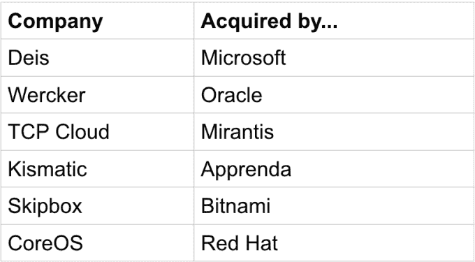

# 随着 Kubernetes 的成长，一个创业生态系统也随之发展起来

> 原文：<https://web.archive.org/web/https://techcrunch.com/2018/05/07/as-kubernetes-grows-a-startup-ecosystem-develops-in-its-wake/>

[Kubernetes](https://web.archive.org/web/20230224212417/http://kubernetes.io/) 、开源容器编排工具[几年前出自 Google](https://web.archive.org/web/20230224212417/https://techcrunch.com/2015/07/21/as-kubernetes-hits-1-0-google-donates-technology-to-newly-formed-cloud-native-computing-foundation-with-ibm-intel-twitter-and-others/) ，并以惊人的速度获得了关注。随着[成长的每一步](https://web.archive.org/web/20230224212417/https://techcrunch.com/2018/05/06/kubernetes-stands-at-an-important-inflection-point/)，它都为公司创造了在开源项目上发展业务的机会。

开源的美妙之处在于，当它起作用时，你建立了一个基础平台，一个经济生态系统随之而来。这是因为像 Kubernetes(或任何成功的开源产品)这样的项目会产生新的需求，作为项目增长和开发的自然延伸。

当然，这些需求代表了新项目的机会，但也代表了那些希望在开源社区附近建立公司的创业公司的机会。然而，在此之前，有几个关键部分必须到位。

## 成功的要素

首先，你需要大公司的支持。以 Kuberentes 为例，在去年 7 月至 9 月初的 6 周时间内，我们看到一些最知名的企业技术公司，包括 [AWS](https://web.archive.org/web/20230224212417/https://techcrunch.com/2017/08/09/aws-joins-the-cloud-native-computing-foundation/) 、[甲骨文](https://web.archive.org/web/20230224212417/https://techcrunch.com/2017/09/13/oracle-joins-the-cloud-native-computing-foundation-as-a-platinum-member/?ncid=rss&utm_source=feedburner&utm_medium=feed&utm_campaign=sfgplus&sr_share=googleplus&%3Fncid=sfgplus)、[微软](https://web.archive.org/web/20230224212417/https://techcrunch.com/2017/07/26/microsofts-new-azure-container-instances-make-using-containers-fast-and-easy/)、 [VMware 和 Pivotal](https://web.archive.org/web/20230224212417/https://www.geekwire.com/2017/now-vmware-pivotal-cncf-becoming-hub-enterprise-tech/) 都加入了云计算原生计算基金会(CNCF)，这是开源项目背后的专业组织。这是一个信号，表明 Kubernetes 正在成为容器编排的标准。

毫无疑问，这些大公司更喜欢(并试图)自己控制编排层，但他们很快发现他们的客户更喜欢使用 Kubernetes，他们别无选择，只能遵循围绕项目发展的明确趋势。

照片:盖蒂图片社的 Georgijevic

开源社区蓬勃发展的第二个要素是，大量开发人员必须接受它，并开始在平台上构建东西 Kubernetes 也做到了这一点。据 CNCF 称，自 2015 年 Kubernetes 1.0 发布以来，共有 771 名开发人员在该平台上开发了 400 个项目，提交了超过 19，000 个项目。自去年 8 月以来，即 CNCF 有数据的最后一天，开发商的捐款增加了 385%。那是一吨的动量。

## 提示投资者

当你有了这两个要素——开发者和大型供应商——你就可以开始加速了。随着越来越多的公司和开发人员的到来，这个社区继续发展，这就是我们在 Kubernetes 上看到的。

当这种情况发生时，投资者通常不会花很长时间来注意到这一点，根据 CNCF 的说法，到目前为止，已经有超过 40 亿美元的投资投向了云本土公司——这些投资来自一个不久前甚至还不存在的项目。

图片:盖蒂图片社的 Fitria Ramli / EyeEm。

这种投资采取了风险投资的形式，为试图在 Kubernetes 上建立一些东西的初创公司提供资金，我们已经看到了一些大幅增长。本月早些时候， [Hasura 筹集了 160 万美元的种子资金，用于专门为满足开发者需求而设计的打包版 Kubernetes。就在上周，](https://web.archive.org/web/20230224212417/https://techcrunch.com/2018/04/25/hasura-snares-1-6-m-seed-for-developer-focused-kubernetes-solution/)[一家来自西雅图的新创公司](https://web.archive.org/web/20230224212417/https://techcrunch.com/2018/05/02/upbound-grabs-9-m-series-a-to-automate-multi-cloud-management/)在首轮融资中获得了 900 万美元，用于以标准(云原生)方式帮助管理多集群和多云环境。再往上一点，Heptio 已经筹集了超过 3300 万美元，最近一轮是去年 9 月[2500 万美元的 B 轮](https://web.archive.org/web/20230224212417/https://techcrunch.com/2017/09/13/heptio-raises-25m-series-b-to-help-bring-cloud-native-computing-to-the-enterprise/)。最后是 CoreOS，它在一月份以 2 . 5 亿美元的价格卖给红帽之前筹集了近 5000 万美元。

无论如何，CoreOS 并不孤单，因为在过去的一两年里，我们已经看到其他组织收购云本地创业公司。特别是，当你看到像微软、甲骨文和红帽这样的大型组织收购相对年轻的初创公司时，他们往往在寻找人才、客户和产品，以便在 Kubernetes 这样的不断增长的技术领域更快地跟上速度。

## 发展经济生态系统

Kubernetes 在很短的时间内成长并发展成为一个经济强国，因为围绕它开发了数十个配套项目，为各种规模的公司创造了更多的机会来生产产品和服务，以满足投资、创新和经济活动良性循环中不断增长的需求。

如果这个项目继续增长，它将有机会获得更多的投资，因为公司继续流向容器和 Kubernetes，结果会有更多的初创公司开发产品来满足新的需求。