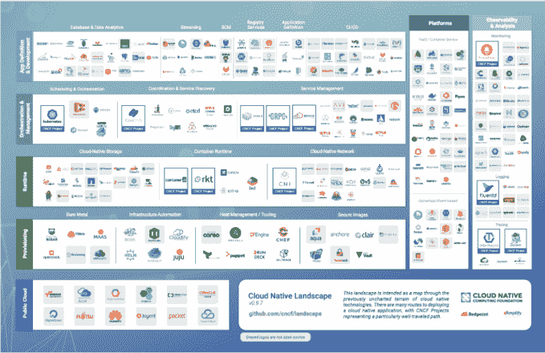

# 随着 Kubernetes 在 2017 年人气飙升，它创造了一个充满活力的生态系统 

> 原文：<https://web.archive.org/web/https://techcrunch.com/2017/12/18/as-kubernetes-surged-in-popularity-in-2017-it-created-a-vibrant-ecosystem/>

对于一项普通人可能从未听说过的技术， [Kubernetes](https://web.archive.org/web/20230215190652/https://kubernetes.io/) 在 2017 年因一群从事容器技术工作的 IT 专业人士而大受欢迎。Kubernetes 是一个编排引擎，它是运营人员大规模部署和管理容器的基础。(关于集装箱的内幕，[查看本文](https://web.archive.org/web/20230215190652/https://techcrunch.com/2016/10/16/wtf-is-a-container/)。)

简单地说，这意味着随着容器数量的增长，您需要一个工具来帮助启动和跟踪它们。因为容器的概念——以及它所支持的所谓“微服务”模型——是将一个复杂的整体应用程序分解成更小、更易于管理的部分，所以容器的数量往往会随着时间的推移而增加。Kubernetes 已经成为这项工作事实上的标准工具。

Kubernetes 实际上是一个开源项目，最初由谷歌开发，由[云本地计算基金会](https://web.archive.org/web/20230215190652/https://www.cncf.io/) (CNCF)管理。在过去的一年里，我们已经看到一些最大的科技公司聚集在 CNCF，包括 AWS、甲骨文、微软和其他公司，很大程度上是因为他们希望对 Kubernetes 的发展产生一些影响。

## 快速增长

随着 Kubernetes 的发展势头越来越猛，它已经成为一个创新和商业理念的平台(就像流行的开源项目一样)。一旦你超越了早期采用者，公司就开始看到帮助那些想转向新技术，但缺乏内部专业知识的客户的机会。公司可以通过隐藏一些与使用这样的工具相关的潜在复杂性来创造商业机会。

我们开始在 Kubernetes 中看到这一点，因为公司开始基于开源构建产品，提供更打包的方法，使其更容易使用和实现，而不必学习该工具的所有细微差别。

为了让你了解使用率增长有多快，451 Research 在 2015 年做了一项容器调查，发现只有 10%的受访者在使用某种容器编排工具，无论是 Kubernetes 还是竞争对手。仅仅两年后，在一项后续调查中，451 发现 71%的受访者使用 Kubernetes 来管理他们的容器。

谷歌产品管理副总裁萨姆拉姆奇(曾任 Cloud Foundry Foundation 首席执行官)表示，这感觉像是一夜成名，但像许多事情一样，这是一个漫长的过程。Kubernetes 的直接前身是一个名为 [Borg](https://web.archive.org/web/20230215190652/https://research.google.com/pubs/pub43438.html) 的谷歌项目。拉姆奇指出，谷歌在 2014 年将 Kubernetes 作为开源项目发布之前，已经在生产中运行了十年的容器。

“谷歌有近十年的大规模容器管理经验。这不是实验。这是在博格上大规模运营谷歌业务的代码。Kubernetes 是基于这些经验从零开始建立的，”Ramji 说。

## 云计算原生计算

一般来说，使用 Kubernetes 和云原生工具背后的一个重要驱动因素是，公司越来越多地在一个混合的世界中运营，其中一些资源在云中，一些在数据中心的内部。像 Kubernetes 这样的工具提供了一个框架，用于以一致的方式管理应用程序。

这种一致性是它受欢迎的一大原因。如果 IT 被迫使用两种不同的工具(或工具集)在两个不同的地方管理应用程序，将会(而且确实会)造成混乱，难以了解在任何特定时刻他们正在使用什么资源以及数据在哪里。

云原生计算基金会被称为(而不是 Kubernetes 基金会)的一个原因是，谷歌和其他管理成员认识到 Kubernetes 只是云原生故事的一部分。这可能是一个很大的部分，但他们希望鼓励一个更丰富的工具系统。通过更广泛地命名它，他们鼓励开源社区构建工具来扩展以云本地方式管理基础设施的能力。

## 船上的大公司

如果你看看该项目的前 10 名贡献者，它涉及一些主要的技术玩家，其中一些跨越到 OpenStack，Linux 和其他开源项目。其中包括谷歌、红帽、CoreOS、FathomDB、中兴通讯、华为、IBM、微软、富士通、Mirantis。

CNCF 的执行董事丹·科恩(Dan Kohn)表示，这些公司已经认识到，围绕基础技术进行合作和在更高水平的工具上竞争更容易。“我会拿 Linux 做类比。人们将 Kubernetes 描述为“云的 Linux”。并不是所有这些公司都决定牵手或者不争夺同一个客户。但他们已经认识到，试图在容器编排方面竞争没有太大价值，”他说。

在过去的 12-18 个月中，这些公司中的许多公司一直在收购 Kubernetes、container 或云相关的公司。

| 公司 | 被收购公司 | 目的 | 获得日期 | 数量 |
| 红衣主教 | 科登威 | 容器开发团队工作区 | 5/25/2017 | 身份不明的 |
| 神谕 | 韦克尔 | 大规模运营和部署云原生应用 | 4/17/2017 | 身份不明的 |
| 微软 | 戴斯 | Kubernetes 的工作流工具 | 4/10/2017 | 身份不明的 |
| 米兰蒂斯 | TCP 云 | 云状持续更新 | 9/15/2016 | 三千万美元 |
| 世纪链接 | 弹性盒 | 多重云应用程序管理 | 6/14/2016 | 两千万美元 |
| 阿普伦达 | Kismatic | Kubernetes 的支持和工具 | 5/19/2016 | 身份不明的 |

所有这些加起来就是围绕一个工具建立的一系列业务，该工具直到 2015 年 7 月才达到 1.0(尽管在此之前有几个 0.x 版本)。从那以后，使用量稳步攀升。

今年早些时候，CNCF 宣布 [36 家公司同意 Kubernetes 认证标准](https://web.archive.org/web/20230215190652/https://techcrunch.com/2017/11/13/the-cncf-just-got-36-companies-to-agree-to-a-kubernetes-certification-standard/)——上一次 36 家科技公司同意任何事情是什么时候？他们这样做是为了防止任何单个成员创建不兼容或不一致的版本，这些版本要么行为与预期不同，要么不能从一个版本移植到另一个版本。这通常被称为分叉，该组织认识到 Kubernetes 越来越受欢迎，希望尽可能确保这种情况不会发生。

## 构建生态系统

将 Kubernetes 商业化的公司包括谷歌本身，它提供了一个谷歌 Kubernetes 引擎(以前的谷歌容器引擎)，Red Hat OpenShift，Pivotal 的 Pivotal 容器系统(以令人困惑的首字母缩写 PKS 而闻名)和 CoreOS architectural。[在 Kubernetes 对其容器服务的支持下，AWS 也加入了这股潮流](https://web.archive.org/web/20230215190652/https://techcrunch.com/2017/11/29/awss-container-service-gets-support-for-kubernetes/)。今年早些时候，掀起集装箱热潮的 T4 Docker 公司做了同样的事情。

图片:谷歌提供(点击放大)

除了寻找将 Kubernetes 的核心开源版本商业化的方法，还有一系列其他工具正在开发中，从主机管理和安全映像到日志记录和监控，不一而足。

所有这些都表明，围绕一个只有两年历史的开源项目，正在开发一套丰富的工具。这就是当你创建一个开放系统时会发生的事情。[创新往往会发生](https://web.archive.org/web/20230215190652/https://techcrunch.com/2014/06/27/open-platforms-fuel-startup-ecosystems/)因为人们需要工具和应用来运行创新。我们已经在 Linux 上看到了。我们已经在 Hadoop 和 OpenStack 上看到了它，我们正在 Kubernetes 上看到它——今年它大获成功。