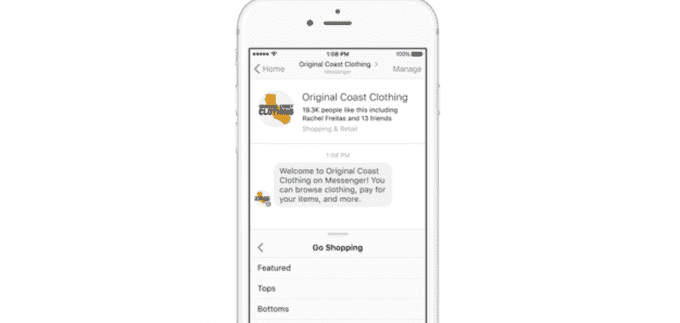

# 随着 Messenger 的机器人失去动力，脸书在聊天界面上推送菜单

> 原文：<https://web.archive.org/web/https://techcrunch.com/2017/03/02/as-messengers-bots-lose-steam-facebook-pushes-menus-over-chat/>

脸书的信使机器人可能没有产生社交网络所期望的影响。就在昨天，在线零售商 Everlane，机器人平台的推出合作伙伴之一，[宣布它将放弃 Messenger 的客户通知功能](https://web.archive.org/web/20230328045549/http://www.recode.net/2017/3/1/14779978/everlane-facebook-messenger-stop-customer-service-notifications)，转而使用电子邮件。随后，今日脸书[宣布](https://web.archive.org/web/20230328045549/https://messengerblog.com/platform-updates/messenger-platform-1-4-brings-even-more-tools-to-build-great-experiences/)升级的信使平台，为用户引入了一种新的与机器人互动的方式:通过简单的持久菜单，包括那些根本没有与机器人聊天选项的菜单。

脸书机器人的一个问题是经常不清楚如何开始。Messenger 中的机器人目录最初并不可用，现在只有当你在应用程序中开始搜索时才会显示出来。一旦添加了机器人，如何让它说话，或者如何在机器人的许多部分之间来回导航，这并不总是显而易见的。

信使[平台今天的更新](https://web.archive.org/web/20230328045549/https://messengerblog.com/platform-updates/messenger-platform-1-4-brings-even-more-tools-to-build-great-experiences/)解决了后一个问题，它提供了一个更有限——有时甚至令人困惑——的系统的替代品。

开发人员可以选择创建一个持久菜单，而不是强迫用户与机器人对话，这种持久菜单允许多个嵌套项目，以更好的方式在一个简单的界面中显示所有机器人的功能。

新的持久菜单在顶层限于三个项目，其子菜单现在限于五个。以前，如果用户想要使用这样的菜单，他们通常必须与机器人进行对话，以发现各种部分和项目。

现在，脸书[向开发者](https://web.archive.org/web/20230328045549/https://developers.facebook.com/docs/messenger-platform/messenger-profile/persistent-menu)建议他们*“考虑剥离这样的交换，把最重要的功能放在你的菜单上，切入正题。*

例如，零售商的机器人可能会提供菜单选项，让你“去购物”、“问问题”或“发送信息”如果你点击进入购物区，菜单会更新为一个商品列表，比如上衣、下装、鞋子和配饰。

除了网络视图——比如你想买的衬衫的产品页面——新的体验感觉更像是在 Messenger 中导航移动网站，而不是使用机器人。

另一个新的特点是，开发者现在可以选择隐藏编写器屏幕，并完全放弃让客户在机器人中进行对话体验。

我想我们不能再叫他们聊天机器人了吧？

当然，这导致的问题是这些是否有必要。如果脸书的机器人变得更像移动网站，那么在 Messenger 中使用它们还有什么意义呢？

感觉脸书在这里走错了方向。Messenger 似乎准备成为该公司基于语音的计算和语音驱动的虚拟助理的突破平台，但该公司并没有把太多注意力放在这些新兴技术上。

虽然它在 2015 年收购了语音和自然语言初创公司 Wit.ai ，但除了测试让[脸书在聊天期间将语音剪辑转化为文本](https://web.archive.org/web/20230328045549/https://www.facebook.com/photo.php?fbid=10155150801660195&set=p.10155150801660195&type=1&theater)，它还没有在语音计算方面做太多公开工作。

今天，你不能仅仅通过说话将 Messenger 和它的许多机器人联系起来。也就是说，看起来你*应该*能够对 Messenger 说，“CNN 有什么最新消息？”或者“今天会下雨吗？，“然后让适当的机器人做出反应。但事实并非如此。

与此同时，脸书还摆弄了一下 Messenger 中的虚拟助手[“M”，但这款产品尚未向少数测试人员推出。](https://web.archive.org/web/20230328045549/http://www.theverge.com/2015/10/26/9605526/facebook-m-hands-on-personal-assistant-ai)

今天的其他 Messenger 平台更新也没有关注这些技术。

相反，1.4 版本的更大更新包括扩展共享功能，这可以帮助机器人获得更多曝光；工具，以更好地匹配企业的客户名单，以信使的用户群；一些新的 APIs 改进的分析；以及迎合特定开发人员需求的其他调整和特性。

与此同时，脸书正在迅速成为最大的科技公司之一，没有一条通往语音计算驱动的未来的明确道路，苹果、谷歌、亚马逊和三星等其他公司今天正在激烈竞争。但是拥有超过 10 亿活跃的 Messenger 用户，脸书有足够的时间来解决问题。