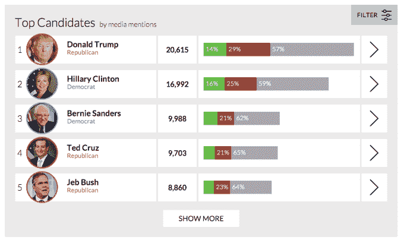
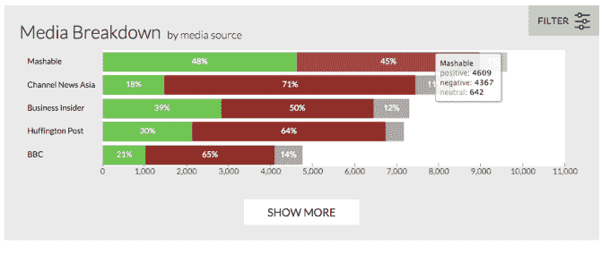
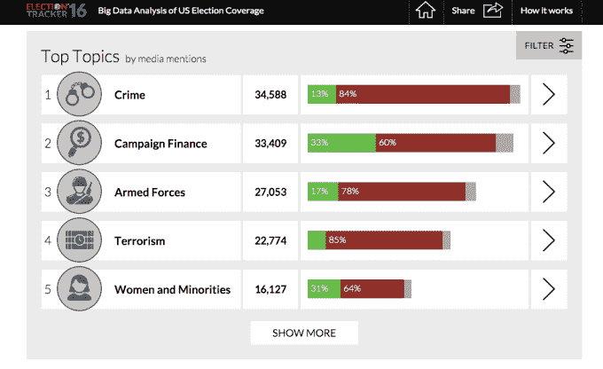

# 随着初选季节的开始，OpenText 发布了选举新闻追踪工具 

> 原文：<https://web.archive.org/web/https://techcrunch.com/2016/02/01/as-primary-season-opens-opentext-releases-election-news-tracking-tool/>

经过几个月的辩论、社交媒体的喋喋不休、愤怒和疯狂，总统初选终于在今天以爱荷华州党团会议拉开帷幕。作为对这一里程碑式事件的回应， [OpenText](https://web.archive.org/web/20230130000238/http://www.opentext.com/) 宣布将发布一款新工具，帮助选民跟踪选举新闻，并根据候选人和问题进行解析。

该工具名为[选举跟踪器 16](https://web.archive.org/web/20230130000238/http://electiontracker.us/) ，旨在展示即将发布的 OpenText 软件套件中的一些数据收集和分析工具。在你说出来之前，是的，一家加拿大公司为美国大选披露这些数据有些讽刺，但首席执行官马克·巴雷内西亚说，这是为了找到一种方式来展示他们的套件的功能。

媒体提及的最佳总统候选人。

“当我们[今天]上线时，我们的第一步是能够获得正在运行的顶级候选人，并获得完整、丰富、易于使用的体验。你可以通过话题、媒体细分来追踪候选人，比较候选人和他们的信息量以及人们谈论的热门话题——这真的是数字化时代的新赌注，”Barrenechea 说。

其想法是在各种媒体渠道上搜索报道，然后获取所有数据并对其进行语义分析，最后存储和显示这些数据，并利用围绕这些内容的丰富元数据。

OpenText 选举跟踪工具的顶级媒体来源。

该工具利用了三个 OpenText 产品。首先，OpenText InfoFusion 通过为系统定义的一组关键字来爬取已定义的数据源以寻找信息。在这种情况下，将是候选人的姓名和与选举报道有关的问题，如犯罪、竞选资金等。

已爬网文章中讨论的热门话题。

在抓取数据后，OpenText Actuate iHub 从语义上分析相关数据的内容，最终所有内容都存储并呈现在 OpenText Content Server 中。

“2 月份，我们将推出大量信息(以展示语义加分析的力量)。当我们将范围缩小到两三个候选人时，我们将会看到人类必须如何解读这些数据，”他说。

超越常规，该工具将更进一步，根据这些数据预测他们认为谁将赢得 11 月的选举。Barrenechea 说他不关心对错，而是以一种有趣的方式展示混合工具的能力。

他说，这是关于过滤许多信息来源，并帮助人类得到答案。他说，仍然需要人类来解释这一点，并找出如何最好地利用它。

“我认为人们认为技术是危险的，认为硅可以给你零或一个答案。我们可以为技术的最终用户提供更多的信息。谁能读一万篇文章，想出三个关于枪支管制的突出点？”

最终，Barrenechea 承认这是一种内容营销的想法，旨在展示底层技术，但他对此没有意见。他希望“选举追踪”能证明，如果你能以这种方式筛选这类信息，你就能在商业环境中应用同样的技术。