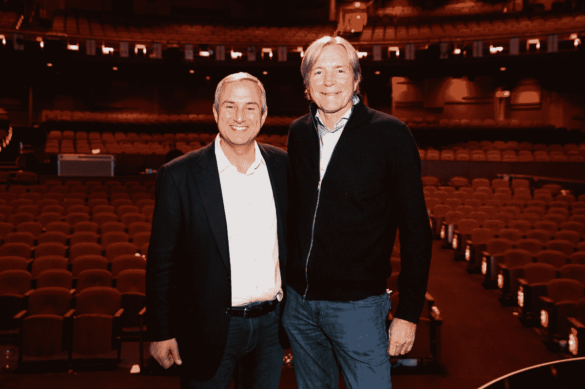

# 随着洛杉矶风险投资市场的蓬勃发展，pre hand 以 4 亿美元关闭了其第六只基金 

> 原文：<https://web.archive.org/web/https://techcrunch.com/2017/06/29/as-the-la-venture-market-booms-upfront-closes-its-sixth-fund-with-400-million/>

洛杉矶是美国第三大风险资本投资市场，仅去年一年就投资了 42 亿美元，它可能是资本承诺增长最快的市场。

随着 Snap 的公开募股，以及 Dollar Shave Club 和 QLogic 的数十亿美元退出，这座城市也证明了投资者正在公布实际回报的地方。

难怪洛杉矶历史最悠久的风险投资公司之一 pre front Ventures 能够为其第六只基金筹集到 4 亿美元。这座城市正在蓬勃发展，而 Upfront 能够关闭该基金的快速步伐(根据管理合伙人马克·苏斯特(Mark Suster)的说法，从启动到关闭只用了两个半月时间)，只是洛杉矶科技界方兴未艾的又一个迹象。

事实上，在今年早些时候举行的公司前期峰会上，这是一个只有投资者、企业家、时尚人士和名人才能参加的活动，苏斯特设法说服了名人企业家和投资者，如科比·布莱恩特、拜伦·戴维斯、提拉·班克斯和格温妮丝·帕特洛(以及市长)，向投资界推销洛杉矶的奇迹。

[https://web.archive.org/web/20221208112206if_/https://www.youtube.com/embed/D8qLXUX7mA0?feature=oembed](https://web.archive.org/web/20221208112206if_/https://www.youtube.com/embed/D8qLXUX7mA0?feature=oembed)

视频

Suster 说，4 亿美元的超额认购基金是该市有史以来筹集的最大一笔资金，并指出这将使该公司管理的总资产达到 20 亿美元。

“洛杉矶真的来了，”斯特告诉我。“过去，人们不愿意在洛杉矶看到真正大的风险投资。”

Suster 说，新基金大约 45%的资金可能会部署在洛杉矶和南加州。事实上，许多早期阶段和 A 轮投资工具可能会进入强大的创业公司已经膨胀的生态系统。

Suster 拒绝对该公司最新基金的表现发表评论，但表示其第二只基金是同类基金中表现最好的，投资了 BillMeLater、Overture 和 Investnet。

现在，随着对 Ring、Loot Crate、GOAT 和 TrueCar 的大举押注，人们开始转向更加以消费者为中心的产品，这些产品可以利用提拉·班克斯所谓的“硅效应”

在该基金的最新交易中，有限合伙人被其过往记录所吸引。“他们看到的是差异化和性能，”苏斯特说。"一只在硅谷成立的基金正在与其他每一家基金管理公司竞争交易."

虽然该基金的规模已经扩大，但 round 也扩大了其团队，这意味着该公司的投资重点仍将是种子和首轮投资者。“几乎 90%的交易都是种子资本和首轮融资，”苏斯特说。

五年前，该公司有四名合伙人，现在该公司雇佣了六名合伙人——包括去年从 Accel 加盟的新成员 Kobie Fuller。

现在，公司的投资伙伴包括创始人伊夫·西斯特伦、格雷格·贝蒂内利、卡拉·诺特曼、富勒、苏斯特和张凯龙。Stuart Lander 是该公司的合伙人，负责该公司的运营和平台团队。

advance Ventures 管理合伙人马克·苏斯特和创始人伊夫·西斯特伦

对 Suster 来说，Upfront 的成功是成功投资基金在美国的地理分布这一大趋势的一个功能。

针对 Bijan Sabet 在波士顿的 Spark Capital、Fred Wilson 在纽约的 Union Square Ventures 以及 Josh Kopelman 执掌的费城首轮资本，Suster 指出，风险投资的多样化不仅仅是地理位置的结果。

在像洛杉矶这样的城市，它比美国任何其他城市中心毕业的工程师都多，并且有着广泛、多样化的背景，性别和种族多样性对一个公司的成功和它筹集的资本一样重要。

Suster 在他自己关于基金关闭的博客中强调了这一点的重要性，他写道:

> 长期以来，front 一直认为，在平等方面，我们应该做的比说的更多，但过去几周的事件让我们希望更多地用语言表达我们对不同种族、国籍和性别的创始人平等资助的根深蒂固的承诺。我们相信这不仅仅是一个市场声明，而是我们将推动巨大和差异化回报的地方。
> 
> 追溯到 2000 年的 prehand II(当时美国表现最好的单一基金),我们的 3 个最佳回报中有 2 个是由女性创始人/首席执行官的公司驱动的。
> 
> 最近有报告列出了按女性创始人比例排名的风险投资公司，我们通常在全国排名前 5%。
> 
> 在我们最近的基金中，我们支持的大约 30%的公司至少有一位女性主要创始人。

随着公司展望自己的未来，斯特和他帮助成长的公司仍然致力于洛杉矶的未来。这两者是成对的，如今，如果一个投资者是#LongLA(使用该公司创造的标签)，看起来有限合伙人也在说前期做多是值得的。