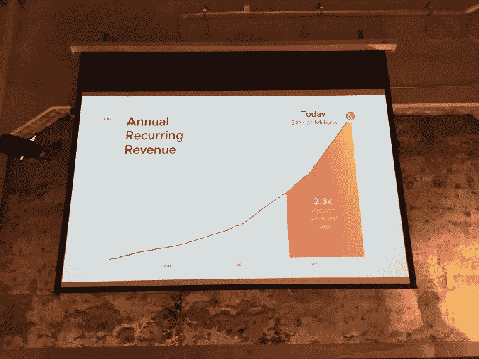
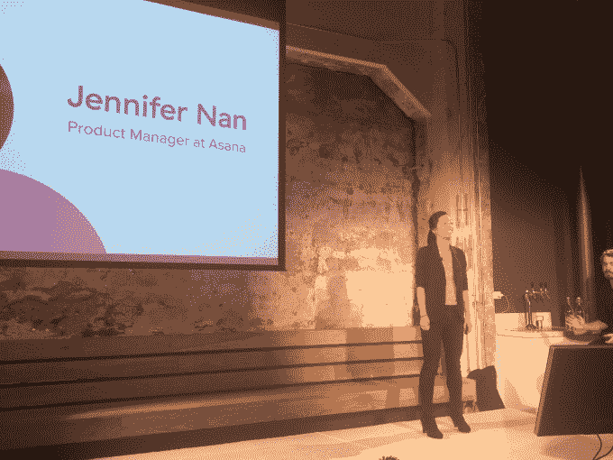
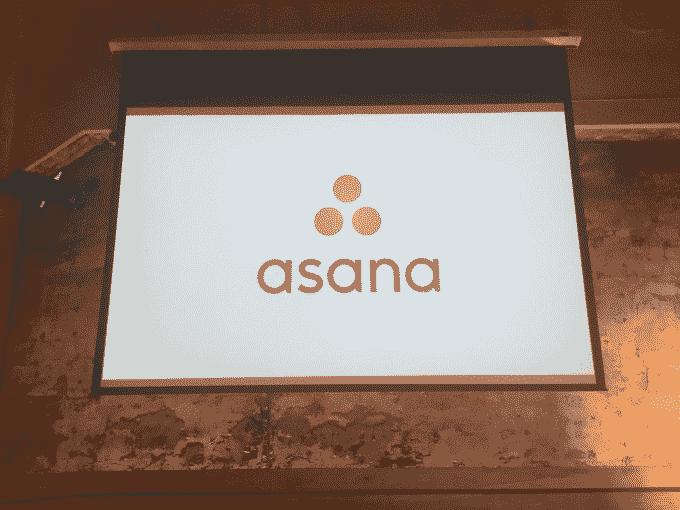

# Asana 推出新版 Collab 软件，声称 14 万家公司使用其服务

> 原文：<https://web.archive.org/web/https://techcrunch.com/2015/09/30/asana-debuts-new-version-of-its-collab-software-claims-140k-companies-use-its-service/>

今天早上，在 Asana 的旧金山总部，这家初创公司宣布了其产品的一个新版本，一个新品牌——logo——以及一些关于其增长的指标。

你会记得，这家初创公司周一从谷歌挖来了一位[新业务负责人](https://web.archive.org/web/20230406162032/https://techcrunch.com/2015/09/28/asana-picks-up-google-exec-chris-farinacci-to-run-its-business-ops/)，同时宣布其收入在过去一年中增长了 230%。

## 增长

Asana 宣布，它的年度经常性收入为“几千万美元”，这是一个衡量目前使用其平台的 140，000 家公司的指标。该公司还宣布，每月将增加 10，000 家公司，以客户为基础，年增长率不到 100%。

(你可以发现 Asana 的收入增长相对于其客户增长所隐含的正美元流失。)(Protip:好看。)(其他 protip:别理我。)

此外，Asana 描述了盈利能力的快速增长。在该公司聘用新业务负责人之后，TechCrunch 表示，Asana 作为潜在的 IPO 候选人，其表现值得关注。比如说 18 到 24 个月。在台上，该公司扩展了其收入图表，加入了一条关于扭亏为盈的说明:

这很重要，因为软件即服务(SaaS)领域的许多公司发展很快，但在这样做的同时，主要是用别人的钱(T2)来制造莫洛托夫鸡尾酒，导致长达数年的狂欢，这可能有助于他们董事会的一些人认为亏损越大，未来的正现金流越大。这可能是，有时不是；Asana 试图玩一种不同的游戏。

## 产品

Asana 的产品吸引了大量用户，因为它对那些想要避开电子邮件、同时管理不那么复杂的工作流程的被淹没的团队很有用。至少这是该公司的目标。

为此，Asana 今天宣布了一项重新设计和几项新功能，据推测，它预计将提高其目前的市场表现。Asana 的执行二人组贾斯汀·罗森斯坦和达斯汀·莫斯科维茨说新的*新的* Asana 是“从地面重新设计的”

据两位创始人和他们的产品团队称，他们从用户那里收到的最大请求是改进他们应用程序的设计。

Asana 的新版本今天早上向用户推出，包括旨在将通信带入其自身平台(hello，Slack)的新功能，以及一个旨在帮助用户在当前工作环境中保持信息的工具。

最后一部分要到“2016 年初”才会推出，而通信工具现在已经推出。

Asana 因此设法完成了目前的业务三连胜，如果你愿意，强调快速增长，产品进步，以及将其产品整合到他人工作流程中的战略。这听起来像是老生常谈，但在这种情况下，鉴于 Asana 的资本效率，我们应该允许平淡。

哦，这是新的标志:

