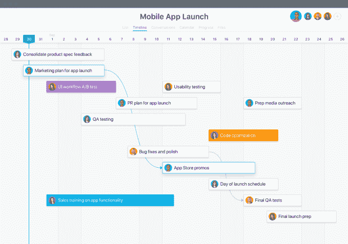

# Asana 引入时间线，为基于人工智能的监控奠定基础，成为生产力的“团队大脑”

> 原文：<https://web.archive.org/web/https://techcrunch.com/2018/03/30/asana-introduces-timeline-lays-groundwork-for-ai-based-monitoring-as-the-team-brain-for-productivity/>

今年 1 月，当工作流管理平台 [Asana](https://web.archive.org/web/20230406161919/http://asana.com/) 宣布获得由前副总统戈尔的世代投资管理公司(Generation Investment Management)牵头的[7500 万美元](https://web.archive.org/web/20230406161919/https://techcrunch.com/2018/01/31/asana-raises-75m/)的新一轮融资时，这家初创公司没有透露计划如何使用这笔资金，也没有透露是什么赢得了投资者对其新的 9 亿美元估值(我们现在已经向该公司证实了这一数字)。

现在，Asana 正在揭开其战略的下一阶段。本周，该公司宣布了一项名为 Timeline 的新功能——分配给团队中不同人员的各种项目的复合、可视化和交互式地图，让团队更广泛地了解需要完成的所有工作，以及这些项目如何配合，以时间轴格式绘制出来。

Timeline 是一个新的优质产品:Asana 的 35，000 名付费用户将能够免费使用它。Asana 数百万免费用户中的那些人将不得不升级到 premium 等级才能访问它。

Asana 制作的时间表旨在用于产品发布、营销活动和活动规划等场景，它不是一个新软件，你必须重复工作，而是每个项目自动成为团队时间表的一个新部分。通过时间线查看项目允许用户识别不同的段是否重叠，并相应地调整它们。

然而，时间表中最有趣的一个方面可能是，这是 Asana 计划在明年实施的更大战略的第一部分，该战略旨在增强和发展其服务，使其成为帮助您在工作时专注于工作的首选平台。

虽然 Asana 一开始是一个人们管理项目进度的地方，但它未来的雄心是成为一个平台，在后端有一个机器学习引擎，旨在管理团队和公司更广泛的生产力和工作量，不管他们是否积极参与 Asana 应用程序。

Asana 的联合创始人贾斯汀·罗森斯坦在接受采访时说:“长期愿景是将计算机智能与人类智能结合起来，管理整个公司。”“这是让投资者兴奋的愿景。”

更大的产品——名称尚未透露——将包括许多不同的功能。罗森斯坦让我在 preview 中看到的一些功能包括人们就特定项目进行对话的能力——想想消息传递渠道，但不那么动态，更具包容性。Asana 似乎也打算进入员工监控领域:它一直在开发一种安装在你的电脑上并观察你工作的小工具，目的是让你更有效率。

罗森斯坦说:“体式成为一个团队的大脑，让每个人都集中注意力。”

鉴于 Asana 的两位联合创始人达斯汀·莫斯科维茨和罗森斯坦之前与脸书关系密切——莫斯科维茨是联合创始人，罗森斯坦是其早期工程主管——你可能会想，Timeline 和其新公司生产力引擎的其他部分是否会给桌子(或办公桌，视情况而定)带来更多的社交元素。

其实完全相反。

罗森斯坦可能对“喜欢”按钮和世界上最大的社交网络的其他标志性部分的创建有所贡献，但最近他成为了像脸书这样的服务的分散注意力效应的直言不讳的批评者。这是袭击硅谷的一个更大趋势的一部分，在一波*认错*的浪潮中，硅谷的一些主要参与者开始反对一些更大的创新，尤其是在社交媒体领域。

一些人甚至联合起来成立了一个名为[人道技术中心](https://web.archive.org/web/20230406161919/http://humanetech.com/)的新组织，其口号是“扭转数字注意力危机，让技术符合人类的最大利益”罗森斯坦是一名顾问，尽管当我试图提出脸书在多个方面遭到强烈反对的问题时，我得到了平淡的回应。“这不是我现在想谈论的事情，”他说。(我想这就是保持注意力集中的意义所在。)

本质上，Asana 认为当你必须完成某件事时，社交会适得其反，并将其应用于企业环境。

这是一个有趣的转变，因为在过去几年中，企业 IT 的一个更大的主题是如何将商业应用和软件变得更加“社交化”——利用社交网络的一些机制和流行度来鼓励员工相互合作和交流，即使他们不在同一个物理空间(这是常有的事)。

但是社会工作并不适合所有人，所有时间。广受欢迎的工作场所聊天平台 Slack 将用户和几乎所有企业和商业应用相互连接起来，用罗森斯坦的话说，它因产生“海量通知”而闻名，导致人们无法真正完成工作。

“我并不是说 Slack 这样的服务没有用，”他解释道。(Slack 也是 Asana 的整合合作伙伴。)”但企业正意识到，要想有效合作，他们需要的不仅仅是沟通。他们需要内容和工作管理。我认为 Slack 有很多有用的用途，但我不知道它是否一直都是好的。”

Asana 设想的“团队大脑”角色可能完全是通过了解你和减少分心来提高生产力——你会收到警报，但你(可能是大脑)会优先考虑你收到的警报，如果有的话——但有趣的是，它保留了许多社交网络服务的另一个特征:收集关于你的活动的数据，并利用这些数据来优化参与。正如罗森斯坦所描述的，Asana 将很快能够跟踪你正在做什么，以及你是如何做的，以找出你的工作模式。

这个想法是，通过使用机器学习算法，你可以快速了解一个人做什么，以及什么可能需要更长时间，以帮助更好地计划这个人的任务，并最终使这个人更有效率。最终，该系统将能够建议你应该在什么时候做什么。

所有这些对经理来说可能听起来像音乐，但对一些人来说，员工监控程序听起来有点儿[警告](https://web.archive.org/web/20230406161919/https://www.theguardian.com/world/2017/nov/06/workplace-surveillance-big-brother-technology)他们对你一举一动的监控有多严密。鉴于最近社交媒体服务对他们[收集的所有数据的关注，看看像这样的企业服务是如何被采用和观看的将会很有趣。目前还不清楚这些程序将如何适应欧洲的 GDPR 等新指令，这些指令制定了一套新的规则，规定任何互联网服务提供商都需要告知用户他们的数据是如何使用的，任何数据收集都需要有明确的商业目的。](https://web.archive.org/web/20230406161919/https://twitter.com/oliviasolon/status/978875614525575168)

尽管如此，考虑到不同的目标——帮助你更好地工作——结果可能证明手段是正确的，不仅对老板来说如此，对那些可能对每天工作感到不知所措的人来说也是如此。罗森斯坦说:“当你早上来上班时，你可能会有一个清单(许多事情)要做。”。“我们接管你的桌面，展示你*需要*做的一件事。”去他妈的查看你的 Instagram 订阅。