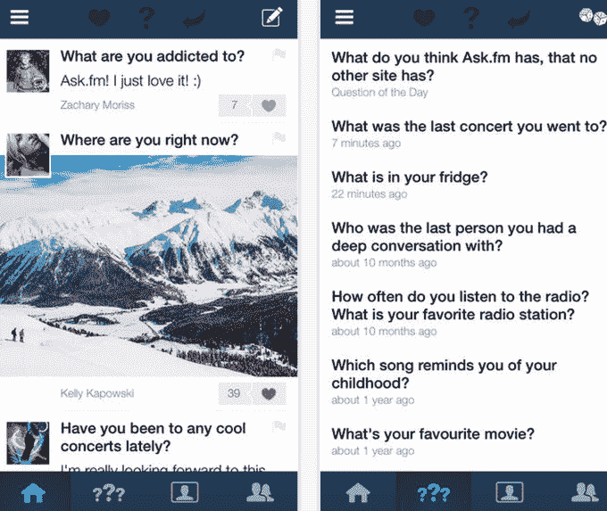

# 在 Ask.fm 交易 TechCrunch 后，IAC 同意与监管机构合作保护网络欺凌

> 原文：<https://web.archive.org/web/https://techcrunch.com/2014/08/14/ask-com-agrees-to-work-with-regulators-on-cyberbullying-protections-following-ask-fm-acquisition/>

IAC 旗下的搜索公司 Ask.fm 收购了陷入困境的匿名问答社交网络 Ask.fm。这一消息是由《纽约时报》今天早上首先报道的，T2 的 IAC 和 Ask.fm 也向 TechCrunch 证实了这一消息。除了这笔交易，IAC 还与纽约和马里兰州的司法部长签署了一项协议，他们概述了试图遏制 Ask.fm 上的网络欺凌的政策。最近几个月，这场争议严重损害了该公司的声誉。

收购的条款没有被披露，但这两个网站似乎有更多的共同之处，而不仅仅是他们的名字。

在过去几年将搜索之战拱手让给谷歌之后，Ask.com 如今是一种类似问答的服务。与此同时，Ask.fm 也是一个问答服务，但它致力于向你的朋友提问，无论是公开还是匿名。

后一个功能实际上在最近几个月给 Ask.fm 带来了麻烦，因为青少年开始使用该网站匿名网络欺凌他人——这一趋势是拉脱维亚的小型初创公司 Ask.fm [没有准备好面对的](https://web.archive.org/web/20230210114047/https://techcrunch.com/2013/07/04/ask-fm/)。网站上的网络欺凌变得如此激烈，以至于 Ask.fm 在许多青少年自杀事件中被认为是一个促成因素。该公司进行了一段时间的公关封锁，后来[以一项新的“安全政策”](https://web.archive.org/web/20230210114047/https://techcrunch.com/2013/08/19/ask-fm-safety-policy/)重新出现，旨在保护其敏感的年轻用户。

但 Ask.fm 的声誉已经受损。由于新闻报道，许多家长已经知道了这个网站，并禁止和阻止他们的孩子使用它。

尽管 Ask.fm 存在问题，但该服务在被收购时仍拥有大量用户——该公司在 150 多个国家拥有 1.8 亿月度用户，其中 40%的用户年龄小于 18 岁。Ask.fm 估计每分钟有 20，000 个问题，大约 45%的移动月度活跃用户每天登录。媒体和互联网公司 IAC 表示，迄今为止，这款手机应用已经被下载了 4000 多万次。

这笔交易为 Ask.com 进入社交网络提供了一个可行的切入点。(Ask.com 全球用户“过亿”，供参考。)

“此次收购将 Ask.com 的问答品牌领导地位扩展到 Ask.fm 的大规模移动社交平台，”Ask.com 首席执行官道格利兹在今天早上的发布会上说。“这是进入 Ask.com 一直寻求扩张的细分市场和平台的自然选择。”

IAC 告诉我们，目前还没有从产品或运营角度整合 Ask.fm 或 Ask.fm 的计划。

然而，作为交易的一部分，Ask.fm 目前的领导层，联合创始人[伊尔贾](https://web.archive.org/web/20230210114047/http://www.crunchbase.com/person/ilja-terebin)和[马克·特雷宾](https://web.archive.org/web/20230210114047/http://www.crunchbase.com/person/mark-terebin)将被替换。

## Ask.com 同意在网络欺凌保护方面与监管机构合作

然而，由于围绕儿童安全的问题，Ask.com 表示，它优先考虑主动与监管机构接触，这些监管机构此前对该平台现有所有权表示担忧。这些努力导致了今天也将正式宣布的协议。

具体来说，Ask.fm 与纽约州总检察长埃里克·施耐德曼和 T2 马里兰州总检察长道格·甘斯勒合作，签署了平行协议，根据这些协议，Ask.fm 将实施一系列旨在提高服务安全性的最佳实践。

在 IAC 的领导下，Ask.fm 将修改其安全政策和程序，超越初创公司本身的做法，包括创建一个新的在线安全中心，聘请一名信任和安全官员作为主要的安全联系人，并建立一个安全顾问委员会来监督所有安全问题。数百万美元将用于提高适度性。

该网站同意在 24 小时内审查用户投诉，并删除多次投诉的用户，以减少欺凌问题。

一个独立的安全和安保检查员将被任命检查这些变化，并在三年内向总检察长办公室报告遵守情况。该网站将与自杀预防热线合作，该热线将培训节制和风险管理人员，并提供其他资源。它还将在国家失踪和被剥削儿童中心注册，并遵守性剥削图像的报告要求。

13 岁以下的儿童将被禁止使用该网站。最后，它将采用一种工具，供第三方或父母报告孩子创建了一个帐户或在 Ask.fm 上发帖，并请求删除该帐户。

除了许多变化，Ask.fm/Ask.com 还任命数字安全资深人士[前雅虎全球安全和产品政策总监 Catherine Teitelbaum](https://web.archive.org/web/20230210114047/http://www.crunchbase.com/person/catherine-teitelbaum) 担任 Ask.fm 新设立的首席信任和安全官

IAC 表示，新的工具和政策将在六个月内“实质性地”提高安全性，与其他大型社交网络服务目前的做法并无太大不同。但它们最终可能会削弱 Ask.fm 对其服务的变化无常的青少年观众的吸引力。

毕竟，Ask.fm 最初吸引人群是因为它是一个未经审查的游乐场，现在这种情况正在改变。