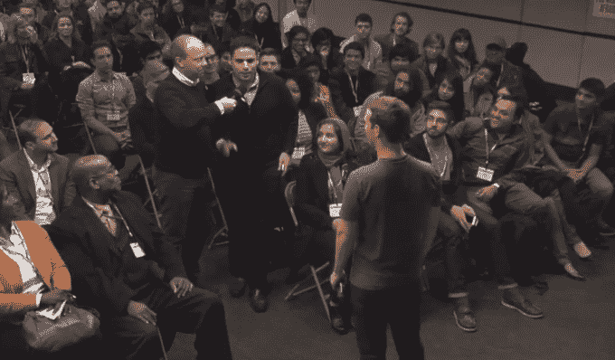

# 在公开问答中，扎克伯格表示脸书希望表达多样化，但不会推出不喜欢的按钮 

> 原文：<https://web.archive.org/web/https://techcrunch.com/2014/12/11/ask-zuck-anything/>

在马克·扎克伯格的第二个公开 Q & A 目前正在[直播](https://web.archive.org/web/20221209141545/https://fbevents-a.akamaihd.net/20141211_liveqa/ak/index.html)中，扎克伯格讨论了脸书不会增加一个不喜欢按钮，但希望给人们分享情绪和反应的方式提供更多细微差别，而不是认可，并解释了他如何不认为与朋友联系是浪费时间。

这位 30 岁的首席执行官穿着灰色 t 恤制服，他说脸书在跟上新技术的同时，尽可能不改变隐私政策。该公司正致力于监督围绕情感和敏感社区的实验和用户测试。虽然脸书因让我们在现实生活中联系更少而受到抨击，但扎克伯格表示，该产品的目标是让我们超越邓巴的数量，并与更多人保持关系。

[扎克上个月的首次公开问答见证了他直面脸书最棘手的问题和批评。这位首席执行官解释说，脸书将 Messenger 从其主应用程序中分离出来，并强迫人们下载它进行移动聊天，以便让人们更快地从朋友那里获得回复，并获得更好的体验。他谈到了有机页面覆盖范围的下降，称由于人们喜欢更多的页面，不断添加更多的朋友，每个人都在分享更多的内容，但人们花在浏览新闻提要上的时间有限，随着时间的推移，竞争自然会降低覆盖范围。](https://web.archive.org/web/20221209141545/https://beta.techcrunch.com/2014/11/06/facebook-faq/)

今天的问题如下:

从喜欢按钮的成功来看，有没有讨论过不喜欢按钮？

“你知道我们正在考虑，在不喜欢按钮上。这是一个有趣的问题，对吧，因为它可能意味着两件事。我们正在考虑和讨论做一个而不是另一个。所以我们不想做的是:喜欢按钮真的很有价值，因为当有人把自己放在那里分享一些东西时，它是一种让你快速表达积极情绪或情感的方式。而且，你知道，有些人要求一个不喜欢按钮，因为他们希望能够说“那东西不好”。这不是我们认为对世界有益的事情。所以我们不打算建造它。我觉得帖子好坏不需要有投票机制。我不认为帮助人们分享他们生活中的重要时刻在社会上很有价值或者对社区有好处。

但是我认为非常有价值的一点是，人们想要表达的情感比积极或者他们喜欢的东西更多。你知道，很多时候人们在脸书分享他们生活中悲伤的时刻，或者艰难的文化或社会问题，人们经常告诉我们，他们不喜欢媒体，因为当有人失去亲人或谈论非常困难的问题时，喜欢不是合适的情绪。

因此，我们已经在内部进行了一些对话，并且已经思考了很长时间的一件事情是，如何正确地让人们可以轻松地表达更广泛的情感，以表达同情或表达惊讶或笑声或任何这些事情。你知道你可以随时发表评论，对吧，所以今天也不是没有办法，很多人一直都在评论帖子。但是“喜欢”按钮有一些非常简单的东西。你知道，如果你在评论，很多时候你会觉得你必须有一些机智的话要说或加入到对话中。

但每个人都觉得他们可以按下“喜欢”按钮，这是在重要时刻同情或同情某人的重要方式，他们把自己放在那里分享。让人们有能力以更多的方式、更多的情感去做这件事是很强大的，但我们需要找到正确的方式去做，这样它最终会成为一种好的力量，而不是坏的力量，贬低人们在那里发布的帖子。所以这是一件重要的事情。我们没有任何东西会很快出来，但这是一个重要的讨论领域。"

当你创办脸书时，你希望得到的一条建议是什么？

不要太担心犯错。人们问我希望我能避免哪些错误。但是错误是你学习的方式。真正的问题是你如何从中学习。我很小的时候就开始了，对经营公司一无所知。你必须继续前进，不要为此感到压力太大。

**你对脸书浪费时间有什么看法？**

我们长大了，去上学了，然后被告知做完作业后要去社交。这在社会中是如此普遍，以至于人们认为我必须在关注朋友或家人之前完成所有的工作，我认为这是错误的。我的朋友和家人，这才是最重要的。我觉得和他们联系根本不是浪费时间。

**为什么我不能改名字？**

如果他们使用真实姓名而不是一些假的网名，在服务上找到某人会更容易。有些人想欺骗或欺骗别人，做坏事，如果你和你真实世界的身份联系在一起，你会更负责任，而不是和一些假的身份联系在一起。而是创造一个安全的社区。

**脸书如何促进公民参与和讨论？**

脸书在公民辩论中的角色给你带来了更多的观点。如果发生了什么大事，你可能只会在几份报纸上看到，但我们希望世界上的每个人都有发言权。这在世界上是一件很新的事情。一有动乱，人们就求助于脸书。我认为观点多样化很重要。在脸书，即使你是共和党或民主党，你也可能有一些朋友在另一个阵营。如果你是基督徒、犹太人或穆斯林，你可能会有其他宗教的朋友。所以在脸书，你会听到与你不同的人的意见。

**为什么会有这么多隐私更新？**

我们大约每年更新一次隐私政策，以反映去年以来的产品和政策变化。脸书曾经是一个网站。现在，脸书作为一家公司提供一系列不同的服务。脸书和新闻提要，信使，Instagram。但随着技术的发展，脸书可能会想在地理位置上建立东西，所以这是我们将把它纳入隐私政策的一部分。我们不想太频繁地改变它。需要通读和消化的内容很多。有时我们做得很好，有时做得不好，会受到批评。但是我们需要跟踪我们能做的新事物的技术进步。

脸书在帮助附近社区的年轻人创建自己的公司方面做了些什么？

我们想成为社区的好公民。无论是当地初中和高中的项目来这里接受培训，还是暑期实习项目。我教过一门关于企业家精神的课。我想我学到的比我教的多。总会有更多我们想做的事情。我们支持当地警方。我个人向当地的 Ravenswood 健康中心捐了款。如果我们能做些什么来成为社区和海湾地区更好的公民，我们很乐意听取建议。

**你认为哪些习惯导致了你的成功？**

我试着主动利用我的时间。我试着把大部分时间花在我想做的事情上。最重要的事情是把你的时间花在你希望看到发生的事情上，而不是别人想要的。你必须对社区做出回应，但我认为任何企业家或任何人都会说，你的时间很容易被占用。

你想要什么比萨配料？

炸鸡。

**为什么编码如此重要？**

这是少数几个你可以坐下来，花几个小时写代码，然后带着对世界有价值的具体东西离开的学科之一。我认为这是年轻人表达自己的重要方式。如果你会编码，你就有坐下来创造东西的权力，没有人能阻止你。脸书大约一半的人是技术人员。即使对于不写代码的人来说，无论你想做什么，理解工程都是有价值的，所以我们支持社区中帮助人们学习编码的努力。

**你如何平衡改进产品的需求和对用户实验的伦理关注？**

有媒体报道了脸书的一位数据科学家在今年夏天发布的一份报告，我们把它作为一个收紧措施的机会。我们认为，让我们的产品变得更好的唯一方法是尝试一些东西，并从社区获得反馈。我们将尝试新功能，以及在新闻提要中显示内容的不同方式。我们尝试让脸书变得更快。我们努力让我们向社区推出的所有东西都产生积极的影响。测试是脸书的重要组成部分。

我的妻子是一名医生，有一种假设认为你进行的任何测试都有一个后果，并且有一种信念认为每项测试的潜在好处都需要大于风险。有些东西我们不应该测试。与年轻人或敏感群体有关的任何事情都是我们需要特别小心的，或者与情绪或心理健康有关的任何事情。我们需要确保内部人员没有能力对可能伤害他人的东西进行测试。

我们做这项研究是因为有报道称，在脸书上看到关于人们生活中快乐时刻的帖子会让人难过，因为他们觉得自己错过了什么。我们不想让人难过。我们有责任理解脸书的影响。我们进行了一项相对较小的研究，向人们展示了或多或少的快乐帖子，并测量了他们事后是否会发布快乐或悲伤的事情。如果脸书正在发生的事情会对社会产生负面影响，我认为我们有责任改变它，让它产生更积极的影响。我们需要做出改变，如果一名工程师想要进行测试，脸书的人会进行检查，以确保这是可以接受的测试。

脸书可能会让一些人反社会。你有没有想过帮助人们在现实生活中建立联系？

脸书试图做的很多事情是帮助你与你已经认识的人保持联系，而不是试图帮助你结识新朋友。我认为这是社会中的一个重要角色。定义一个工具的是它获取并增强人类的能力。我戴眼镜，这增强了我的视力。自行车和汽车扩展了我们四处走动的能力。史蒂夫·乔布斯将电脑描述为大脑的自行车。总的来说，我们试图用脸书和社交网络来增强维持关系的能力。研究表明，人们一次只能和 150 个人保持关系，我们希望扩大这个范围。我在脸书看到一些人，看到他们生活中的重要事件。或者如果我的家人在其他地方旅行，我不能亲自去那里体验。我们希望拓展人类的能力，让他们能够感同身受，与更多的人建立联系。

如果我有机会亲自去见我的妻子或母亲  ，我会通过打电话或在脸书与他们交谈来实现。面对面是一种高带宽、更丰富的交流方式。但是脸书帮助我们与更多的人交流。

**我应该如何教我的孩子关于脸书的知识？**

我试着去想，因为我没有孩子。一方面，我记得我真的很年轻，使用技术，我认为这是非常积极的。有时我认为社会有一种傲慢的态度，认为孩子们不知道如何做正确的事情。

我们想照顾好我们的家人。欺凌是一个真实的问题，我们对此非常重视。我们与当地执法部门和学校管理人员合作，以确保平台上没有欺凌行为，实名等措施有助于实现这一目标。

我会遵守我们的规则。我们不允许 13 岁以下的人使用脸书。在那之后，我可能会和他们谈论这件事。我希望我的孩子使用技术来了解现代世界，禁止技术并不能帮助他们了解外面的世界。但是你需要不断的对话，并确保报告任何有害的事情。我们需要继续尽最大努力确保这种情况消失。

—

总的来说，扎克伯格在问答过程中似乎很自信，也很和蔼，尽管他经常说“这是一个非常好的问题”和“这是脸书非常认真对待的事情”，为自己赢得时间来制定答案。尽管如此，令人印象深刻的是，他愿意如此直接和公开地回应公司的一些最严厉的批评。