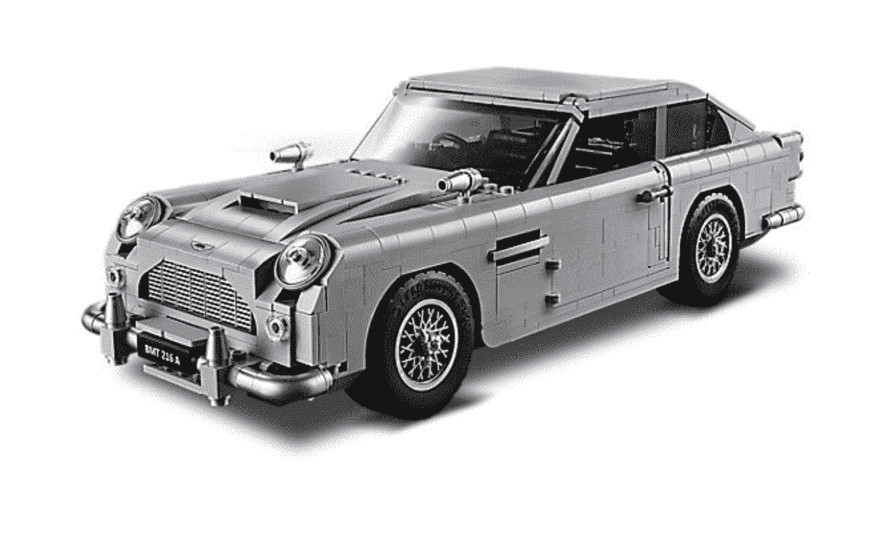

# 乐高制造了詹姆斯·邦德的阿斯顿马丁，配有工作弹射座椅 

> 原文：<https://web.archive.org/web/https://techcrunch.com/2018/07/18/aston-martin-lego-ejector-seat/>

# 乐高公司制造了詹姆斯·邦德的阿斯顿·马丁，配有工作弹射座椅

市场上有一款新的阿斯顿·马丁 DB5，它是你所期待的詹姆斯·邦德在电影《金手指》中使用的车辆。

唯一的缺点:太小了，开不动。

乐高创造了超级间谍詹姆斯·邦德使用的阿斯顿马丁 DB5 的复制品，但是是微缩的。这辆 1964 年的跑车长 13 英寸，功能齐全，包括一个带有可隐藏雷达跟踪器的详细内部和一个带电话的车门隔间。

还有其他功能性设备，最明显的是一个工作弹射座椅，一个旋转车牌和一个可以升降的防弹后窗。甚至还有安装在车轮上的轮胎镰刀和变速杆，当向后拉时，可以看到前翼机枪。

新套装零售价为 149.99 美元，从周三开始向乐高贵宾提供。目前，顾客只能购买两套。

像其他乐高收集套装一样，这个不适合孩子。这套包括 1290 多件作品，是为 16 岁及以上的人设计的。