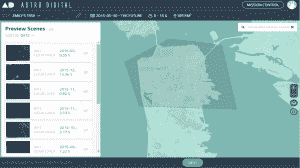
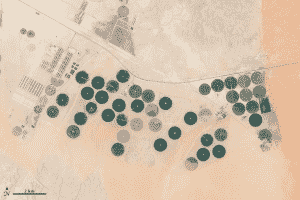
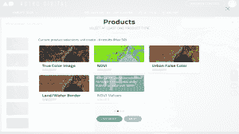

# Astro Digital 为任何人提供分析卫星图像的平台 

> 原文：<https://web.archive.org/web/https://techcrunch.com/2016/02/24/astro-digital-releases-platform-for-anyone-to-analyze-satellite-imagery/>

Astro Digital 是一家卫星成像和图像分析公司，今天发布了他们图像处理软件的最新版本。任何人都可以免费访问他们的软件，并检索地球上任何地区的卫星图像。该公司还提供了一个 API，开发者可以用它将卫星数据整合到他们的产品中。

该软件本身编译全球卫星图像，并允许用户选择特定的地球区域进行监测。每当有新的卫星图像进入用户指定的区域时，用户都会得到通知。

借助这一工具，Astro Digital 希望创建一个用户友好的平台，使客户能够轻松理解和利用万亿字节的卫星数据。

目前，Astro Digital 已经利用 LandSat 等开放数据计划来填充他们的数据库。然而，最终该公司计划使用他们自己的卫星图像。迄今为止，他们已经在太空测试了两颗卫星，并计划在今年晚些时候发射 4 颗新卫星。

> “到今年年底，我们将有能力每天监控美国所有的农业用地。”Astro Digital 产品主管布朗温·阿格里奥斯

*Astro Digital 平台截图*

商业地球观测空间肯定越来越拥挤。随着像行星实验室和 Alphabet 的[天空盒成像](https://web.archive.org/web/20221209183042/https://beta.techcrunch.com/2014/06/10/google-is-confirming-purchase-of-satellite-startup-skybox-imaging-today/)这样的公司走在前面，有比以往更多的私人卫星对地球进行成像。2016 年，92 颗商业地球观测卫星计划[进入轨道](https://web.archive.org/web/20221209183042/http://fortune.com/2015/12/23/satellite-images-big-data/)，这一数字是 2013 年的 10 倍。

卫星图像有助于天气预报、救灾、气候建模、人口分析和作物监测。当您可以观察地球上的特定区域如何随时间变化时，这些图像尤其有用。

*沙特阿拉伯一个耕地农场的卫星图像/图片由美国地球资源卫星/美国国家航空航天局提供*

例如，通过每天甚至每周提供地球的新图像，干旱的影响可以得到控制，我们可以跟踪野火的蔓延，或者农民可以分析不同的农业策略如何影响他们的作物产量。

这张地球的实时照片几乎是真实的。随着越来越多的私人卫星上线，商业地球观测行业开始遇到一个新的挑战:你如何以一种对付费用户有效的方式包装万亿字节的地球图像？

这就是 Astro Digital 的用武之地。该公司计划通过提供图像处理、存储、分发和访问的最佳平台，使自己从其他卫星成像公司中脱颖而出。从本质上说，他们想让将空间融入任何业务变得快速而简单。

Astro Digital 的产品负责人布朗温·阿格里奥斯(Bronwyn Agrios)告诉 TechCrunch，他们通过专注于软件和硬件一样多(如果不是更多的话)，在这个行业建立了自己的地位。

> “像素将被商品化，所以我们不仅仅是漂亮的图片。”Astro Digital 产品主管布朗温·阿格里奥斯

然而，Astro Digital 并不是这一领域唯一的影像分析公司。公司[笛卡尔实验室](https://web.archive.org/web/20221209183042/http://www.descarteslabs.com/)对图像进行历史分析，以预测作物产量，[轨道洞察](https://web.archive.org/web/20221209183042/http://orbitalinsight.com/)开发了机器学习算法，用于跟踪和预测中国的停车场容量，甚至建筑，像行星实验室这样的卫星运营商为他们的客户提供自己的软件产品。

曾在行星实验室和 [ESRI](https://web.archive.org/web/20221209183042/http://www.esri.com/data/imagery) 工作过的阿格里奥斯说，Astro Digital 是独一无二的，因为他们将为客户提供现场监控。他们的设置方式允许他们在一颗卫星下载新数据时，实时处理并向客户提供图像。

他们的独特之处还在于，他们的软件平台很容易从他们的主网站[进入，并且对任何人都是免费的。其他公司也提供 API，但如果没有付费订阅或提交访问请求，就无法在他们的网站上获得。](https://web.archive.org/web/20221209183042/http://www.astrodigital.com/)

然而，免费版只允许用户访问有限的内容。为了在更长的时间内监测更大面积的土地，需要付费订阅。

通过使用他们的软件，人们可以选择地球上的一个区域，并检索经过处理的卫星图像，以显示 4 个属性中的任何一个:真实颜色、植被密度、城市增长和陆地/水域边界。当卫星为你选定的区域传送新数据时，你会自动得到通知。

*Astro Digital 的平台截图*

Astro Digital 由 Agrios 于 2015 年 1 月联合创立。她说，该公司正在努力确保一旦他们的卫星发射并投入使用，他们就已经拥有了一个功能齐全的处理管道和面向客户的平台。

在短短一年多的时间里，该公司已经雇用了 21 名工程师，并获得了 600 万英镑的种子资金。一旦他们的第一颗卫星建造完成，他们将寻求首轮融资。

Astro Digital 计划根据用户的反馈改进和迭代他们的软件。他们软件的新版本将每两周发布一次，主要版本每三个月发布一次。

随着越来越多的公司开始将卫星图像纳入他们的业务，数据打包和交付的方式将变得越来越重要。一个人只能用这么多不同的方式来描绘地球。在这些数据的基础上提供有用的分析，并创建巧妙的、用户友好的平台来展示这些分析，肯定会在航天工业中产生全新的竞争浪潮。