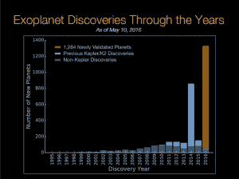

# 天文学家宣布发现最大一批新行星

> 原文：<https://web.archive.org/web/https://techcrunch.com/2016/05/12/astronomers-announce-largest-batch-of-new-planets-ever-discovered/>

美国国家航空航天局宣布，天文学家利用开普勒太空望远镜已经确认了 1284 颗新行星，比开普勒望远镜之前确认的行星数量增加了一倍多。事实上，这一批新发现的行星是迄今为止最大的一批新发现的行星。

天文学家对开普勒太空望远镜在 2015 年 7 月收集的 4302 颗*潜在*行星的行星目录进行了统计分析。在这些候选者中，天文学家发现，1284 颗符合“行星”资格的可能性超过 99%

这意味着，在进一步分析后，可能会发现这些新确认的行星中有一些最终可能根本不是行星。即便如此，一次确认的行星数量之大令人兴奋。

系外行星发现时间表/图表由美国宇航局提供

随着进一步的分析，开普勒 2015 年 7 月的行星目录可能会证实更多的行星。美国宇航局表示，有 1327 颗候选行星“更有可能不是真正的行星”，但它们没有达到 99%的门槛，需要进一步研究。

4302 个候选者中的其余候选者“更有可能是一些其他的天体物理现象”，或者已经通过其他技术验证为行星。

在 1284 颗已确认的行星中，有 550 颗大小合适，有可能是像地球一样的岩石世界。这就是结果变得相当令人兴奋的地方。九个新的潜在岩石世界在其恒星的“可居住区”内运行，在这个区域中，一颗行星可能具有合适的表面温度来容纳液态水——正如我们所知，液态水是生命的必要成分。

可居住区，也被称为适居区/插图由美国宇航局提供

加上这九颗特殊的行星，我们总共有 21 颗确认的系外行星(太阳系以外的行星)，它们很可能是岩石世界，生活在太阳系的可居住区。

开普勒太空望远镜插图/图片由美国宇航局提供

科学界对这种“可居住”的系外行星特别兴奋，因为它们可能是寻找生命的最佳地点。在 2009 年 3 月开普勒发射之前，天文学家不知道宇宙中有多少普通行星，更不用说类似地球的行星了。

> “在开普勒太空望远镜发射之前，我们不知道系外行星在银河系中是罕见还是常见。多亏了开普勒和研究团体，我们现在知道行星可能比恒星还多。”保罗·赫兹，美国宇航局总部天体物理学分部主任。

在我们的宇宙中发现新的世界与寻找外星生命密切相关。既然天文学家已经证实宇宙中可能存在大量系外行星，外星生命的可能性似乎更大了。

随着新的太空望远镜在未来几年内上线，天文学家将有更好的工具和数据来继续搜索可居住的类地行星和地外生命。

开普勒监测了一批天空中的 15 万颗恒星，寻找地球大小或更小的行星。开普勒任务的主要目标之一就是确定恒星中有像地球一样的岩石行星围绕它们旋转的几率有多大。

美国宇航局的下一个大型系外行星搜寻望远镜，[凌日系外行星调查卫星](https://web.archive.org/web/20230328231607/http://tess.gsfc.nasa.gov/)，计划于 2018 年发射，将建立在从开普勒获得的知识基础上，在距离地球更近的 20 万颗恒星周围搜索类似地球的行星。

同年晚些时候，当[詹姆斯·韦伯太空望远镜](https://web.archive.org/web/20230328231607/http://www.jwst.nasa.gov/)发射时，天文学家将能够研究可居住的系外行星的大气，并寻找表明表面可能有生命存在的化学特征。

在几年内，科学界已经从假设宇宙中行星的频率发展到将技术和计划应用于在已确认的类地行星上寻找生命。

虽然要真正了解这些新行星还有很多工作要做，但这是一个研究宇宙的激动人心的时刻，特别是对天文学家、行星科学家和那些希望回答“我们是孤独的吗？”这个问题的人来说