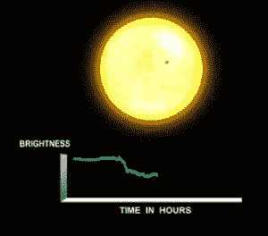
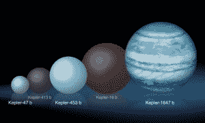
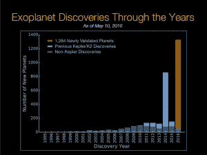

# 天文学家刚刚发现了一颗围绕两个太阳运行的巨大行星 

> 原文：<https://web.archive.org/web/https://techcrunch.com/2016/06/15/astronomers-just-discovered-a-huge-planet-orbiting-two-suns/>

塔图因，是你吗？

来自美国宇航局戈达德太空飞行中心和圣地亚哥州立大学的一组天文学家发现了一颗围绕两颗恒星运行的新系外行星。这个特别的发现值得注意的是，它是迄今为止发现的双星系统中最大的行星。

天文学家称之为[开普勒-1647b](https://web.archive.org/web/20230127070036/http://arxiv.org/pdf/1512.00189v2.pdf) ，这颗系外行星在其恒星的“宜居带”中运行，在那里液态水可能存在于表面——这是生命形成的重要成分。然而，开普勒-1647b 的大小几乎与木星相同，这意味着它是一个气体巨星，不太可能有我们所知的生命。

然而，除了它的大小，塔图因型系统与我们的地球-太阳系统有一些相似之处。开普勒-1647b 的年龄为 44 亿岁，与地球的年龄差不多。此外，系外行星围绕的两颗恒星与我们的太阳相似，一颗比我们的母星略大，一颗略小。

这颗新发现的行星距离地球大约 3700 光年，太暗了，在夜空中用肉眼看不到。因为来自开普勒-1647b 恒星系统的光需要 3700 年才能到达地球，所以研究该系统的天文学家认为它存在于 3700 年前。

2009 年发射的开普勒太空望远镜可以使用凌日法探测其他恒星周围的行星。通过这种策略，当一颗行星相对于地球从主星前面经过时，天文学家会寻找主星的亮度下降。

美国宇航局艾姆斯研究中心提供的凌日方法/图片说明

围绕两颗恒星运行的行星被称为环双星，天文学家已经在我们的星系中确认了其中的几颗。所有其他已知的环绕双星的行星都小于开普勒-1647b。

对比开普勒-1647b 发现的几颗环绕双星的图示/图片由美国宇航局提供

通常情况下，较大的行星更容易被识别，因为在凌日期间，它们会比较小的行星更明显地减弱来自其宿主恒星的光线。然而，开普勒-1647b 的轨道周期如此之长，以至于它在恒星前面过境的频率低于其他已确认的系外行星。

开普勒-1647b 的运行周期为 1107 天(仅三年多一点)，是迄今为止任何已确认的凌日系外行星中运行周期最长的。

> “有点奇怪的是，这颗最大的行星花了这么长时间来确认，因为发现大行星比小行星更容易。但这是因为它的轨道周期太长了。”圣地亚哥州立大学天文学家杰罗姆·奥罗兹是开普勒-1647b 发现小组的成员

与单星系统相比，塔图因类型的行星很难发现，甚至更难确认。事实上，开普勒-1647b 的凌日早在 2011 年就被 SETI 研究所的天文学家劳伦斯·道尔注意到了。然后花了几年的时间进行分析，以确认开普勒数据中注意到的亮度下降确实是由一颗环绕双星的行星引起的。

> “但是寻找环绕双星的行星比寻找围绕单个恒星的行星要困难得多。凌日在时间上没有规律的间隔，它们的持续时间甚至深度都可以变化。”圣地亚哥州立大学天文学家威廉·威尔士是开普勒-1647b 发现小组的成员

系外行星发现时间表/图表由美国宇航局提供

自开普勒太空望远镜发射以来的七年中，天文学家已经在银河系的一批天空中确认了几千颗系外行星，包括几颗与地球和金星非常相似的行星。就在两个月前，美国宇航局[宣布](https://web.archive.org/web/20230127070036/https://techcrunch.com/2016/05/12/astronomers-announce-largest-batch-of-new-planets-ever-discovered/)有史以来发现的最大一批新行星，同时有 1284 颗确认的系外行星。

> *“在开普勒太空望远镜发射之前，我们不知道系外行星在银河系中是罕见还是常见。”保罗·赫兹，美国宇航局总部天体物理学分部主任。*

纵观现代历史，科学家们相信有其他行星存在，但开普勒是证明这一假设的关键工具。由于来自开普勒的数据，科学家们现在知道行星在宇宙中可能比恒星更频繁。