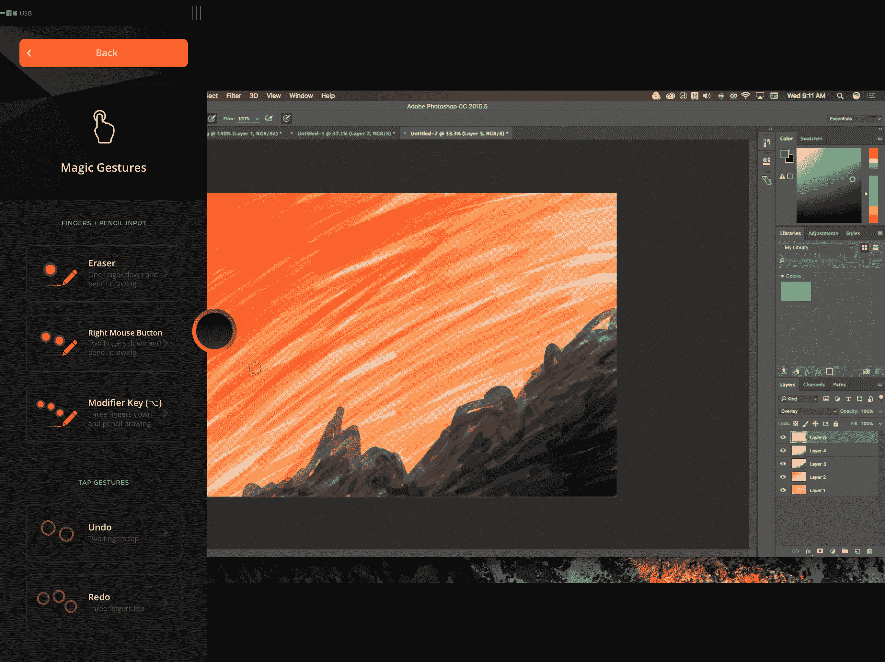

# Astropad Studio 将 iPad Pro 变成面向 MAC 电脑的专业绘图板 

> 原文：<https://web.archive.org/web/https://techcrunch.com/2017/01/11/astropad-studio-turns-the-ipad-pro-into-a-pro-drawing-tablet-for-macs/>

iPad Pro 是一款非常实用的绘图工具，适合你在旅途中使用，但它缺少很多专业软件，而这些软件是职业艺术家完成工作所必需的。Astropad 是一家专注于为 iPad 制作第二屏幕软件以用于联网 Mac 的公司，今天推出了其软件的新版本，该版本在 Astropad 的基本屏幕镜像功能上添加了许多可定制的选项，使其成为 Wacom 的 Cintiq 平板电脑等昂贵图形硬件的更强大的替代品。

Astropad 的最新软件为 Apple Pencil 提供了全面的压力敏感性支持，非常低的延迟(当快速绘制草图时，你会注意到一些非常轻微的延迟)和出色的视觉保真度。它既可以通过 Wifi 工作，也可以通过 USB 电缆连接，不过如果你真的希望将它用于专业用途，你可能会想坚持使用后者。

【YouTube https://www.youtube.com/watch?v=l4LUc3MdzT4&w=680&h=383]

其他应用程序也提供类似的功能 Astropad Studio 最接近的竞争对手是 Duet Display，但尽管该应用程序支持 Apple Pencil 和压敏输入，但它的设计更像是另一个扩展桌面的显示器，而不是 Studio，后者非常明确地专注于提供旨在满足他们特定需求的图形专业工具。

这些不仅包括铅笔支持和性能，还包括可定制的快速操作和快捷方式，通过触摸输入实现，并将触摸输入与铅笔相结合。例如，您可以通过在工作流程中添加点击来快速撤销或抹掉，并且您可以根据需要调整这些特定的快捷键。

Astropad Studio 连接到 Mac 上的客户端(您可以单独下载)，让您选择现有显示器的一部分，以定义为在 iPad Pro 上使用的交互表面。iPad 屏幕上的一个小光盘图标允许你调整快捷键设置，并检查附加命令。可用的命令非常棒，像通用的撤销和重做组合，以及一种简单的擦除方法，只需将一个手指留在屏幕上，像平常一样使用铅笔。

在实践中，Astropad Studio 是专用图形平板电脑的一个非常强大的替代品。我把它放在 Wacom Cintiq 13HD 旁边使用，虽然 Wacom 确实感觉反应更快，但对许多用户来说，两者之间的实际差异并不能证明价格差异的合理性。Astropad Studio 需要每月 7.99 美元或每年 64.99 美元的订阅，但有了 math，你可以获得设置同步、额外的支持以及 Astropad 的承诺，即它将每月更新新功能和改进。

如果你是 iPad Pro 用户，你可能会渴望充分利用你的铅笔选项，Astropad Studio 肯定能做到这一点，另外还有 7 天的免费试用，所以你可以确保它符合你的需求。