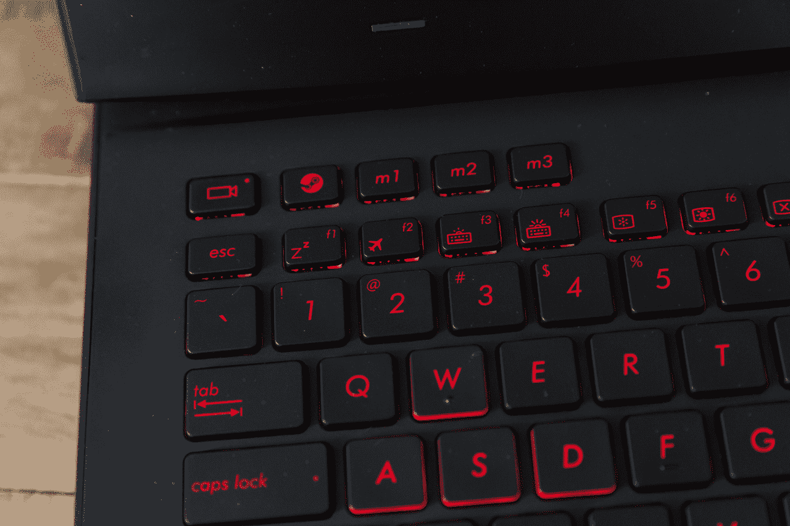

# 华硕游戏玩家共和国 G751 评论:便携式游戏，强调“游戏”

> 原文：<https://web.archive.org/web/http://techcrunch.com/2015/03/02/asus-republic-of-gamers-g751-review/>

就游戏电脑而言，必然会有所取舍:更大的尺寸意味着更好的性能，更好的便携性自然会导致纯粹游戏性能的妥协。华硕玩家国度 G751 是一款顶级游戏笔记本，但它仍然受到游戏笔记本的基本事实的困扰，这种体验扩展了“便携”的定义，但也应该让游戏玩家在仍然符合笔记本基本定义的情况下寻求最高性能。

## 基础

*   17.3 英寸 1920×1080 防眩光显示屏
*   2.5GHz 酷睿 i7 处理器
*   24GB DDR3 内存
*   1 TB 硬盘和 256GB 固态硬盘
*   Nvidia GeForce GTX980M 显卡，带 4GB GDDR5 RAM
*   802.11A/C 无线网络
*   4 个 USB 3.0 端口、蓝光 DVD、SD/MMC 读卡器、千兆以太网、蓝牙 4.0、Thunderbolt、VGA、HDMI
*   6000 毫安时电池
*   8.4 磅
*   [产品信息页面](https://web.archive.org/web/20230313110653/http://www.asus.com/Notebooks_Ultrabooks/ASUS_ROG_G751JT/)
*   建议零售价:2400 美元(经测试)

## 设计

华硕 ROG G751 是一款野兽般的游戏机，这意味着你无法将它放入一个小背包中，在没有任何明显身体负担的情况下四处奔跑。它几乎有 11 磅重，比重量不到 4.5 磅的 Retina MacBook Pro 要重得多。然而，它有一个 17 英寸的显示屏，这对于更沉浸式的游戏来说很好，但对于整体物理尺寸来说就不那么好了。简而言之，ROG G751 将扩展你对*圈*顶的定义。另一方面，我可以在我的膝盖上使用它，尽管它的尺寸很小，但它仍然比我记得的早期笔记本电脑更舒适，当时它们几乎不能比你的普通翻盖手机做更多的事情。

[gallery ids="1126470，1126471，1126472，1126473，1126474，1126475，1126476"]

让我们面对它:如果你对 G751 感兴趣，你已经声明你喜欢游戏性能，而不是便携性。很可能，您正在寻找一种比台式塔式机更易于移动，但性能不相上下，配有内置显示器的设备，这样当您出门在外时，或者只是在家里，但无法轻松接触到固定位置的显示器或电视屏幕时，您就不必提供自己的显示器了。假设这是正确的，华硕硬件的设计提供了许多相当大的优势，这些优势在竞争对手的设备上不一定存在。

例如，笔记本电脑的橡胶顶壳确保您可以在运输过程中很好地抓住机器，grippy 支脚有助于稳定的桌面坐着，底部有足够的空间来帮助冷却。背面有两个大排气口，用于风扇冷却，内置在后铰链中，有助于笔记本电脑的显示器倾斜而不会过度摇晃，同时也为高容量可移动电池留出了更多空间。

该计算机的充足表面积还允许完整的端口，包括四个 USB 3.0 连接器、蓝光驱动器、Thunderbolt、有线千兆以太网和完整的音频输入和输出。

发光键盘，WASD 键上有特殊的强调照明，超宽的触控板有大的左右按钮，也是不错的触摸。就游戏笔记本的设计而言，我的一个抱怨是，我发现自己不小心按了蓝光驱动器上的硬件弹出按钮，导致光盘弹出了很多次，我想拿起笔记本电脑，甚至只是在屏幕打开的情况下移动它的位置。

## 特征

华硕在 ROG G751 中加入了一些非常方便的特殊功能，包括一个专用的录制按钮，可以激活 Nvida 的 ShadowPlay 进行游戏内会话录制。当它运行时，它会有一个灯告诉你，一旦你完成初始设置，它会极大地简化这个过程，如果你想记录游戏中的事件，以便以后与后代分享，这是非常酷的。

华硕上的其他专用键包括一个 Steam 键，无论你碰巧在哪里，它都会启动应用程序，将你踢到大画面模式，这样你就可以摆脱噪音，直接开始游戏。

还有三个可编程的宏按键，用于设置单击使用的组合，以及一个启动玩家国度游戏中心的按键，可以配置所述宏，查看当前使用的内存和存储容量，调整音频并在预配置的游戏模式之间切换，从而触发不同的系统设置。

如上所述，华硕的屏幕设置在铰链上，这也使游戏玩家在实际运行软件时更接近动作。显示器本身虽然只有全高清，但其规格可以(并确实通过外部显示器)支持 4K 输出，非常明亮和均匀，并且由于哑光处理，在大多数照明条件下工作良好，不会引入任何眩光。

华硕有一个“出色”的技术软件功能，可以让你调整颜色配置文件，并在三种保存的配置之间切换，这有助于你处理软件性能之间的差异。

## 表演

如上所述，这款笔记本电脑的显示屏虽然不像 Razer 的最新款[那样超高清或 4K，但做得很好，易于观看，即使是更长时间的游戏。它还可以输出到 4K 显示器上，如果你碰巧有一个安装在家里的桌子上进行长时间游戏的话，这要归功于功能极其强大的 Nvidia GeFore GTX 980M 显卡。](https://web.archive.org/web/20230313110653/https://techcrunch.com/2015/02/25/the-new-razer-blade-is-the-gaming-laptop-to-beat/)

该处理器与酷睿 i7 CEPU 相结合，能够在一些最新的顶级游戏中实现 60 fps 的性能，包括个人最喜欢的《魔多之影》。

简而言之，如果您正在寻找能够在没有塔式机或不需要外接屏幕的游戏中发挥桌面功能的产品，华硕 G751 肯定会满足您的需求。诚然，我们测试的版本配备了不太便宜的规格，但最终价格为 2400 美元，与您可能对这种性能的预期相比，它实际上并不疯狂。它唯一不太好的地方是当你在拔掉插头的情况下长时间使用它进行游戏时，但如果你认为华硕可能神奇地消除了当前电池技术的限制，那么你无论如何都是在做梦。

说到电池，你可以幸运地在游戏中使用 G751 超过一个小时，但在标准的混合使用性能中，它可以持续更长时间，尽管仍然只有大约四五个小时。同样，如果你正在寻找一个持久的电池，你可能也不会寻找一个桌面替代游戏机，所以它不应该真正影响你的选择，除非你愿意在图形和帧率上妥协。

## 结果

华硕 ROG G751 是一款游戏笔记本电脑，它非常认真地对待自己的工作，因此在该领域处于领先地位。事实上，对于移动游戏，这是我目前的首选，尽管我对 Razer 的最新产品很感兴趣。然而，华硕提供了更大的屏幕，配有全尺寸键盘和更强大的 Nvidia 显卡，这意味着对于那些寻求最佳游戏体验的人来说，它可能仍然是最好的选择，而且还可以旅行。