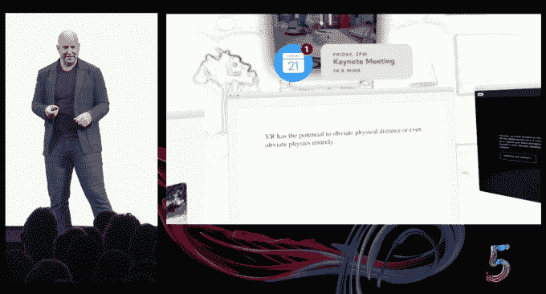
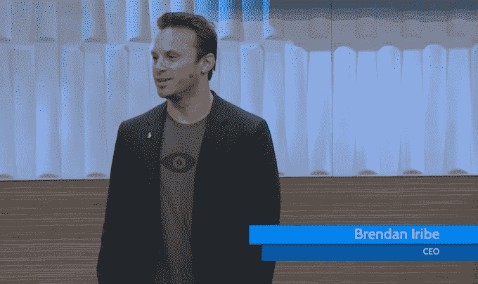

# 在 Oculus Connect keynote 上，最初的联合创始人没有登台 

> 原文：<https://web.archive.org/web/https://techcrunch.com/2018/09/26/at-oculus-connect-keynote-original-co-founders-absent-onstage/>

# 在 Oculus Connect keynote 上，最初的联合创始人没有上台

当脸书高管在该公司以虚拟现实为重点的 Oculus Connect 5 大会的开幕主题演讲中走上舞台时，有一件事显然缺失了，那就是曾在 2014 年以 20 亿美元收购了虚拟现实初创公司脸书的创始团队。

五位最初的 OculusVR 联合创始人都没有登上该公司的重要主题演讲台，而脸书的高管，包括首席执行官马克·扎克伯格、长期担任 Ads 副总裁的安德鲁·博斯沃思(现为 VR/AR 副总裁)和脸书 VR 副总裁雨果·巴拉，发表了大部分重要声明。

VR/AR 副总裁 Andrew Bosworth

OculusVR 联合创始人缺席脸书今年最大的虚拟现实活动，正值围绕脸书高调收购的前领导人流传一系列新闻。本周早些时候，Instagram 的联合创始人凯文·斯特罗姆和迈克·克里格[宣布他们将出人意料地离开公司。](https://web.archive.org/web/20221207183037/https://techcrunch.com/2018/09/24/instagram-founders-leave/)

今天，[我们听到了更多的消息](https://web.archive.org/web/20221207183037/https://techcrunch.com/2018/09/26/whatsapp-founder-brian-acton-says-facebook-used-him-to-get-its-acquisition-past-eu-regulators/) WhatsApp 创始人 Brian Acton 今年早些时候离开了脸书，在对他最初创建的公司的方向越来越不满意后，他放弃了 8.5 亿美元。

从 2014 年开始

Oculus 在脸书经历了比其他收购更动荡的时期，该公司去年与 ZeniMax Media 就公司成立和窃取知识产权提起了 30 亿美元的诉讼。最终，脸书被迫支付了 2.5 亿美元。

在 2016 年大选期间向一个反希拉里团体捐款后，创始人帕尔默·卢奇也被证明是脸书公共传播领域的一个令人头疼的问题，引发了一场负面新闻风暴。Luckey [去年](https://web.archive.org/web/20221207183037/https://techcrunch.com/2017/03/30/palmer-luckey-facebook/)离开了脸书。虽然该公司的其他联合创始人在收购后继续担任领导职务，但 2016 年底的一次大调整降低了时任首席执行官布伦丹·伊里贝(Brendan Iribe)和时任产品副总裁内特·米切尔(Nate Mitchell)的职位，小米的巴拉后来加入，领导 Oculus 成为脸书的虚拟现实副总裁，直接向扎克伯格报告。

在过去几年的活动中，OculusVR 的联合创始人也更多地扮演了后座角色。虽然 Iribe 和 Luckey 在早期会议的主题演讲中占了很大比重，但去年只有 Mitchell 走上了舞台。今年有很多回调，将过去的主题演讲与首席科学家迈克尔·阿布拉什(Michael Abrash)等早期员工谈论虚拟现实平台的未来联系起来，但最终在近两个小时的演示中，这家初创公司的原始领导层没有一个人出现在舞台上。

随着脸书继续将其高调收购从 autonomy 转移到其核心领导保护伞下，创始领导人推动他们最初创建的公司的公共愿景的未来似乎更加不确定。

