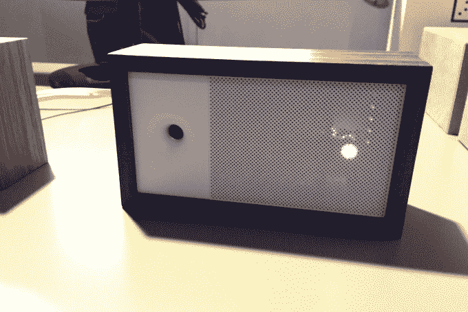
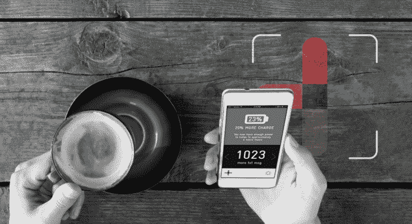
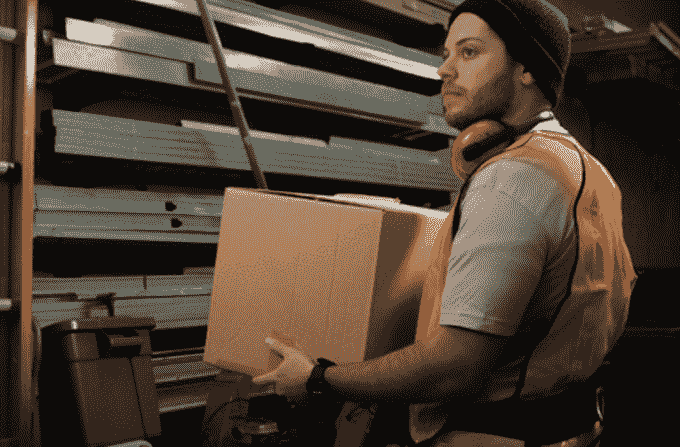
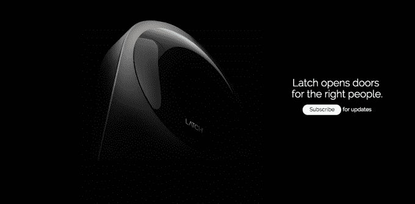
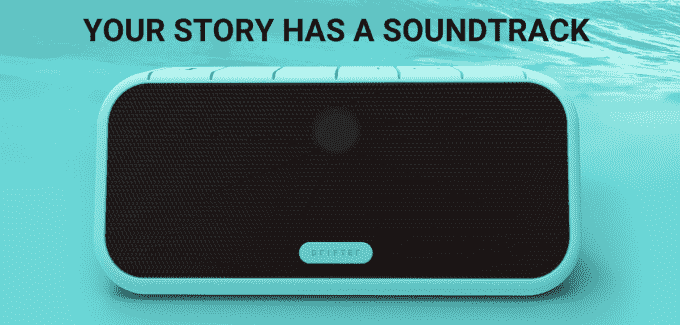

# 在 R/GA 加速器演示日，十家新的物联网公司上线 

> 原文：<https://web.archive.org/web/https://techcrunch.com/2015/02/12/at-the-techstars-rga-demo-day-ten-new-iot-companies-go-live/>

在由 TechStars 提供支持的 R/GA 加速器演示日，10 家公司希望改变世界。

早在 8 月，TechStars 和 R/GA 再次聚在一起，形成了一种特殊的加速器，完全专注于联网设备和物联网领域。今天，所有这些劳动的成果即将揭晓，10 家新公司将亮相现场，研究软件和硬件的结合将如何让我们的生活变得更好。

我们在演示日为您带来所有的现场活动，并将随着公司的出现更新此贴。

## Lisnr

[Lisnr](https://web.archive.org/web/20221225022332/http://lisnr.com/) 使用高频音频音调通过环境噪音解锁折扣、第二屏幕体验和其他参与机会。这里的想法是，Lisnr 可以提供正常听觉范围之外的音频音调，这将触发任何设备采取某种行动。如果你正在看一场棒球比赛，走向一个小卖部，那个小卖部会给你一份菜单，甚至让你在线订购。如果你走向体育场的出口，优步的应用程序会被触发打开，询问你是否需要搭车。但是它可以更细化。Lisnr 可以直接把那个大本垒打的回放发送到你的手机上。

Lisnr 表示，对于这种类型的接口层，使用音频是最有效和可扩展的标准。该公司表示，它将在 2015 年实现超过 300 万美元的收入，并推出主要试点项目，以取代非接触式支付和其他基于 NFC 的技术。

## 灯丝

灯丝是工业互联网的神经系统。使用细丝节点传感器(配有 USB 端口，因此可以连接到几乎任何设备)，细丝创建自己的网络(不是 WiFi 或蓝牙)，以便不同的基础设施可以被监控，甚至可以相互通信。这些传感器的范围可达 9 英里，这意味着它们可以用于办公室这样的小空间，也可以用于工厂或城市这样的大空间。

Filament 以每月订阅模式(他们称之为“传感器即服务”)出售传感器，价格不到 10 美元/传感器/月，过去六个月的销售额超过 256，000 美元。凭借这一模式，Filament 表示，它有望在 2015 年产生超过 1050 万美元的年度经常性收入。

## 成岩物质

成岩科技公司正在帮助食品生产商和农民追踪可能在他们的土地上传播的任何疾病，以便他们能够提前发现问题。现在，农民们在他们的土地上走来走去，手动检查病虫害。事实上，每年有 7500 万美元的农作物因生病而损失。

成岩公司提供了一种叫做生物游侠的硬件，它可以让食品生产商立即采集土壤样本并测试植物。通常，测试土壤和可能生病的植物需要大约 5 天时间和 70 美元。使用 Bioranger，只需 10 美元，结果就会通过配套应用程序立即反馈回来。

## Bitfinder

Bitfinder 致力于让我们在呼吸空气时保持清醒。通过一款名为 Awair 的产品，BitFinder 可以为您提供关于家庭或办公室环境的可操作数据，并提供解决任何问题的解决方案。Awair 测量环境温度、湿度、二氧化碳、灰尘颗粒和 VOC(来自地毯、塑料、油漆等的有毒化学物质)。).如果空气感觉到你的公寓又干又闷，它会建议你补充水分，呼吸一些新鲜空气。如果模式继续，它会推荐买一个好的加湿器。

Awair 看起来设计精美，并与 Nest 等其他物联网产品兼容，可以了解你的习惯并自动纠正你的环境。Bitfinder 不清楚这款手机的定价。

## （关于）星球的；（关于）太空的

[Astro](https://web.archive.org/web/20221225022332/http://www.astro.ai/#/) 是一家专注于租房者的智能家居自动化公司。最后。不幸的是，Astro 并不清楚它的实际产品是什么样子，或者它是如何工作的。他们有一个即将到来的众筹活动，届时他们将真正展示他们的产品。我们现在只知道 Astro 想提供一个完全便携的家庭自动化平台/产品。

## Chargifi

Chargifi 试图回答一个古老的问题:“我的下一次智能手机充电来自哪里？”

Chargifi 创造了无线充电钥匙，这意味着它永远不会插入外部电源。相反，Chargifi 充电钥匙利用磁共振通过磁场传导电力。和你给电动牙刷充电的方式挺像的。计划是将这些钥匙集成到商店、场馆、餐厅等现有的家具中。在世界各地。

该公司已经计划在迪拜的多家五星级酒店推出，已经与欧洲最大的两家咖啡店(Cafe Nero 和 Pret A Manger)签订了合同，并准备在未来几个月内在纽约的 50 家酒吧推出。但除了实际的硬件，Chargifi 还提供了一个移动平台，让品牌和场馆有机会提供移动订购、支付和客户数据分析。

## 运动的

[Kinetic](https://web.archive.org/web/20221225022332/http://www.wearkinetic.com/) 致力于保护仓库工人和其他高度体力劳动的员工(例如亚马逊仓库员工)，他们每天都要举起数百个沉重的箱子，以便我们能在两天内拿到我们的货物。Kinetic 将这些工人称为“工业运动员”,并意识到一次背部受伤就可能让公司损失高达 20 万美元，需要增加 250 万美元的收入才能支付这笔费用。这些伤害每年给公司造成数千亿美元的损失，无论是医疗保健、预防软件还是培训。

Kinetic 出售一个 500 美元的设备包(配有一个手腕佩戴的活动跟踪器和一个背带)，可以确定工人何时进行举重，以及举重的风险有多大。每个高风险电梯都提供了关于如何保持安全和正确提升的反馈，管理人员可以看到每个工人的完整档案，以提前应对任何健康问题。除了最初的硬件费用，使用 Kinetic 的公司将支付 20 美元/月/工人。

## 门闩

[Latch](https://web.archive.org/web/20221225022332/http://www.getlatch.com/) 是一家智能锁公司，专注于为用户而非坏人打造产品。Latch 允许您使用智能手机或平板电脑而不是钥匙，为用户提供了设置临时管理员进出房屋的能力。例如，Latch 允许您访问 UPS 的工作人员、水管工、遛狗的人或保姆，而不必给他们一个钥匙链或进行复制。

像 Astro 一样，Latch 也保持相对沉默，因为他们计划在今年晚些时候推出该产品。你可以(试着)在这里了解更多。

## 自由音频

[自由音响](https://web.archive.org/web/20221225022332/http://getdrifter.com/)有一款产品叫 Driftr。这是一个不依赖蓝牙的便携式扬声器，就像……嗯，*每一个便携式扬声器*都能工作一样。Freedom Audio 希望为户外爱好者制造一款高度耐用的便携式扬声器，他们只想在智能手机无法安全到达的地方欣赏音乐。

Driftr 完全独立于智能手机播放音乐，允许你从 Spotify 和 Beats 等各种流媒体服务下载音乐。在家里，Driftr 通过使用 Wifi 来节省能源，如果你只是挂在院子里，它当然有蓝牙选项。但在一次冒险中，Driftr 有自己的处理器来播放下载的音乐。如果这还不够，Driftr 是防水的，可以漂浮，并且有夹子可以钩到任何现有的 GoPro 支架上。目标人群是水上运动市场，它没有同时冲浪和听音乐的单一选择。Freedom Audio 预计 5 月发货。

## SkySpecs

SkySpecs 希望让这个充满无人机的新世界变得更加安全。SkySpecs 没有让人类完全控制无人机，而是使用技术来确保无人机能够理解周围的世界。这样，无人机在击中人类的脸之前会自动后退。

在今年的 CES 期间，SkySpecs 是我们在[硬件战场的参赛者之一，并以 Guardian 技术给我们留下了深刻的印象。你可以在这里](https://web.archive.org/web/20221225022332/https://techcrunch.com/2015/01/06/with-skyspecs-guardians-the-drones-have-become-self-aware/)了解更多关于 SkySpecs [的信息。](https://web.archive.org/web/20221225022332/http://www.skyspecs.com/#wind)